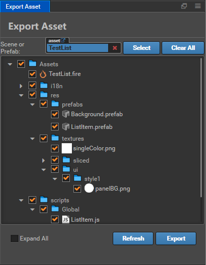
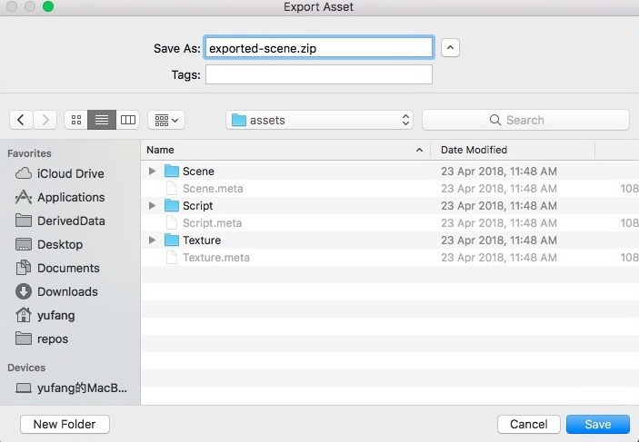
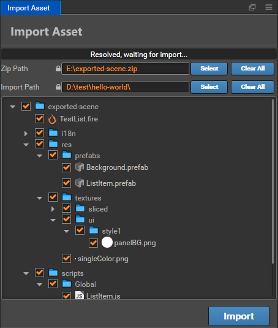

# Resource import and export workflow

Cocos Creator is a game development tool focused on content creation. In the game development process, in addition to the specific project program architecture and features of each project, we will also generate a large number of relatively independent elements such as scenes, characters, animations, and UI controls. For the development team, in many cases these content elements can be reused to some extent.

Under the mode of scenes and prefab as the core of content organization, Cocos Creator v1.5 has built-in export and import tools for scene (.fire) and prefab (.prefab) resources.

## Export Assets

From the main menu, select `File -> Export Asset` to open the Resource Export Tool Panel, next, you can select the resources to be exported in the following two ways:

- Drag a scene or prefab file from **Assets** to the Resources tab of the Export Resource Panel.
- Click the **Select** button on the right of the resource bar to open the file selection dialog and select the resource you want to export in the project.

Resources that can be selected include `.fire` scene files and `.prefab` files.

### Confirming Dependencies

The export tool automatically checks the list of dependencies of the selected resources and lists them in the panel, The user can manually check if each dependency is necessary and remove some of the dependent resources. The removed resource will not be exported.

After confirmation, click the **Export** button will pop up the file storage dialog, the user needs to specify a folder location and file name. Click the **Save** button will generate a package file of `file name.zip` containing all the exported resources.

## Import Asset

With the exported resource bundles, these ready-made resources can be imported into the new project. 
In the main menu of the new project, select `File -> Import Asset` to open the Resource Import Tool Panel.

Click the **Select** button to the right of the **Zip Path** input box, and in the file browse dialog select the exported resource package you just exported.

During the import process, the user is again asked to confirm the resource dependency at the time of import. At this time, you can also uncheck some resources to not import these resources.

### Setting Import Location

Compared to the export process, the `Import Path` setting was added to the import process, The user can click on the **Select** button next to it to select a folder under the `assets` path of the project as the location for the imported resource. Because all resource paths are saved relative to the `assets` path when exporting resources, if you do not want imported resources to be placed in the `assets` root directory during import, you can specify an intermediate directory to isolate the imported resources from different sources.

After setting, click the **Import** button will pop up a confirmation dialog. After confirmation, the listed resources will be imported into the target path.

### Script and Resource Conflicts

Because the script in the Creator project cannot have the same name, when the imported resource contains a script with the same name as the script in the current project, the script with the same name will not be imported. If there is a conflict between the UUID of the imported resource and the UUID of the existing resource in the project, a new UUID will be automatically generated for the imported resource and the references in other resources will be updated.

## Workflow Application

With the new resource import/export capabilities, we can further extend the workflow based on project and team needs, such as:

- Programs and Art designer use separate projects to development, UI, character, and animation developed by Art designer can be imported into the main project that the programs is responsible for by exporting resources. Avoid conflicts and further strengthen privilege management.
- After a project is developed, reusable resources can be exported and imported into a common repository, After the resource is optimized in the public resource library project, it can be exported to other projects at any time, which greatly saves development costs.
- Make a more complete function into a scene or prefabricated, and upload resource packages to the extension store, easy for community users to download and use.

On this basis, a more diversified workflow can be developed. The development team can use their imagination and use the extension plugin system to further customize the imported and exported data and behaviors to meet more complex needs.
