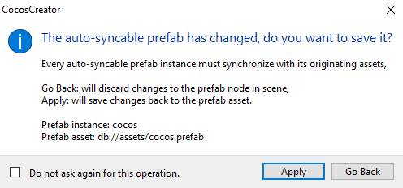

# Prefab

Prefabs are pre-configured game objects that can be used as templates when we dynamically generate nodes.

## Creating Prefab

After editing the node in the scene, drag the node directly from the **Node Tree** to the **Assets** panel at:

to create a **prefab**:

## Editing Prefab

Double-clicking on a prefab in the **Assets** panel switches the scene editing mode of the **Scene** panel to prefab editing mode.

After editing, click the **Save** button on the top of the **Scene** panel to save the edited prefabs, and then click the **Close** button to exit prefab editing mode and return to scene editing mode.

## Using Prefab

Drag and drop a prefab from the **Assets** panel to the **Node Tree** or the **Scene** panel to generate a **Prefab Instance** in the scene. The Prefab Instance node is shown in blue in the **Node Tree**.

If you modify each property of a prefab instance in the scene and then save the scene, the modified data will be stored in that prefab instance and will not affect the prefabs in the **Assets** panel or the data of other prefab instances generated using prefabs.

## Prefab Instances

When the prefab instance node is selected in the **Node Tree**/**Scene** panel, several actionable buttons appear at the top of the **Properties** panel panel.

- **Select**: click this button to yellow highlight the prefab for this prefab instance in the **Assets** panel.

- **Return**: if the prefab instance is modified, click the **Return** button to restore the prefab instance to the initial state.

  > **Note**: the rollback operation is not valid for the modification of **Node Activation Status**, **Node Name**, `Position` and `Rotation`.

- **Save**: after modifying a prefab instance in the scene, click **Save** directly in the **Properties** panel to synchronize the changes to the prefab that generated the prefab instance.

### Automatic and Manual Synchronization

When the original prefab corresponding to a prefab instance is modified, you can choose whether to synchronize the prefab automatically or manually for each prefab instance in the scene. With the prefab instance selected, click  button to toggle manual/auto sync, the default is manual sync.

- When set to **Manual Sync**, the prefab instance will not be updated automatically with the original prefab. If it is necessary to synchronize the update, click the **Return** button on the top right. The prefab instance node will be shown in blue in the **Node Tree**.

  

- When set to **Auto Sync**, the prefab instance will be automatically synchronized with the original prefab and the prefab instance node will be shown in green in the **Node Tree**.

  

  > **Note**: in order to keep the engine lean, auto-syncable prefab instances have the following restrictions:
  >
  > 1. In order to facilitate individual customization of each scene instance, the `name`, `active`, `position` and `rotation` properties of the root node of the prefab instance in the scene itself are not automatically synchronized. Instead, all other child nodes and all components must be synchronized with the original prefab, and if changes occur, the editor will ask whether to undo the changes to that prefab instance or to save the changes and update them to the original prefab when switching to another node.
  >
  >    
  >
  > 2. Components in an auto-syncable prefab instance cannot refer to other objects outside of that prefab instance, or the editor will pop up a prompt.
  > 
  > 3. Components outside an auto-syncable prefab instance can only refer to the root node of the prefab instance, and cannot refer to its components and children, otherwise the editor will pop up a prompt.
  >
  > These restrictions only affect the editor operation, not the runtime.

### Reverting a prefab instance to a normal node

If it is not necessary to use a prefab and delete it in the **Assets** panel, the prefab instance generated by that prefab in the scene can be restored to a normal node by clicking **Node -> Convert to Regular Node** in the top menu bar.

### Associating nodes to prefabs

Select both a node in the scene and a prefab in the **Assets** panel, then click **Node -> Connect Node to Prefab** in the top menu bar to associate the selected node and the prefab.

## Prefab Options

When selecting any prefab in the **Assets** panel, set its **Optimization Policy**, **Async Load Assets** and **Readonly** in the **Properties** panel, and click the **Apply** button on the top right after setting to take effect.

### Setting Optimization Policy

The optimization policy optimizes the instantiation time of the selected prefab, i.e. the time required to execute `cc.instantiate`. Possible settings include **Auto Adjust** (default), **For Single Instance Creation**, and **For Multiple Instance Creation**.

- If set to **Auto Adjust**, the engine will automatically adjust the optimization policy based on the number of creations. When creating a prefab instance for the first time, the policy is equivalent to **For Single Instance Creation**, and will automatically switch to **For Multiple Instance Creation** after multiple creations.

- If this prefab requires repeated execution of `cc.instantiate`, please select **For Multiple Instance Creation**, otherwise just keep the default **Auto Adjust**.

### Setting delayed asset loading

This item is disabled by default. If this item is enabled, it will delay the loading of other assets that the prefab depends on, improving the loading speed of some page-based games. For details, please refer to the [Enable Async Load Assets](scene-managing.md#enable-async-load-assets) documentation.

### Readonly

The readonly state, some editor-generated assets will not be modified.
