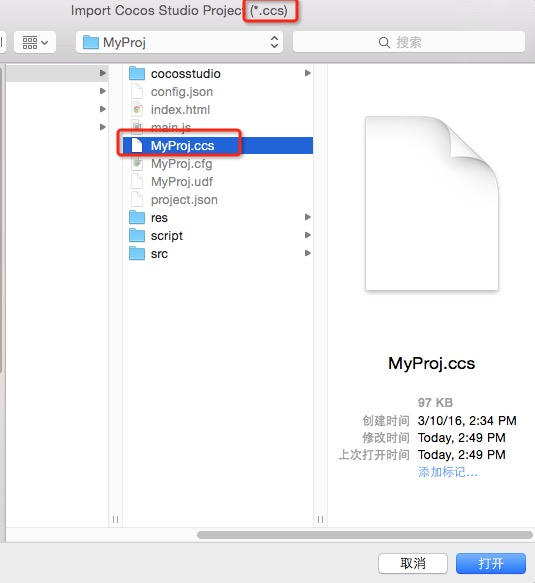

# Importing Projects from other Editors

You can import projects from other editors by the Main Menu __File->Import Project__. Currently supported project types:

  * Cocos Studio Projects (*.ccs)
  * Cocos Builder Projects (*.ccbproj)

## Steps

1. Click the right menu item, there will be a Open File dialog.
2. Select a file with the specified extension like this:

	

3. When Cocos Creator is processing the import, logs will be output in **Console**. The log looks like this:

	
	
	Details:
	* The full path of the imported project.
	* Log the file is now importing.
	* When the importing is finished, you will see a line like this: `Import XXX project finished.`. (XXX should be the project type.)
	* Last, the url of imported resources will be shown.

The time of importing depends on the size of the project. When it's importing, please don't operate Cocos Creator. You should wait for the import to be finished.

## Details of Importing Cocos Studio Projects

* There are 3 kinds of `csd` files in Cocos Studio project：
	* Scene ---- Imported as a scene (`.fire`)
	* Layer ---- Imported as a prefab
	* Node ---- Imported as a prefab
* The animation data in the `csd` files will be imported as .anim files.
* The File Structure after the project imported:
	* The resources will be stored in a separate folder in assets. The folder name will be same with the Cocos Studio project name.
	* The File Structure will be same with the Cocos Studio project.
	* The animation files will be stored in a child folder. The folder name will be `[csd file name]_action`
* Some widgets in Cocos Studio are not supported in Cocos Creator. The importing process will add a `StudioComponent` for the node with unsupported widgets. The data of the widgets will be stored in the StudioComponent. Unsupported widgets:
	* CheckBox
	* LabelAtlas
	* SliderBar
	* ListView
	* PageView
* The data of `StudioComponent` will be looks like this:

	

	1. The type of the widget.
	2. The data of the widget.

### Unsupported

* importing skeletal animation.
* importing `csi` files. (small images will be imported)
* importing property `SkewX` & `SkewY` of the `Node`.
* `Particle` is not a supported property of Blend Function. Blend Functions are not supported.

### Special Instructions

The feature of importing a Cocos Studio project is developed & tested on Cocos Studio __3.10__. If you want to import an old version project, please import it to Cocos Studio 3.10 first. Then import the Cocos Studio 3.10 project to Cocos Creator.

## Details of Importing Cocos Builder Projects

* All `ccb` files will be imported as a __prefab__.
* The animation data in `ccb` files will be imported as `.anim` file.
* The file structure after importing is the same as Cocos Studio above.

### Unsupported

* `CCControlButton` in Cocos Builder can set different color for different states, but Cocos Creator does not support this.
* `LayerGradient`.
* importing property `SkewX` & `SkewY` of the `Node`.

Back to [Asset Workflow](index.md) 
Continue on to read about [Script Assets](script.md)
