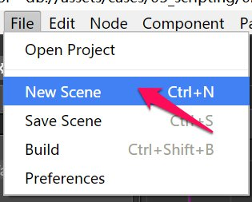
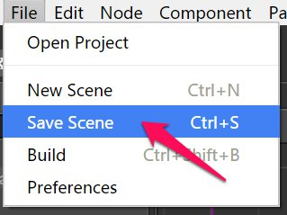
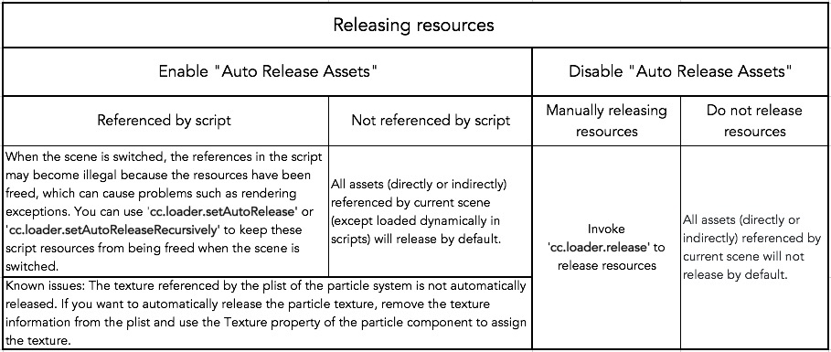

# Creating and managing scenes

## Creating a scene

Method one: on the main menu select **File -> New Scene**.

Method two: click the create menu in **Assets** to create a new scene.

## Saving a scene

Method one: use keyboard shortcut **Ctrl + S** (Windows) or **Command + S** (Mac).

Method two: on the main menu select **File -> Save Scene**.

## Switching scenes

Double click the scene that you want to open in **Assets**.

## Change the policy of auto releasing assets from previous scene

In a large game where you have many scenes, as the engine continues to load different scenes, the memory usage will continue to increase. Besides using API such as `cc.assetManager.releaseAsset` to accurately release unused assets, we can also use scene's auto releasing feature. To enable auto releasing, select the desired scene in **Assets** panel, then change the "Auto Release Assets" property in **Properties** panel, the property is true by default. 
When switching from current scene to the next scene, if current scene disabled the auto releasing, then all assets (directly or indirectly) referenced by current scene (except loaded dynamically in scripts) will not release **by default**. On the other hand, if enable the auto releasing, then these assets will release **by default**.

> Known issues: The texture referenced by the plist of the particle system is not automatically released. If you want to automatically release the particle texture, remove the texture information from the plist and use the Texture property of the particle component to assign the texture.

### Prevent auto releasing for some specifed assets

With the auto releasing enabled for a scene, if some of the scene's assets are saved in the script as "special reference", these references will become invalid once the scene switched, since the resource has been released, may cause rendering problems. To prevent these assets from being released automatically, we can use [Asset.addRef](../../../api/en/classes/Asset.html#addref) to retain them.

> "Special reference" refer to references in the form of global variables, singleton, closures, "dynamic assets", and so on. "Dynamic assets" refer to assets that are dynamically created or dynamically modified in a script.

The above content of the automatic release of scene resources can be summed up in the following diagram of several cases:

For details on resource release, see [Release Of Resources](../asset-manager/release-manager.md) documentation.

## Change the policy of scene loading

Select the scene in **Assets** panel, you will see the **Async Load Assets** option in **Properties** panel, which is disabled by default.

### Disable Async Load Assets

When loading a scene, if its "Async Load Assets" is set to false, all its dependent assets (including recursive dependents) will be load and the scene will launch after loaded completely.

### Enable Async Load Assets

When loading a scene, if its "Async Load Assets" is set to true, all its dependent textures, audios and particles will be load lazily after scene launched, this would increase the scene loading speed significantly. 
However, the players may see some assets rendered one by one after scene launched, and when a new GUI displayed in the screen, some elements in the GUI may rendered later, so this loading mode is better for web games. 
In this mode, to display the entire scene faster, you can make the undisplayed rendering components (such as Sprite) keep inactive from the beginning.

> The depended assets for Spine and TiledMap will always loaded before scene launch.
