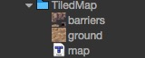
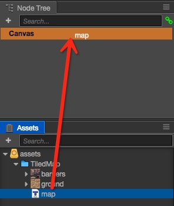

# TiledMap

## Import Assets

Assets required by TiledMap:

- .tmx : The TiledMap data file.
- .png : The texture used by TiledMap.
- .tsx : The data of tileset **(optional)**

	

## Create a Node with TiledMap

* 1st Way: Drag a TiledMap asset from **Assets** to **Node Tree**:

	 

* 2nd Way: Drag a TiledMap asset from **Assets** to **Scene**:

	

* 3rd Way: Drag a TiledMap asset from **Assets** to the `Tmx Asset` property of a TiledMap Component:

	

## Store in Project

In order to improve the efficiency of management, we suggest that put the TiledMap assets togather in a separate folder.

Continue on to read about [Content creation workflow](../content-workflow/index.md)
