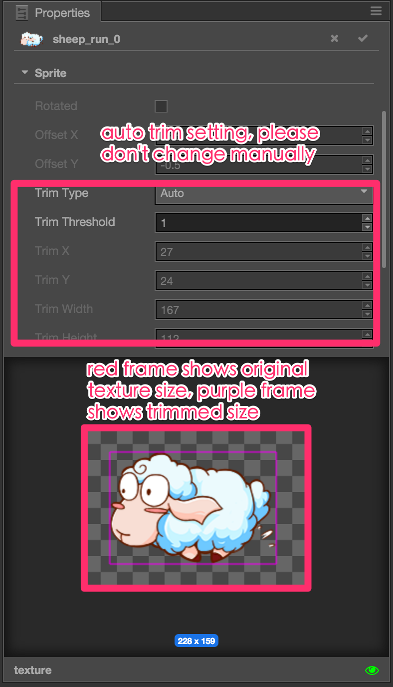

# Auto Trim for SpriteFrame

Once a texture is imported, the SpriteFrame asset generated with the texture will be trimmed automatically. Any fully transparent pixels around the image will be cropped. This will help us get the exact node size we need for Sprites.

## Trim Related Properties in Sprite Component

There are two properties related to trim setting in **Sprite** component:

- `Trim` If checked, the node's bounding box will not include transparent pixels around the image. Instead the bounding box will be an exact fit to trimmed image. If unchecked the bounding box will be showing original texture including transparent areas.
- `Size Mode` Use the options in this property to set node's size to the original texture size or trimmed image size. Options are:
  - `TRIMMED` Select this option will set the size of the node to use trimmed image size of the current SpriteFrame used by Sprite component.
  - `RAW` Select this option will set the size of the node to use the original texture size, including transparent areas.
  - `CUSTOM` This option make sure the size of the node will not be changed along with SpriteFrame, and should be managed by user himself. If user use **Rect Transform Tool** or `Size` property in **Properties** panel to modify the size of the node, the `Size Mode` property will be automatically set to `CUSTOM`.

The following picture shows the comparison of two size modes:

## Sprite Animation with offset

There are a lot of animator prefer to draw the moving motion in texture, commonly seen in attack animations. Usually animator will use a large canvas and put character on different positions on the canvas for different animation frames. In this case, all animation frames are textures with the same size and transparent areas around the character. We should set **Sprite** component's `Trim` property to `false`, and set `Size Mode` to `RAW`. This way when playing sprite animation the sprite node position will not change, instead the character will move based on it's offset in original textures.

If `Trim` property is set to `true`, it would fit animations that have no in texture offset.

## TexturePacker Setting

We recommend users to use sprite sheet tools such as [TexturePacker](https://www.codeandweb.com/texturepacker) for generating sprite animation texture assets. In TexturePacker before you publish your sprite sheet, please make sure you choose `Trim` in **Trim Mode** setting of Sprites section. Please do not use `Crop, flush position`, or the trim information will be lost and you can't get back originial texture offset anymore.

Continue on to read about [Font](font.md).