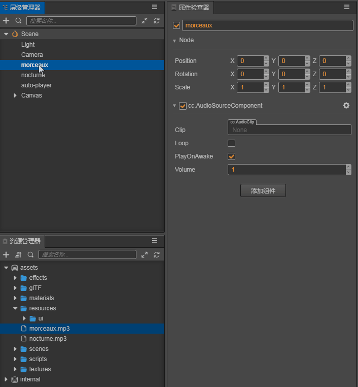

# Audio

__Sound__ assets are __audio files__. An __audio system__ has two main functions: __playing background music__ and __playing short sound effects__.
For sound assets, there is no difference between the two. After all, audio assets are imported into the editor, `AudioClip` assets perform related audio operations through the `AudioSource` system component. To use the audio system, please refer to the [Audio System](../audio-system/overview.md) documentation.

## Supported audio asset formats

Currently, the engine's audio system can support the following formats:
  - `.ogg`
  - `.mp3`
  - `.wav`
  - `.mp4`
  - `.m4a`

## Use of sound assets

After adding an `AudioSource` to a `Node`, drag the imported audio asset from the __Asset Manager__ to the `Clip` of the node `AudioSource` to control the sound asset:

