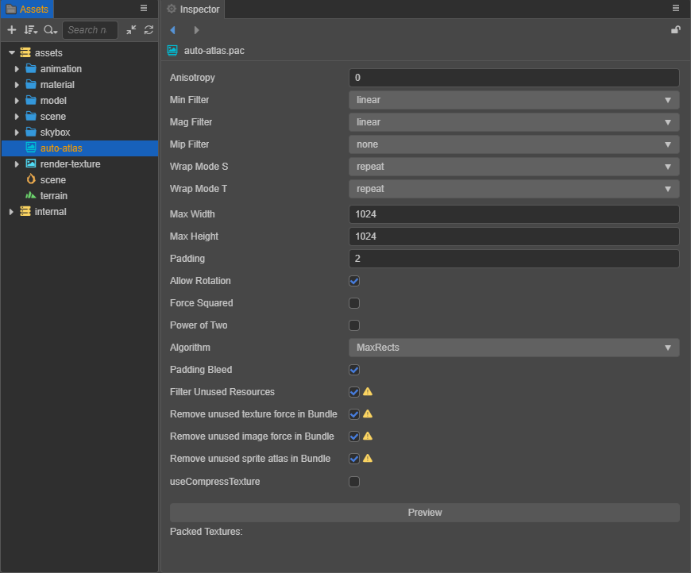

# Auto Atlas

**Auto Atlas** is the picture-combining method that comes as part of Cocos Creator. **Auto Atlas** packs a specified series of images into a __sprite sheet__. This capability is very similar to the function of __Texture Packer__.

## Creating Auto Atlas Assets

Create a new **auto-atlas.pac** resource in the **Assets** panel by clicking the **+** Create button in the upper left corner and then selecting **Auto Atlas**.

**AutoAtlas** will pack all **SpriteFrame** assets in the same folder into a big **Sprite Atlas** asset during the build process. We might add other ways to choose assets for packing in the future. If the original **SpriteFrame** asset have been configured, then all configurations will be preserved.

## Configuring Auto Atlas Assets

After selecting an **Auto Atlas Resource** in the __Assets__ panel, the **Inspector** panel will display all of the configurable items for the **Auto Atlas Resource**.

| Property | Functional Description
| :-------------- | :----------- |
| **Max Width** | Single atlas maximum width |
| **Max Height** | Maximum Height of a single atlas |
| **Padding** | Spacing between shreds in the atlas |
| **Allow Rotation** | Whether rotate fragments |
| **Force Squared** | Whether to force the size of the atlas to be square |
| **Power of Two** | Whether to set the size of the atlas to a multiple of a square |
| **Algorithm** | Atlas packaging strategy, currently only one option `MaxRects` |
| **Padding Bleed** | Expand a pixel outer frame outside the border of the broken image, and copy the adjacent broken image pixels to the outer frame. This feature is also called **Extrude**. |
| **Filter Unused** | If this option is checked, unreferenced assets will not be included when building. This option only takes effect after the build.

The rest of the properties are the same as Texture, please refer to the [Texture](./texture.md#sub-asset-texture2d-properties-panel) documentation for details.

After the configuration is complete, click the **Preview** button to preview the packaged results. The related results generated according to the current automatic atlas configuration will be displayed in the area below the **Inspector** panel.

> **Note**: after each configuration, re-click **Preview** to update the preview image. (Generating a preview is not required).

The results are divided into:

- __Packed Textures__: Display the packaged atlas pictures and picture-related information. If there are multiple pictures to be generated, they will be listed below in the **Inspector** panel.
- __Unpacked Textures__: Display the broken image assets that cannot be packed into the atlas. The cause may be that the size of these broken image assets is larger than the size of the atlas assets. At this time, the configuration or fragmentation of the following atlas may need to be adjusted. The size of the figure is increased.

## Generating an Atlas

When inside the editor or previewing the project __Cocos Creator__ is directly using the split **SpriteFrame** assets, only after you build the project with the option **AutoAtlas** enabled, the **Atlas** asset will be generated and be used instead of all split assets.

In general, after **Atlas** asset is generated, the **Texture2D** assets and **Image** assets related by the original split assets will be deleted in the package. The following two special cases will have special process:

1. When **Atlas** asset is in a `resources` directory, the **Texture2D** assets and Image assets related by the original **SpriteFrame** assets in the **AutoAtlas** asset's directory will also be generated.

2. When any **Texture2D** asset depended by **SpriteFrame** assets in the **Atlas** asset's folder is directly used by another asset, the dependent **Texture2D** asset and **Image** asset will also be generated.

The two situations above will increase the package size, please do not use an **Atlas** like this unless necessary, **Builder** will also produce a console warning to prompt you to consider your package size.
