# Asset Bundle Overview

> Author: Santy-Wang, Xunyi

Starting with v2.4, Creator officially supports **Asset Bundle**. The Asset Bundle is a modular resource tool that allows developers to divide the resources such as textures, scripts, scenes, etc. into different Asset Bundles according to the project requirements. Then, as the game runs, load different Asset Bundles as needed to minimize the number of resources to be loaded at startup. thus reducing the time required for the first download and loading of the game.

The Asset Bundle can be placed in different places as needed, such as on a remote server, locally, or in a subpackage of a mini game platform. 

## The built-in Asset Bundle

In addition to the custom Asset Bundle, there are three built-in Asset Bundles in the project, which like other custom Asset Bundles, can be configured for different platforms.


| Built-in Asset Bundle | Function Explanation | Configuration |
| :--------------- | :--------- | :-------- |
| `main`        | Store all scenes checked in the **Included Scenes** selection box of the **Build** panel and their dependent resources  | By configuring the **Main Bundle Compression Type** and **Main Bundle Is Remote** options of the **Build** panel. |
| `resources`   | Store all resources in the `resources` directory and their dependent resources  | By configuring the `assets -> resources` folder in the **Assets** panel. |
| `start-scene` | If you check the **Start Scene Asset Bundle** option in the **Build** panel, the first scene will be built into the `start-scene` folder. | Cannot be configured. |
| `internal`    | Some default resources built into the engine module | Cannot be configured. |

After the build, the built-in Asset Bundle will be generated in different locations depending on the configuration, see the [Configure the Asset Bundle](bundle.md#configuration) documentation for the configuration methods and generation rules.

The built-in Asset Bundle is loaded in `application.js`, and you can modify the code in `application.js` by using the custom build template feature, as shown below.

```typescript
// ...

function loadAssetBundle (hasResourcesBundle, hasStartSceneBundle) {
    let promise = Promise.resolve();
    const mainBundleRoot = 'http://myserver.com/assets/main';
    const resourcesBundleRoot = 'http://myserver.com/assets/resources';
    const bundleRoot = hasResourcesBundle ? [resourcesBundleRoot, mainBundleRoot] : [mainBundleRoot];
    return bundleRoot.reduce((pre, name) => pre.then(() => loadBundle(name)), Promise.resolve());
}

function loadBundle (name) {
    return new Promise((resolve, reject) => {
        assetManager.loadBundle(name, (err, bundle) => {
            if (err) {
                return reject(err);
            }
            resolve(bundle);
        });
    });
}
```

## Configuration

The custom Asset Bundle is configured in **folders**. When we select a folder in the **Assets** panel, the **Properties** panel will show a **Is Bundle** option, if set, the folder-related configuration options will appear:


| Configuration Options | Function Explanation |
| :---  | :---- |
| **Bundle Name**      | The name of the Asset Bundle after it is built, which will use the name of this folder by default, can be modified as needed.  |
| **Bundle Priority**  | Creator opens up 20 configurable priorities, and the Asset Bundle will be built in descending order of priority. For more detail, see [Asset Bundle -- Priority](bundle.md#priority) documentation. |
| **Target Platform**  | An Asset Bundle can have different settings on different platforms and the editor will choose the corresponding setting at build time. |
| **Compression Type** | Determines the final output form of the Asset Bundle, including the five compression types **Merge Depend**, **None**, **Merge All JSON**, **Mini Game Subpackage** and **Zip**. For more detail, see [Asset Bundle -- Compression Type](bundle.md#compression-type) documentation. |
| **Is Remote Bundle** | Whether to configure the Asset Bundle as a remote package and not support the Web platform.<br>If checked, the Asset Bundle will be placed in the **remote** folder after the build, and you will need to place the entire **remote** folder on the remote server.<br>When building mini game platforms such as OPPO, vivo, Huawei, etc., the Asset Bundle will not be packaged into rpk if this option is checked. |
| **Bundle Filter Config** | Use **Bundle Filter Config** to filter some assets in a bundle, and to preview the assets in the bundle by clicking on the **Preview** button. For more, see [Bundle Filter Config](./bundle.md#Bundle%20Filter%20Config) below. |
| **Build Bundle** | Click to build the selected or specified bundle. For [more](./bundle#Build%20Bundle) |

After the configuration, click the **green tick button** at the top right of the panel, and the folder will be configured as an Asset Bundle, then select the corresponding platform in the **Build** panel to build.

> **Notes**:
>
> 1. There are three [built-in Asset Bundles](bundle.md#the-built-in-asset-bundle) in Creator, including **internal**, **resources**, **main** and **start-scene**. When setting the **Bundle Name**, **do not** use these three names.
> 2. The [mini game subpackage](../editor/publish/subpackage.md) can only be placed locally and cannot be configured as remote packages. So the **Is Remote Bundle** option cannot be checked when the compression type is set to **Mini Game Subpackage**.
> 3. The Zip compression type is primarily used to reduce the number of network requests and is used by default with the **Is Remote Bundle** option. Since the package doesn't need network requests if it's local, there's no need to use Zip compression.
> 4. The folder configuration set to Bundle is used as a collection of options for the Asset Bundle and we do not recommend that you place all assets in it very directly. Similar to the previous version of resources, the Bundle configuration folder should preferably hold entry assets such as Scene, Prefab, or assets that need to be dynamically loaded within the script, and the final build phase will export all referenced assets based on dependencies to eventually populate the entire Asset Bundle.In this way, unnecessary resource exports can be minimized.

## Priority

When the folder is set to Asset Bundle, the resources in the folder and the related dependent resources outside the folder are merged into the same Asset Bundle. It is possible to have a resource that is not in the Asset Bundle folder, but belongs to both Asset Bundles, because it is depended upon by both Asset Bundles. As shown in the figure:


Another possibility is that a resource is in one Asset Bundle folder, but is also depended upon by other Asset Bundles. As shown in the figure:


In both cases, `resource c` belongs to both `Asset Bundle A` and `Asset Bundle B`. So which Asset Bundle does `resource c` actually exist in? This needs to be specified by adjusting the priority of the Asset Bundle.<br>
Creator opens up 20 configurable priorities, and the editor will build the Asset Bundle in **descending order** of priority at build time.

- When the same resource is referenced by multiple Asset Bundles with **different priorities**, the resource will be placed in the high-priority Asset Bundle, while the lower-priority Asset Bundle stores only one record message. In this case the lower-priority Asset Bundle relies on the higher-priority Asset Bundle.<br>
If you want to load this shared resource in a lower-priority Asset Bundle, you must load the higher-priority Asset Bundle before loading the lower-priority Asset Bundle.

- When the same resource is referenced by multiple Asset Bundles of the **same priority**, the resource will be copied in each Asset Bundle, with no dependencies between the different Asset Bundles, and they can be loaded in any order. So try to make sure that the Asset Bundle that the shared resource (e.g.: `Texture`, `SpriteFrame`, `Audio`, etc.) is in has a higher priority, so that more lower-priority Asset Bundles can share resources, thus minimizing the package size.

The four built-in Asset Bundle folders are prioritized as follows:

| Asset Bundle | Priority |
| :--- | :--- |
| `main`        | 7  |
| `resources`   | 8  |
| `start-scene` | 20 |
| `internal`    | 21 |

When the four built-in Asset Bundles contain the same resources, the resources are stored in the higher priority Asset Bundle. It is recommended that other custom Asset Bundle priorities are not higher than the built-in Asset Bundle, so that the resources in the built-in Asset Bundle can be shared whenever possible.

## Compression Type

Creator currently provides **Merge Depend**, **None**, **Merge All Json**, **Mini Game Subpackage**, and **Zip** compression types for optimizing the Asset Bundle. All Asset Bundles use the **Merge Depend** compression type by default, and you can reset the compression type for all Asset Bundles including the built-in Asset Bundle.

| Compression Type | Function Explanation |
| :------ | :------ |
| **Merge Depend**   | When building the Asset Bundle, JSON files for interdependent resources are merged together to reduce the number of load requests at runtime. |
| **None**           | When building the Asset Bundle, there is no compression operation. |
| **Merge All Json** | When building the Asset Bundle, the JSON files for all resources are merged into one, which minimizes the number of requests, but may increase the load time for a single resource. |
| **Mini Game Subpackage** | On a mini game platform that provides subpackaging, the Asset Bundle will be set as a subpackage of the mini game. |
| **Zip**            | On some mini game platforms, the resource file will be compressed into a Zip file when building the Asset Bundle, reducing the number of load requests at runtime. |

If you use different compression types for the Asset Bundle on different platforms, then the Asset Bundle will be built according to the settings of the corresponding platform.

## Building of the Asset Bundle

At build time, resources (including scenes, code, and other resources) in the folder configured as an Asset Bundle, as well as relevant dependent resources outside the folder, are merged into the same Asset Bundle folder. For example, if "scene A" is placed in "folder a", when "folder a" is configured as an Asset Bundle, "scene A" and its dependent resources will be merged into the "Asset Bundle a" folder.

All the **code** and **resources** in the folder configured as the Asset Bundle are treated as follows.

- **Code**: All the code in the folder is merged into an entry script file named `index.js` or `game.js`, depending on the release platform, and removed from the main package.
- **Resources**: All resources in the folder and the related dependent resources outside the folder are placed in the `import` or `native` directory.
- **Resource Configuration**: All resource configuration information including path, type, and version information is merged into a file named `config.json`.

The structure of the Asset Bundle directory generated after build is shown below:


After building, the Asset Bundle folder will be packaged into the **assets** folder in the release package directory of the corresponding platform. However, there are two special cases.

- If the **Is Remote Bundle** option is checked when configuring the Asset Bundle, this Asset Bundle folder will be packaged into the **remote** folder in the release package directory of the corresponding platform.
- If the **Compression Type** is set to **Mini Game Subpackage** when configuring the Asset Bundle, this Asset Bundle folder will be packaged into the **subpackages** folder in the release package directory of the corresponding platform.

Each folder contained within these three folders **assets**, **remote** and **subpackages** is an Asset Bundle.

**For example**, if the **cases/01_graphics** folder in the [example-case](https://github.com/cocos/cocos-example-projects) is configured as an Asset Bundle on the Web Mobile platform, then after the project is built, a **01_graphics** folder is generated in the **assets** folder in the release package directory, and the **01_graphics** folder is an Asset Bundle.


### Scripts in the Asset Bundle

The Asset Bundle supports script subpackaging. If your Asset Bundle includes the script files, then all the scripts will be merged into a single **js** file and removed from the main package. When loading the Asset Bundle, this **js** file will be attempted to be loaded.

> **Notes**:
> 1. Some platforms do not allow the loading of remote script files, such as the WeChat Mini Game, and Creator will copy the code of the Asset Bundle to the `src/bundle-scripts` directory to ensure normal loading.
> 2. It is recommended that scripts in the different Asset Bundles do not reference each other, otherwise you may not find the corresponding script at runtime. If you need to reference certain classes or variables, you can share them by exposing them in your own global namespace.

## Load the Asset Bundle

The engine provides a unified API `assetManager.loadBundle` to load the Asset Bundle, which you need to pass in either the Asset Bundle's **URL** or the **Bundle Name** set in the Asset Bundle configuration panel, but if you want to reuse Asset Bundles from other projects, you can only do so through the **URL**. The usage is as follows:

```typescript
assetManager.loadBundle('01_graphics', (err, bundle) => {
    bundle.load('xxx');
});

// Reuse Asset Bundles from other projects
assetManager.loadBundle('https://othergame.com/remote/01_graphics', (err, bundle) => {
    bundle.load('xxx');
});
```

`assetManager.loadBundle` also supports loading an Asset Bundle from user space with the path in user space. Use the download interface provided by the corresponding platform to pre-download the Asset Bundle into your user space and then use `loadBundle` to load it, so that you can manage the download and cache process of the Asset Bundle by yourself.

```typescript
// Download an Asset Bundle in advance to the "pathToBundle" directory in your user space, and it's necessary to ensure 
// that the structure and content of the Asset Bundle in your user space is identical to that of the original Asset Bundle.
// ...

// Load with the path of the Asset Bundle in user space
// On native platform
assetManager.loadBundle(jsb.fileUtils.getWritablePath() + '/pathToBundle/bundleName', (err, bundle) => {
    // ...
});

// On WeChat Mini Game
assetManager.loadBundle(wx.env.USER_DATA_PATH + '/pathToBundle/bundleName', (err, bundle) => {
    // ...
});
```

> **Note**: if you check the **Is Remote Bundle** option when configuring the Asset Bundle, then please fill in the **Resource Server Address** in the **Build** panel when building.

When you load the Asset Bundle via the API, instead of loading all the resources in the Asset Bundle, the engine loads the Asset Bundle's **resource manifest** and **all the scripts** it contains.<br>
When the Asset Bundle is loaded, the engine triggers a callback and returns an error message and an instance of `AssetManager.Bundle` class, which is the main entrance of the Asset Bundle API that can be used to load the various resources in the Asset Bundle.

### Versions of the Asset Bundle

Asset Bundle continues the MD5 scheme of Creator for updates. When you need to update the Asset Bundle on the remote server, check the **MD5 Cache** option in the **Build** panel. Then the filename of the `config.json` in the built Asset Bundle will come with a Hash value. As shown in the following figure:


It is not necessary to provide an additional Hash value when loading the Asset Bundle, Creator will search for the corresponding Hash value in the `settings.json` and make adjustments automatically.<br>
However, if you want to store the relevant version configuration information on the server and dynamically fetch the version information at startup for hot updates, you can manually specify a version Hash value and pass in the `loadBundle`, and the Asset Bundle will be built based on the incoming Hash value:

```typescript
assetManager.loadBundle('01_graphics', {version: 'fbc07'}, function (err, bundle) {
    if (err) {
        return console.error(err);
    }
    console.log('load bundle successfully.');
});
```

Then bypass the old version files in the cache and redownload the latest version of the Asset Bundle.

## Load the resources in the Asset Bundle

After the Asset Bundle is loaded, the engine returns an instance of `AssetManager.Bundle` class. Load the resources in the Asset Bundle by using `load` method of the instance, which has the same arguments as the `resources.load`, you just need to pass in the path of the resource relative to the Asset Bundle, and the end of the path **must not** contain the file extension.

```typescript
// Load Prefab
bundle.load(`prefab`, Prefab, function (err, prefab) {
    let newNode = instantiate(prefab);
    director.getScene().addChild(newNode);
});

// Load Texture
bundle.load(`image/texture`, Texture2D, function (err, texture) {
    console.log(texture)
});
```

Like the `resources.load`, the `load` method also provides a type parameter, which is useful for loading resources with the same name or loading a SpriteFrame.

```typescript
// Load SpriteFrame
bundle.load(`image/spriteFrame`, SpriteFrame, function (err, spriteFrame) {
    console.log(spriteFrame);
});
```

### Bulk load resources

The Asset Bundle provides `loadDir` method to bulk load multiple resources in the same directory. The arguments of this method are similar to the `resources.loadDir`, you just need to pass in the path of the directory relative to the Asset Bundle.

```typescript
// Load all resources in the "textures" directory
bundle.loadDir("textures", function (err, assets) {
    // ...
});

// Load all Texture resources in the "textures" directory
bundle.loadDir("textures", Texture2D, function (err, assets) {
    // ...
});
```

### Load scenes

The Asset Bundle provides `loadScene` methods for loading scenes from the specified bundle, you just need to pass in the **scene name**.<br>
The difference between `loadScene` and `director.loadScene` is that `loadScene` will only load the scene from the specified bundle and will not run the scene, you also need to use `director.runScene` to run the scene.

```typescript
bundle.loadScene('test', function (err, scene) {
    director.runScene(scene);
});
```

## Get the Asset Bundle

After the Asset Bundle has been loaded, it will be cached, and the name can be used to get the Asset Bundle. For example:

```typescript
let bundle = assetManager.getBundle('01_graphics');
```

## Preload resources

In addition to scenes, other resources can also be preloaded. The loading arguments for preloading are the same as for normal loading, but because preloading only downloads the necessary resources, and does not perform the resources' deserialization and initialization, so it consumes less performance and is suitable for use during gameplay.

The Asset Bundle provides `preload` and `preloadDir` interfaces to preload the resources in the Asset Bundle, which are used in the same way as the `assetManager`, see [Loading and Preloading](preload-load.md) documentation for details.

## Release resources in the Asset Bundle

After loading the resources, all the resources are temporarily cached in `assetManager` to avoid reloading. Of course, the resources in the cache also occupy memory, and some resources you can release in the following three ways if they are no longer needed:

1. Use the regular `assetManager.releaseAsset` method for release.

    ```typescript
    bundle.load(`image/spriteFrame`, SpriteFrame, function (err, spriteFrame) {
        assetManager.releaseAsset(spriteFrame);
    });
    ```

2. Use `release` method provided by the Asset Bundle, then pass in the path and type to release resources, but can only release the single resource in the Asset Bundle. The arguments can be the same as those used in the `load` method of the Asset Bundle.

    ```typescript
    bundle.load(`image/spriteFrame`, SpriteFrame, function (err, spriteFrame) {
        bundle.release(`image`, SpriteFrame);
    });
    ```

3. Use `releaseAll` method provided by the Asset Bundle, which is similar to the `assetManager.releaseAll`, but the `releaseAll` will release all resources that belong to the Asset Bundle (including resources in the Asset Bundle and the related dependent resources outside the Asset Bundle), so please use caution.

    ```typescript
    bundle.load(`image/spriteFrame`, SpriteFrame, function (err, spriteFrame) {
        bundle.releaseAll();
    });
    ```

> **Note**: when releasing a resource, Creator will automatically handle the resource's dependent resources, and you don't need to manage their dependency resources.

For more information about releasing resources, see [Release of Resources](release-manager.md) documentation.

## Remove the Asset Bundle

After the Asset Bundle is loaded, it will remain in the entire gameplay, unless you manually remove it from the game. When an unneeded Asset Bundle is manually removed, the cache for the bundle is also removed. If you need to use it again, you must reload it again.

```typescript
let bundle = assetManager.getBundle('bundle1');
assetManager.removeBundle(bundle);
```

> **Note**: when you destroy an Asset Bundle, the resources already loaded in the bundle are not released. If you need to release it, use the Asset Bundle's `release`/`releaseAll` method first.

```typescript
let bundle = assetManager.getBundle('bundle1');
// Releases a single resource in the Asset Bundle.
bundle.release(`image`, SpriteFrame);
assetManager.removeBundle(bundle);

let bundle = assetManager.getBundle('bundle1');
// Releases all resources belonging to the Asset Bundle.
bundle.releaseAll();
assetManager.removeBundle(bundle);
```

## Bundle Filter Config

The **Build Filter Config** allows you to config the selected bundle, and choose which asset should be included or excluded from the bundle.

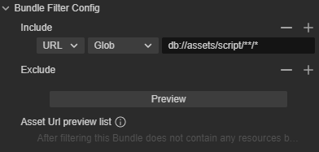

### Filter Type

There are two types of the filter, **Asset** and **URL**, the default value is **URL**.

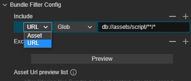

- **Asset**: Take an asset as a filter type. Drag an asset from the **Assets** panel or click the lock button 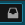  to select one.
- **ULR**: Filter all assets in the selected bundle according to one of the four rules including **Glob Expression**, **Begin With**, **End With**, and **Containing**. After the rule is set, type any string in the right input-box to filter assets.

    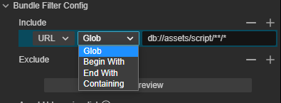

| Rule | Description |
| :---| :---|
| **Glob** | Glob Expression which can be referred by [npm](https://www.npmjs.com/package/glob).|
| **Begin With** | Filter all assets begin with what in the input-box |
| **End With** | Filter all assets end with what in the input-box |
| **Containing** | Filter all assets containing what in the input-box |

To add a new filter rule, clicking the "+" button on the right.
Click the "-" button to delete the last added or selected rule.

### Include

A **Include** rule will include all the assets it configs.

### Exclude

A **Exclude** rule will exclude all the assets meet the rule out of the bundle.

### Preview

Click the **Preview** button to preview all the assets in the bundle.

## Build Bundle

Since v3.8, Cocos Creator supports the Build Bundle feature which allows the users can build a specified bundle instead of build all the asset bundles.

To open the **Build Bundle** panel, after selecting a bundle, click the **Build Bundle** button at the bottom of the **Inspector** panel.

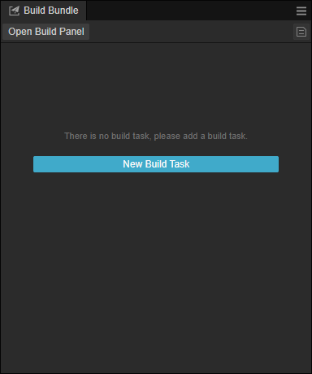

You need have at least one build task to build a bundle. Click the **Open Build Panel** button to create a new build task.

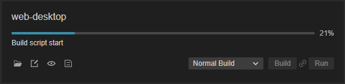

After a build task is created, now you can see the build bundle panel.

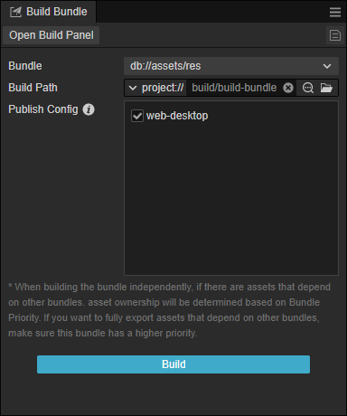

Select a bundle from the drop-down list, and click the **Build** button at the bottom, and the Bundle will be built to the specified **Build Path**.

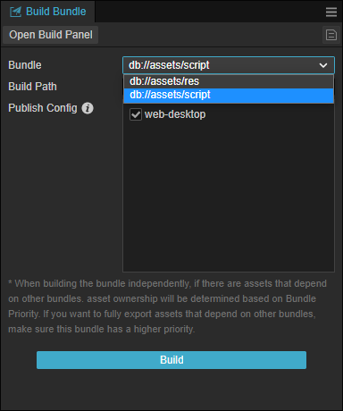

There are to types of **Build Path**.

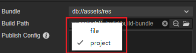

- file: The absolute path of the output bundle.
- project：A related path based on the project.


To select a different path, click the selected button , or after the build task finished, use the open button  to locate the output directory.。

Select platforms to build on the **Publish Config** list.

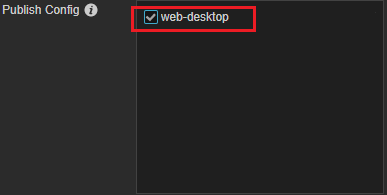

After clicking the **Build** button, it can be cancelled by clicking on the **Cancel** button.

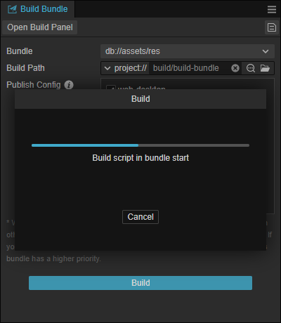

This feature is designed for the big projects or some time-consuming bundles. Developers can build these bundles separately to reduce the build time.

## FAQ

- **Q**: What is the difference between Asset Bundle and resource subpackage?<br>
  **A**:
  1. Resource subpackage is actually splitting out some textures, meshes into a separate packages, but the package is incomplete and illogical and cannot be reused.<br>
  while Asset Bundle is modularizing resources through logical division. The Asset Bundle includes resources, scripts, metadata and resource lists, so it is complete, logical and reusable, and we can load an entire scene or any other resources from Asset Bundle. By splitting the Asset Bundle, you can greatly reduce the number of `json` and the size of `settings.json` in the first package.

  2. Resource subpackage is essentially a basic function controlled by the mini game platform. For example, the WeChat Mini Game supports subpackage, and then Creator made a layer of encapsulation on top of that to help the developers set up resource subpackage. If the WeChat Mini Game doesn't support subpackage anymore, neither does Creator.<br>
  While the Asset Bundle is designed and implemented entirely by Creator, it is a modular tool to help developers divide their resources, independent of the platform, and can theoretically be supported on all platforms.

  3. Resource subpackage is related to the platform, meaning that it needs to be set up in the way required by the platform. For example, the subpackage of the WeChat Mini Game cannot be placed on the remote server, and can only be placed on Tencent's server.<br>
  While the Asset Bundle doesn't have these restrictions, the Asset Bundle can be placed locally, on a remote server, or even in a subpackage of the WeChat Mini Game.

- **Q**: Does the Asset Bundle support the lobby plus sub games mode?<br>
  **A**: Absolutely, subgame scenes can be placed in the Asset Bundle and loaded when needed, and subgames can even be pre-built as an Asset Bundle in other projects and then loaded for use in the main project.

- **Q**: Can the Asset Bundle reduce the size of `settings.json`?<br>
  **A**: Absolutely. In fact, as of v2.4, the packaged project is entirely based on the Asset Bundle, and the `settings.json` no longer stores any configuration information related to the resource, all configuration information are stored in the `config.json` of each Asset Bundle. Each `config.json` stores only the resource information in the respective Asset Bundle, which reduces the size of the first package. This can simply be understood as all the `config.json` combined equal to the previous `settings.json`.

- **Q**: Does the Asset Bundle support cross project reuse?<br>
  **A**: The current version supports it, but we **do not recommend reusing **across projects. As the engine is updated and iterated, this can create all kinds of compatibility issues. cross-project reuse requires the following conditions to be met for now:
  1. The engine version is the same
  2. All scripts referenced in the Asset bundle are placed under the Asset bundle.
  3. The Asset Bundle has no other external dependency bundle, and if it does, it must be loaded.
  4. No reuse of scripts between Asset Bundles where possible<br><br>

- **Q**: Does the Asset Bundle support split first scene?<br>
  **A**: Currently only supported on mini game platforms. You can check the **Start Scene Asset Bundle** in the **Build** panel and the first scene will be put into the `start-scene` of the built-in Asset Bundle to separate the first scene.

- **Q**: Does the Asset Bundle support nesting? For example, if there is a folder B in folder A, can both A and B be set as Asset Bundle?<br>
  **A**: Asset Bundle does not support nesting, please avoid using it as such.

- **Q**: Why might placing an atlas inside an Asset Bundle cause the package to grow larger?
  **A**：**When an atlas is placed in Bundle, by default the SpriteAtlas itself, the image of the atlas, the small image  in the atlas folder, etc., may be loaded by the script, and all the resources contained in the Bundle will be packaged according to the established rules**. Therefore, it is not recommended to put the atlas directly in the Bundle, but to package it naturally into the final Asset Bundle by reference to the resources in the Bundle. There are currently some culling configurations open on the atlas resources, so if you really need to place them in the Bundle folder, you can do so as needed.
