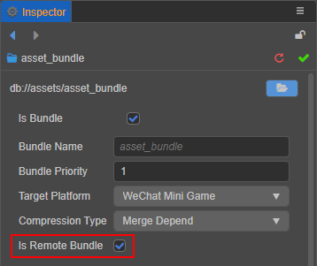
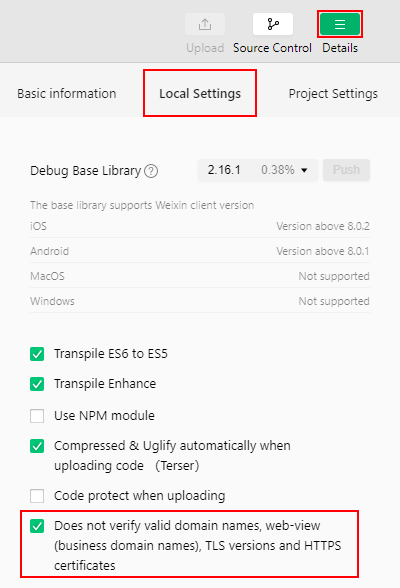

# Cache Manager

> Author: Santy-Wang, Xunyi

On the Web platforms, after resources are downloaded, the cache is managed by the browser, not the engine. <br/>
On some non-Web platforms, such as WeChat Mini Game, such platforms have a file system that can be used to cache some remote resources but do not implement a caching mechanism for the resources. In this case, the engine needs to implement a set of caching mechanisms to manage the resources downloaded from the network, including caching resources, clearing cached resources, querying cached resources, and other features.

Starting from v2.4, Creator provides a cache manager on all platforms with file systems to add, delete, and check caches, which can be accessed by developers through `assetManager.cacheManager`.

## Resource downloading, caching and versioning

The logic of downloading resources by the engine is as follows:

1. Determine whether the resource is in the game package, and if so, use it directly.

2. If not, query whether the resource is in the local cache, and if so, use it directly.

3. If not, query if the resource is in the temporary directory, and if so, use it directly (the native platform does not have a temporary directory, skip this step).

4. If not, download the resource from the remote server and use it directly after it is downloaded to the temporary directory (the native platform downloads the resource to the cache directory).

5. The backend slowly saves the resources in the temporary directory to the local cache directory to be used when accessed again (the native platform skips this step)

6. The resources will fail to be saved when the cache space is full, at which point the older resources will be deleted using the LRU algorithm (the native platform has no size limit on the cache space, so skip this step, and developers can manually invoke cleanup).

For the mini-game platform, once the cache space is full, all resources that need to be downloaded cannot be saved, and only resources downloaded and saved in the temporary directory can be used. And when quitting the mini-game, all temporary directories will be cleaned up, and when running the game again, these resources will be downloaded again, and so on and so forth.

> **Note**: the problem of file saving failure due to cache space exceeding the limit does not occur on WeChat Mini Game's **WeChat DevTools**, because WeChat DevTools does not limit the cache size, so testing the cache needs to be done in a real WeChat environment.

When the engine's **md5Cache** feature is enabled, the URL of the file will change with the content of the file, so that when a new version of the game is released, the resources of the old version will be naturally invalidated in the cache and only new resources can be requested from the server, which also achieves the effect of versioning.

### Uploading resources to a remote server

When the package is too large, it is necessary to upload resources to a remote server, please configure the Asset Bundle where the resources are located as a remote package. Next, taking the WeChat Mini Game as an example, and look at the specific steps:

1. Reasonably allocate resources, configure the resource folder that needs to be managed modularly as Asset Bundles, and check **Is Remote Bundle**. For additional details, please refer to the [Configure Asset Bundle](./bundle.md#configuration) documentation.

    

2. If the main bundle needs to be configured as a remote bundle, check **Main Bundle is Remote** in the **Build** panel.

3. Then check **MD5 Cache** in the **Build** panel, set **Resource Server Address**, and click **Build**. 

4. After the build is complete, upload the `remote` folder in the release package directory to the server which is filled in the previous step.

5. Delete the `remote` folder from the local release package directory.

> **Note**: During the testing phase of WeChat Mini Games, developers may not be able to deploy the project to the official server, and need to test it on the local server. Please open **Tools -> Details -> Local Settings** page in the menu bar of WeChat DevTools, and check the **Does not verify valid domain names, web-view (business domain names), TLS versions and HTTPS certificates** option.
> 
> 

### Querying cache files

The cache manager provides the `getCache` interface to query all cached resources, and developers can query the cache path by passing in the original path of the resource.

```typescript
resources.load('images/background/texture', Texture2D, function (err, texture) {
    const cachePath = assetManager.cacheManager.getCache(texture.nativeUrl);
    console.log(cachePath);
});
```

### Querying temporary files

When a resource is downloaded locally, it may be stored as a temporary file in a temporary directory. The cache manager provides the `tempFiles` interface to query all resources downloaded into the temporary directory, and developers can do so by passing in the original path of the resource.

```typescript
assetManager.loadRemote('http://example.com/background.jpg', function (err, texture) {
    const tempPath = assetManager.cacheManager.getTemp(texture.nativeUrl);
    console.log(tempPath);
});
```

## Caching resources

A number of parameters are provided in the cache manager to control the caching of resources:

- `cacheManager.cacheDir` -- controls the directory where the cached resources are stored.
- `cacheManager.cacheInterval` -- controls the period of caching a single resource, default 500 ms once.
- `cacheManager.cacheEnabled` -- controls whether to cache the resource, default is cache. Alternatively, developers can override the global setting by specifying the optional parameter `cacheEnabled`. Example:

  ```typescript
  assetManager.loadRemote('http://example.com/background.jpg', {cacheEnabled: true}, callback);
  ```

### Clearing cache resources

If the cache resource exceeds the limit and the developer needs to clear the resource manually, use `removeCache`, `clearCache`, `clearLRU` provided by the cache manager `cc.assetManager.cacheManager` to clear the cache resource.

- `clearCache` -- clears all cache resources in the cache directory, please use with caution.
- `clearLRU` -- clears the older resources in the cache directory. The mini-game platform will automatically call `clearLRU` when the cache space is full.
- `removeCache` -- clears a single cache resource. To use it, provide the original path of the resource. Example:

  ```typescript
  assetManager.loadRemote('http://example.com/background.jpg', function (err, texture) {
      assetManager.cacheManager.removeCache(texture.nativeUrl);
  });
  ```

When the developer upgrades the engine version, the cached resources left locally are still the resources corresponding to the previous old version of the engine and are not automatically cleared. This may lead to problems such as errors in loading or rendering of resources. There are two solutions:

1. Check the **MD5 Cache** option in the **Build** panel at build time, which will ensure that the latest version of resources are used.
2. Manually clear the previously cached resources.
    - Clear the cache with `cc.assetManager.cacheManager.clearCache()` on the **real device**.
    - For WeChat Mini Game, clear the cache by clicking **Tools -> Clear Cache -> Clear All** in the menu bar in **WeChat DevTools**.
