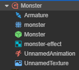

# Asset Loading

## Dynamic loading of resources

Usually we will place the resources that need to be dynamically loaded in the project in the `resources` directory, along with interfaces such as `resources.load` to load them dynamically. You just need to pass in the path relative to `resources` directory, and the end of the path **must not** contain the file extension.

```typescript
// load Prefab
resources.load("test assets/prefab", Prefab, (err, prefab) => {
    const newNode = instantiate(prefab);
    director.getScene().addChild(newNode);
});

// load AnimationClip
resources.load("test assets/anim", AnimationClip, (err, clip) => {
    this.node.getComponent(Animation).addClip(clip, "anim");
});
```

- All resources that need to be dynamically loaded by **script** must be placed in the `resources` folder or one of its subfolders. `resources` needs to be created manually in the `assets` folder and must be located in the `assets` root directory, like this:

  

  > The assets in the `resources` folder can refer to other assets outside the folder, and can also be referenced by external scenes or assets. When the project is built, all assets in the `resources` folder, along with assets outside the `resources` folder they are associated with, will be exported, in addition to the scenes that have been checked in the **Build** panel.
  >
  > If an asset is only depended on by other assets in the `resources` and does not need to be called directly by `resources.load`, then please don't put it in the `resources` folder. Otherwise, the size of `config.json` will increase, and useless assets in the project will not be automatically culled during the build process. At the same time, in the build process, the automatic merge strategy of JSON will also be affected, unable to merge the fragmented JSON as much as possible.

- The second to note is that compared to previous Cocos2d-JS, dynamic loading of resources in Creator is **asynchronous**, you need to get the loaded resources in the callback function. This is done because in addition to the resources associated with the scene, Creator has no additional resources preload list, and the dynamically loaded resources are really dynamically loaded.

  > **Note**: as of v2.4, the `loader` interface is deprecated, please use `assetManager` instead. You can refer to the [Asset Manager Upgrade Guide](asset-manager-upgrade-guide.md) documentation for details.

### Loading a SpriteFrame or a Texture2D

After the image is set to a spriteframe, texture or other image types, an asset of the corresponding type will be generated in the **Assets Panel**. But if `test assets/image` is loaded directly, and the type will be `ImageAsset`. You must specify the full path of sub asset, then the generated SpriteFrame can be loaded.

```typescript
// load a SpriteFrame, image is ImageAsset, spriteFrame is image/spriteFrame, texture is image/texture
resources.load("test assets/image/spriteFrame", SpriteFrame, (err, spriteFrame) => {
    this.node.getComponent(Sprite).spriteFrame = spriteFrame;
});
```

```typescript
// load a texture
resources.load("test assets/image/texture", Texture2D ,(err: any, texture: Texture2D) => {
    const spriteFrame = new SpriteFrame();
    spriteFrame.texture = texture;
    this.node.getComponent(Sprite).spriteFrame = spriteFrame;
});
```

> **Note**: if a __type__ parameter is specified, an asset of the specified type will be found under the path. When you are in the same path includes multiple names simultaneously under a resource (for example, contains both `player.clip` and `player.psd`), should need to declare types. When you need to get a "sub-asset" (such as getting the sub-asset __SpriteFrame__ of __ImageAsset__), you need to specify the path of the sub-asset.

### Load SpriteFrames from Atlas

For an atlas imported from a third-party tool such as Texturepacker, if you want to load the SpriteFrame, you can only load the atlas first, and then get the SpriteFrame. This is a special case.

```typescript
// load SpriteAtlas, and get one of them SpriteFrame
// Note Atlas resource file (plist) usually of the same name and a picture file (PNG) placed in a directory,
// So should need to in the second parameter specifies the resource type.
resources.load("test assets/sheep", SpriteAtlas, (err, atlas) => {
    const frame = atlas.getSpriteFrame('sheep_down_0');
    this.node.getComponent(Sprite).spriteFrame = frame;
});
```

### Load resources in the FBX or glTF model

After importing the FBX model or glTF model into the editor, it will parse out the related resources which includes meshes, materials, skeletons, animations, etc. contained in the model, as shown in the following figure.



It is possible to dynamically load a single resource in the model at runtime by simply specifying the path to a specific sub-resource, as follows.

```typescript
// Load the mesh in the model
resources.load("Monster/monster", Mesh, (err, mesh) => {
    this.node.getComponent(MeshRenderer).mesh = mesh;
});

// Load the material in the model
resources.load("Monster/monster-effect", Material, (err, material) => {
    this.node.getComponent(MeshRenderer).material = material;
});

// Load the skeleton in the model
resources.load("Monster/Armature", Skeleton, (err, skeleton) => {
    this.node.getComponent(SkinnedMeshRenderer).skeleton = skeleton;
});
```

### Resource bulk loading

`resources.loadDir` can load multiple resources under the same path:

```ts
// loading all resource in the test assets directory
resources.loadDir("test assets", function (err, assets) {
    // ...
});

// Load all SpriteFrames in the `test assets` directory and get their urls
resources.loadDir("test assets", SpriteFrame, function (err, assets) {
    // ...
});
```

## Preload resources

Starting with v2.4, in addition to scenes that can be preloaded, other resources can also be preloaded. Preloading has the same loading parameters as normal loading, but it will only download the necessary resources, and will not perform deserialization or initialization. Therefore, it consumes less performance and is suitable for use during the game.

`resources` provides `preload` and `preloadDir` for preloading resources.

```typescript
resources.preload('test assets/image/spriteFrame', SpriteFrame);
 // wait for while
resources.load('test assets/image/spriteFrame', SpriteFrame, (err, spriteFrame) => {
    this.node.getComponent(Sprite).spriteFrame = spriteFrame;
});
```

Use the preload related interface to load resources in advance, without waiting for the preload to finish. Then use the normal load interface to load, the normal load interface will directly reuse the content that has been downloaded during the preload process to shorten the load time.

For more information on preloading, please refer to the [Preloading and Loading](preload-load.md) documentation.

## How to load remote assets or files in device

Currently in Cocos Creator, we support loading the remote image files, which is very useful to load user picture from social network websites. To load files from such urls, you should call `assetManager.loadRemote`. At the same time the same API can be used to load resources on the local device storage. The `resources.load` APIs mentioned above only apply to the application package resources and hot update resources. Here is how to load remote assets and local
device files:

```typescript
// Remote texture url with file extensions
let remoteUrl = "http://unknown.org/someres.png";
assetManager.loadRemote<ImageAsset>(remoteUrl, function (err, imageAsset) {
    const spriteFrame = new SpriteFrame();
    const texture = new Texture2D();
    texture.image = imageAsset;
    spriteFrame.texture = texture;
    // ...
});

// Remote texture url without file extensions, then you need to define the file type explicitly
remoteUrl = "http://unknown.org/emoji?id=124982374";
assetManager.loadRemote<ImageAsset>(remoteUrl, {ext: '.png'}, function (err, imageAsset) {
    const spriteFrame = new SpriteFrame();
    const texture = new Texture2D();
    texture.image = imageAsset;
    spriteFrame.texture = texture;
    // ...
});

// Use absolute path to load files on device storage
let absolutePath = "/dara/data/some/path/to/image.png"
assetManager.loadRemote<ImageAsset>(absolutePath, function (err, imageAsset) {
    const spriteFrame = new SpriteFrame();
    const texture = new Texture2D();
    texture.image = imageAsset;
    spriteFrame.texture = texture;
    // ...
});

// Remote Audio
remoteUrl = "http://unknown.org/sound.mp3";
assetManager.loadRemote(remoteUrl, function (err, audioClip) {
    // play audio clip
});

// remote Text
remoteUrl = "http://unknown.org/skill.txt";
assetManager.loadRemote(remoteUrl, function (err, textAsset) {
    // use string to do something
});
```

There still remains some restrictions currently, the most important are:

1. This loading method supports only native resource types such as textures, audios, text, etc., and does not support direct loading and analysis of resources such as SpriteFrame, SpriteAtlas, TiledMap. (If you want to load all resources remotely, use the [Asset Bundle](bundle.md))
2. Remote loading ability on Web is limited by the browser's [CORS cross-domain policy restriction](https://developer.mozilla.org/en-US/docs/Web/HTTP/Access_control_CORS). If the server forbid cross-domain access, loading request will fail, and due to WebGL security policy restrictions, even if the server allows CORS http request, textures loaded can not be rendered.
