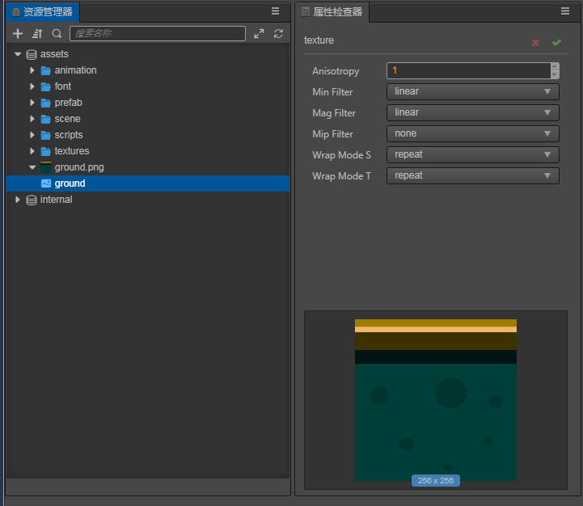
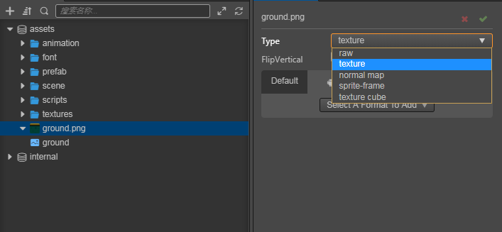

# Images

__Image__ assets are generally created using image processing software (such as __Photoshop__, __Paint__ on Windows, etc) and output into file formats that __Cocos Creator__ can use, currently including __JPG__、__PNG__、__BMP__、__TGA__、__HDR__、__WEBBP__、__PSD__、__PSD__、__TIF__、__TIFF__.

## Importing image assets

After importing images into __Cocos Creator__, they can be seen in __Assets__ panel.

The properties are described as follows:

| Property | Description |
| :--- | :--- |
| __useCompressTexture__ | Whether to use compressed texture.   For more information, please refer to [Texture Compression](compress-texture.md) |
| __Type__ | Used to set the type of image resources, including __raw__, __texture__(default), __normal map__, __sprite-frame__, __texture cube__. For more information, please refer to the following section: __Types of image assets__ |
| __Flip Vertical__ | Whether to flip the imported image vertically along the X axis |
| __Bake Offline Mimmaps__ | Whether to bake offline mipmaps |
| __Fix Alpha Transparency Artifacts__ | Fix alpha transparency artifacts   Fill transparent pixels with color of nearest solid pixel. These filled pixels would fix the dark halos at transparent borders of textures. Please turn on this option when you use the Alpha transparency channel in textures.  Only when  __texture__, __raw__, __sprite-frame__ or __texture cube__ take effect |
| __Is RGBE__ | Whether it is RGBE compression format.   This option only works if the __Type__ property is [TextureCube](texture.md#TextureCube) |

## Types of image assets

On the right side of the __Inspector__ panel, you can choose different ways to use the image asset. There are currently 4 ways to use it for developers, as shown below:

The details of each type of image asset are described in detail in the following sections:

- The raw type is the original picture type. It has no effect and users do not need to use it.
- The texture type is the image asset type, which is also the default type for import. For details, see: [Texture](texture.md)
- normal map type is normal map type
- The sprite-frame type is a sprite frame asset, which is used for 2D/UI production. For details, see: [SpriteFrame](sprite-frame.md)
- The texture cube type is a cube map type, which is used on the panorama to make a sky box. For details, see: [Sky Box](../concepts/scene/skybox.md#Modifytheenvironmentmapoftheskybox)

In the __Assets__ panel, a __triangle icon__ similar to a folder will be displayed on the left of the image. __Click__ to expand to see its __sub-assets__. After each image is imported, the editor will automatically create a __selected type__ asset of the same name. __Select__ the asset itself to __change the asset type__, __set the image flip__, and __set the quality__ of the image on each platform. For detailed descriptions of __sub-assets__, please refer to the [Sub-asset Properties Panel](texture.md#Sub-AssetTexture2D'sPropertyPanel) documentation.

