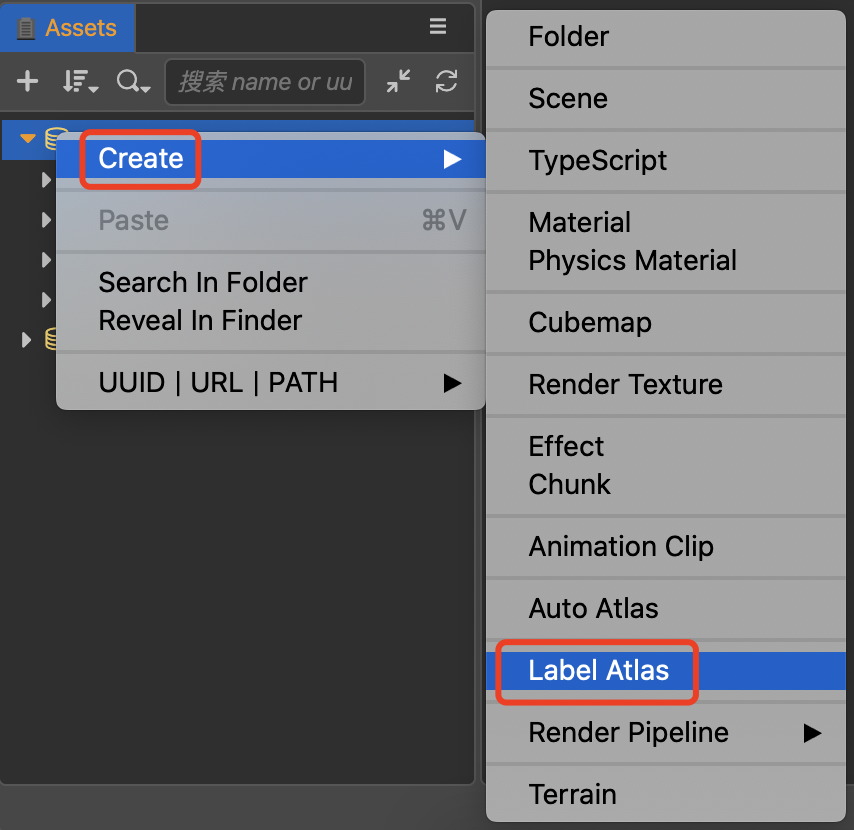
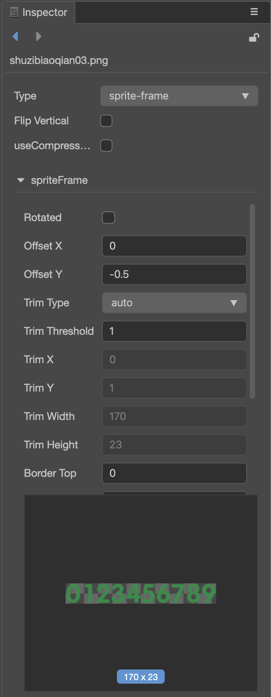
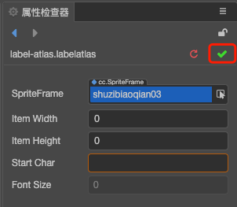

# LabelAtlas Asset

**LabelAtlas** asset is a user-defined asset, it's used for configuring a **LabelAtlas**.

## Create LabelAtlas Asset

In the **Assets** panel right-click on a folder, and click the context menu item **Create -> Label Atlas**. It will create a **LabelAtlas.labelatlas** asset.

Before using the **LabelAtlas** asset, it needs some configuration. Configure a pre-drawn picture that contains the font style, as shown below:

## Configuration of LabelAtlas asset

After selecting a **LabelAtlas** asset in the **Assets** panel, the **Inspector** panel will display all configurable properties for the **LabelAtlas** asset.

| Property       | Description
| :--------------   | :-----------
| **SpriteFrame**      | Specify a pre-drawn picture that contains the font style you want
| **Item Width**       | Specify the width of each character
| **Item Height**      | Specify the height of each character
| **Start Char**       | Specify the start char, even if the start char is a *space*, you also need insert a space. |

When the configuration is complete, click the tick button at the top right of the **Inspector** panel to save the settings.

## Using LabelAtlas asset

It's quite simple to use the **LabelAtlas** asset. Just setup a new Label component and drag the **LabelAtlas** asset to the **Font** property of the Label component. Please refer to the [Label Component](../ui-system/components/editor/label.md) documentation for details.
