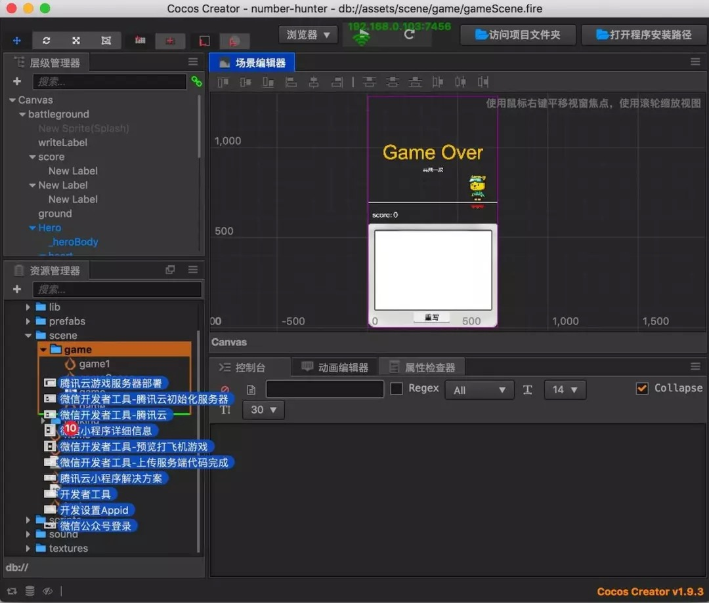
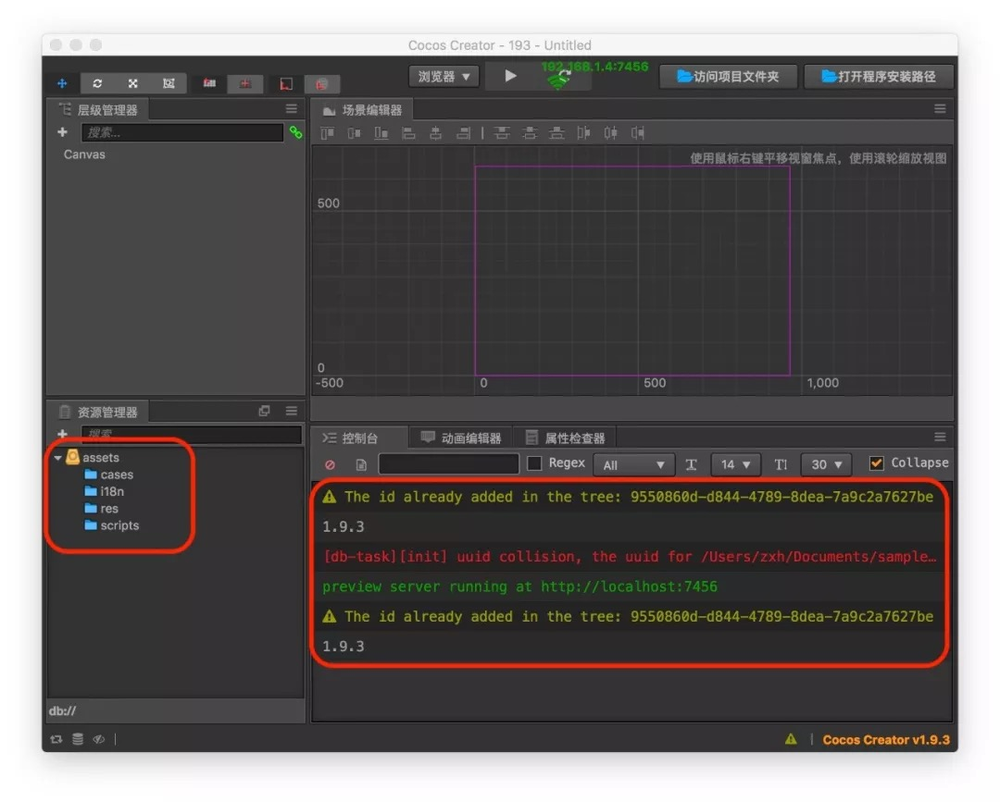
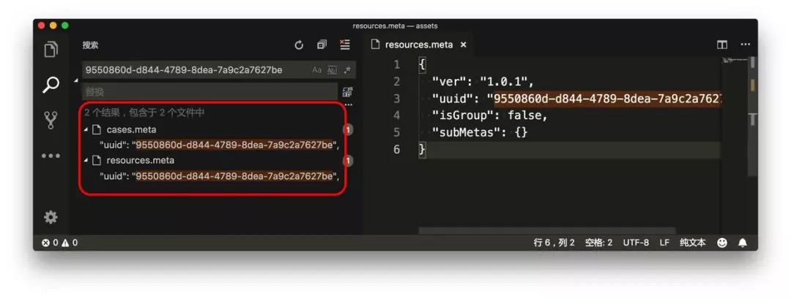

# Resource Management Considerations --- meta files

> **Note**: the full text of this article is reproduced from [WeChat Official Account: Quetta Planet [cn]](https://mp.weixin.qq.com/s/MykJaytb3t_oacude1cvIg), authorized by the author before reprinting<br>
> **Author**: Shawn Zhang

Cocos Creator will generate a **meta** file with the same name for every file and directory in the **assets** directory. Understanding the role and mechanics of Cocos Creator's generation of **meta** files can help developers solve resource conflicts, file loss, and missing component properties that are often encountered with team development. What is the **meta** file used for? Let's take a look!


## The Role of a Meta File

Let's first look at what the **meta** file looks like in the scene:

```json
{
  "ver": "1.0.0", //version
  "uuid": "911560ae-98b2-4f4f-862f-36b7499f7ce3", //global unique id
  "asyncLoadAssets": false, // asynchronous loading
  "autoReleaseAssets": false, // automatically release resources
  "subMetas": {} // child metadata
}
```

The **meta** file for the prefab is the same as the scene. Let's take a look at the **meta** file of the png image:

```json
{
   "ver": "1.0.0",
   "uuid": "19110ebf-4dda-4c90-99d7-34b2aef4d048",
   "type": "sprite",
   "wrapMode": "clamp",
   "filterMode": "bilinear",
   "subMetas": {
       "img_circular": {
       "ver": "1.0.3",
       "uuid": "a2d1f885-6c18-4f67-9ad6-97b35f1fcfcf",
       "rawTextureUuid": "19110ebf-4dda-4c90-99d7-34b2aef4d048",
       "trimType": "auto",
       "trimThreshold": 1,
       "rotated": false,
       "offsetX": 0,
       "offsetY": 0,
       "trimX": 0,
       "trimY": 0,
       "width": 100,
       "height": 100,
       "rawWidth": 100,
       "rawHeight": 100,
       "borderTop": 0,
       "borderBottom": 0,
       "borderLeft": 0,
       "borderRight": 0,
       "subMetas": {}
    }
  }
}
```

The **meta** file for the png image has more information. In addition to the **basic ver** and **UUID**UUID, it also records the width, height, offset, and borders of the image. There is a lot of information that is stored. **UUID** and it is particularly important.

> UUID: Universally Unique Identifier

**UUIDs** in Cocos Creator are used to manage the resources of the game. It assigns a unique id to each file. This means that in the Cocos Creator engine, identifying a file is not simply by `path + filename`, but by **UUID**. Therefore, you can delete and move files at will in **Asset Resource Management**.

## When will a meta file be updated

Cocos Creator generates **meta** files the following situations:

**1. when opening the project**

 When you open a project, Cocos Creator, scans the **assets** directory first, and if it does not have a **meta** file, one will be generated.

**2. when updating resources**

Updating resources also triggers updates to the corresponding **meta** files:

  - In **Assets**, you can modify the file name of a resource, change the directory a resource belongs in, delete resources, and add new resources. You can also drag files directly into **Assets** from your desktop  or the operating system's file manager. Please refer to [Assets](../getting-started/basics/editor-panels/assets.md).

  

  - Files in the `assets` directory can be added, deleted, changed, on your local **file-system**. When the changes are complete, switch to the Creator editor interface, where you can see the process of **Assets** panel refresh. The **Assets** panel is refreshed with each change, as to always show the current state of the resources.

  

If a file's **meta** file does not exist, the above two conditions will trigger the engine to generate a new **meta** file automatically.

## Meta File Error Cases And Solutions

Let's analyze several possible cases that produce a **meta** file error.

### UUID Conflict

**UUID** is globally unique. A conflict occurs if, by chance, two files have the same **UUID**. If this problem occurs, the Cocos Creator resource manager directory structure is incompletely loaded. As shown in the figure below, when this happens, the errors look scary:



**UUID** conflicts can be viewed from the **Console**, and then opened from your local file-system or favorite code editor. Once opened you can search for the conflicting **UUID**:



At this point, close the Cocos Creator editor then delete one of the meta files. Next, open the Cocos Creator editor.

Even though this method can solve the problem, if the resource is referenced in the editor, a resource loss will occur. This means the resource needs to be re-edited or reconfigured again. It is best to restore this **meta** file with the version management tool.

There are two reasons for this problem:

  - When moving files on the **file-system**, copying and pasting operations also result in the **meta** file also being copied. This causes two identical **meta** files to appear simultaneously in the project.

  - When you have multi-person collaboration, from the version management tool, when you update the resource, you may encounter that the **UUID** has been generated by someone else as well as by the file on your computer. This is a very rare occurence, but could still happen.

In general, to reduce the occurrence of **UUID** conflicts, it is best to add and move files in the Cocos Creator resource management tool.

### UUID Changes

Another situation is when the **UUID** has changed, so that the resources corresponding to the old **UUID** cannot be found. In this case, the interface you have edited will have the resources, but the pictures may be lost as well as the components properties may also be lost.


If you can't find the resources corresponding to the old **UUID**, you can see that Cocos Creator gives a very detailed warning message in the **console**. These details include the **scene file name**, **node path**, **component**, **UUID**, etc. The warning message allows you to quickly locate the error.

How is this situation caused exactly? When someone adds a new resource to the project, they forget to switch to the editor interface to generate a **meta** file, and at the same time submit the new file to version management (without the **meta** file). Then, another person updates the resources he/she submitted and switches to the editor interface for editing. At this point, Cocos Creator will check that the new resource is generated without a **meta** file. The **meta** file is also generated when the first person switches to the editor, so that the two people have the same file on the computer, but the **UUID** in the generated **meta** file is different.

In this case, those who submit or update resources later will certainly encounter conflicts. If they are unclear, they will forcibly resolve the conflicts, and the problems mentioned above will arise. The following sequence diagram depicts this erroneous workflow:


A classmate forgets to submit the **meta** file to version control. Other classmates then edit the project resulting in everyone having the file on their computer, each with a different **UUID**.

To solve this problem, note the following:

  - When submitting resources, pre-check for new files. If there are new documents, pay attention to whether **meta** files need to be submitted together.

  - When pulling files, pay attention to whether there are new files, and if there are **meta** files in pairs. If not, remind team-mates who submitted the files to submit the files and **meta** files together.

  - When submitting, if you find that there is only one new **meta** file, then the **meta** file must have been generated by yourself. You need to pay attention to whether the resource corresponding to the **meta** file (the file with the same name) has been used. If you haven't used it, please submit the **meta** file to the first submitter. Never submit this **meta** file.

Note that the above points can basically eliminate the engineering error caused by the **meta** file **UUID** change.

## Summary

The **meta** file is an important tool for Cocos Creator to use for resource management. It is easy to generate resource errors when it is slightly inadvertent in a multi-person collaborative development. To solve this problem, you not only need to understand the mechanism that generates the **meta** file but also the cause of the conflict. Proper thought and control of resource submission helps too.
