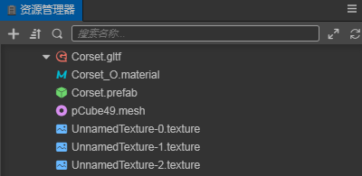
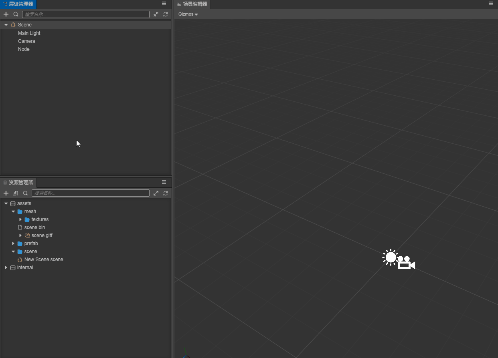
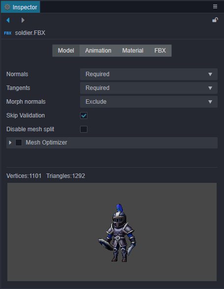
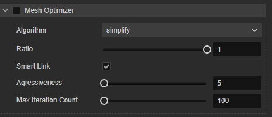
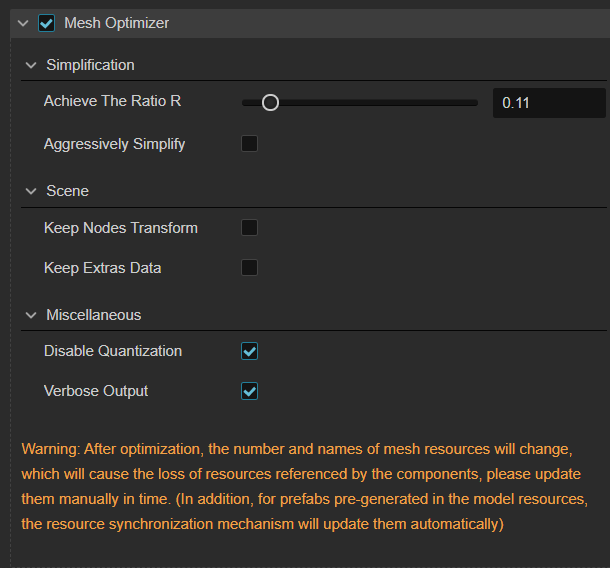
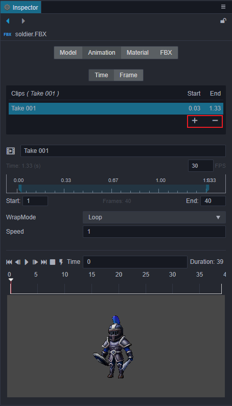
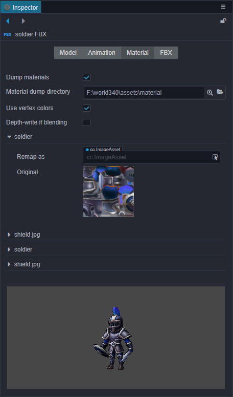
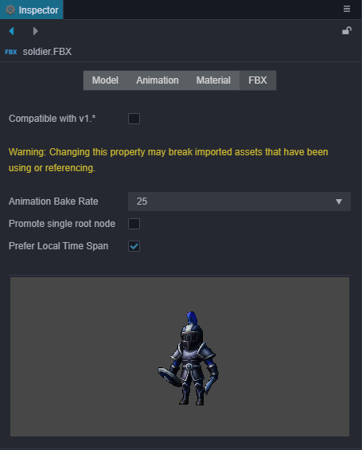

# Model Assets

Currently, Creator supports model files in __FBX__ and __glTF__ formats.

- FBX: FBX 2020 and earlier file formats are supported.
- glTF: glTF 2.0 and earlier file formats are supported, please refer to the [glTF models](./glTF.md) documentation for details.

For how to export these two model files from third-party tools, please refer to the [Importing Models Exported from DCC Tools](./dcc-export-mesh.md) documentation.

## Model Import

After importing into the editor, from the outside, the corresponding model asset file can be obtained in the __Assets__ panel. It's directory structure is as follows:

- The structure of a model file without animations is as follows:

  

- The structure of the model file that contains animations is as follows:

  

    - `.material` -- Material files
    - `.mesh` -- Model files
    - `.texture` -- Model texture files
    - `.animation` -- Model animation files
    - `.skeleton` -- Model bone files
    - `.prefab` -- Prefab files that are automatically generated on import

### Mesh File

Mesh File contains vertices, index, and texture coordinate data. When a mesh file is selected in the __Assets__, the __Inspector__ will show the information of the mesh, also the mesh can be previewed in the bottom panel.

| Property | Description |
| :-- | :-- |
| Vertices | number of vertices |
| Triangles | number of triangle |
| UV | indices of texture coordinate |
| MinPos | minimum position of mesh |
| MaxPos | maximum position of mesh |

## Using Models

After importing a __model__ file, drag the __root node__ of the __model__ file directly from the __Assets__ panel to the __node__ you want to place in the __Hierarchy__ panel to complete the node creation. At this point the model is successfully created in the scene.  
Alternatively, to expand the node of the __model__ file, select the `.prefab` file under the model file node, and drag it from the __Assets__ panel into the __Hierarchy__ panel to complete the creation.

## Model asset Properties

When the model asset file (`.fbx` or `.gltf`) is selected in the __Assets__ panel, the properties of the model asset can be set in the __Inspector__ panel.

### Model Module

| Property | Description |
| :--- | :--- |
| Normals | Normals import setting, including the following four options: 1. __Optional__: Import normals only if the model file contains normals. 2. __Exclude__: Do not import normals. 3. __Required__: Import normals that are contained in the model file, or recalculate if not contained. It is recommended to use this option if the model data itself is fine, without additional processing. 4. __Recalculate__: Recalculate normals and import, ignoring whether if the model file contain normals. Selecting this option will increase the calculated amount, but it will eliminate the subsequent problems caused by the absence of normalization of the model's original normal data. |
| Tangents | Tangents import setting, including Optional, Exclude, Require and Recalculate four options, option feature can refer to the description of __Normals__, the two are not very different. |
| Morph Normals | Import the deformation normal information, including:  __Optional__: Import only the deformation normals contained in the model file, for cases where you know your model data very well. __Exclude__: Not to import deformation normals. |
| Skip Validation | Skip validation of the model file. |
| Disable mesh split | Currently there is a joint-counting-based mesh splitting process during the import pipeline to workaround the max uniform vector limit problem for real-time calculated skeletal animation system on many platforms. This process has a preference impact on other runtime system too. So if it can be pre-determined that the real-time calculated skeletal animations (when `useBakedAnimation` option of the __SkeletalAnimation__ component is unchecked) will not be used, this option can be checked to improve preference. But note that toggling this would update the corresponding prefab, so all the references in the scene should be updated as well to accompany that.   Please refer to the following for details. |
| Allow Data Access| Identifies whether all mesh data in this model can be read or written. If unchecked, the grid data will be automatically released after it is committed to the CPU |
| Promote Single Root Node| If enabled and there is only one root node at the top of the model scene, then that node will be the root node of the Prefab, otherwise all root nodes of the scene will be the children of the Prefab |
| Mesh Optimizer | Used to optimize the model. See below for details |

### Disable Mesh Split

The policy for Disable mesh split in v3.6 is as follows：

- By default, the model is not split and no changes are made to the imported model data (the previous model settings are also maintained)
- If the number of bones does not exceed the actual runtime drive limit, pass it directly using uniform
- If the number of bones exceeds the limit, use texture pass

### Mesh Optimizer

| Properties | Description |
| :-- | :-- |
| __Algorithm__ | Optimization algorithm   __simplify__：[Github - Fast-Quadric-Mesh-Simplification](https://github.com/sp4cerat/Fast-Quadric-Mesh-Simplification) __gltfpack(deprecated)__：Deprecated, the implementation of this feature is based on  [Github - zeux/meshoptimizer](https://github.com/zeux/meshoptimizer)。  There is a known issue that the UV layout may be lost after faceting   Developers should pay attention to the warnings in the __Inspector__ panel to decide whether to use this option   For more information, please refer to the following figure |
| __Ratio__ | LOD Compress ratio |
| __Smart Link__ | To prevent broken surface |
| __Agressiveness__ | Error Distance |
| __Max Iteration Count__ | Max iteration count |

### LOD

The mesh importer will automatically take sub-meshes end with _lodN as a LOD node, if none, you can use the auto LOD by checking the LOD check box.

For more, please refer to [Level Of Details](../../editor/rendering/lod.md)。

### Animation Module

The above image is all the animation asset information under the current model, and the editing area of ​​the specific frame number information of the currently selected animation. You can change the animation name or perform simple animation cropping here. To do so:

- Click the __+__ button in the red box on the image to add an animation clip asset. The new file added by default copies a complete clip data. You can input the number of frames in the `Start` and `End` input box to crop the animation. (Drag and drop animation is not currently supported)

- Click the __-__ button in the red box on the image to delete the currently selected animation file

### Material Module

The top half of the properties are described below, while the bottom half shows the materials contained in the current model.

| Property | Description |
| :--- | :--- |
| Dump material | It is possible to customize or modify the material that comes with the model file. Enable this option to dump the material files in the file structure directory out of the model assets for modifying the materials. |
| Material dumper directory | Specify or view the directory location for the dumped files. |
| Use vertex colors | Whether to use vertex colors. |
| Depth-write if blending | Enable depth-write when Alpha mode is __Blend__. |

### FBX Module

| Property | Description |
| :--- | :--- |
| Animation Baking Rate | Units are __frames per second__ and options include __auto__, __24__, __25__, __30__ and __60__. |
| Promote single root node | When this option is enabled, if the FBX asset contains a scene with only one root node, that root node will be used as the root node of the prefab when converting the FBX scene to a Creator's prefab. Otherwise, the FBX scene will be used as the root node. |
| Prefer Local Time Span | If this option is checked, imported FBX animations will use the animation time range recorded in the FBX file as a priority.  If this option is not checked, the animation time range from the FBX will not be used, and the animation time range will be calculated roughly.  Some FBX tools may not export animation time range information, so the animation time range is also calculated roughly. |
