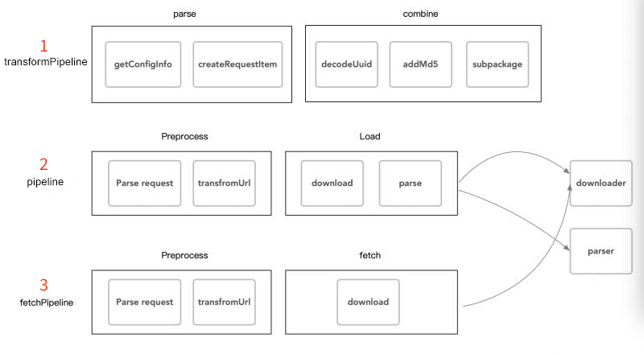

# Pipeline and Task

> Author: Santy-Wang, Xunyi
>
> This article is for advanced developers who have customization needs for their loading process.

To make it easier to modify or extend the loading process of engine, the underlying layer of Asset Manager uses a mechanism called **Pipeline and Task**, **Download and Parser** to load resources. This article will focus on **Pipeline and Task**.

Although `loader` used before v2.4 already used the concept of **Pipeline** for resource loading, in Asset Manager we have refactored the pipeline to make the logic clearer and easier to extend. You can extend an existing pipeline, or customize a pipeline using the class `AssetManager.Pipeline` provided by the engine.

## Pipeline

The **Pipeline** (defined in `AssetManager.Pipeline`) can be understood as a series of processes in series, and as a request passes through the pipeline, it is processed in turn by each stage of the pipeline, with the result of the processing finally being output. The schematic is as follows:


The advantage of a pipeline over a regular fixed process is that all the links in the pipeline are spliceable and combinable, which means you can insert new stages or remove old stages at any point in the existing pipeline, greatly increasing flexibility and scalability.

### The built-in Pipeline

There are three pipelines built into the Asset Manager, as shown in the figure:



- The first pipeline is used to convert resource paths and find the real resource paths.
- The second pipeline is used for the normal loading process.
- The third pipeline is used for the preload process.

> **Note**: the second pipeline uses a downloader and a parser, and the third pipeline uses a downloader. See document [Download and Parse](downloader-parser.md) for details.

### Custom Pipeline

You can extend the built-in pipeline to achieve your own customization needs:

```typescript
assetManager.pipeline.insert(function (task, done) {
    task.output = task.input;
    for (let i = 0; i < task.input; i++) {
        console.log(task.input[i].content);
    }
    done();
}, 1);
```

You can also build a new pipeline:

```typescript
const pipeline = new AssetManager.Pipeline('test', [(task, done) => {
    console.log('first stage');
    done();
}, (task, done) => {
    console.log('second stage');
    done();
}]);
```

Building the pipeline requires a series of methods, each of which requires passing in a task parameter and a completion callback parameter. You can access everything about the task in the method and just call the completion callback on completion.

## Task

**Task** is a request flowing in the pipeline, a task contains inputs, outputs, completion callbacks, [optional parameters](options.md) and so on. As the task flows through the pipeline, each stage of the pipeline takes out the input of the task, makes some processing and saves it back to the output. For example:

```typescript
assetManager.pipeline.insert(function (task, done) {
    for (let i = 0; i < task.input.length; i++) {
        task.input[i].content = null;
    }
    task.output = task.input;
    done();
}, 1);
```

For details, please refer to the type [AssetManager.Task](__APIDOC__/en/classes/asset_manager.task.html).
