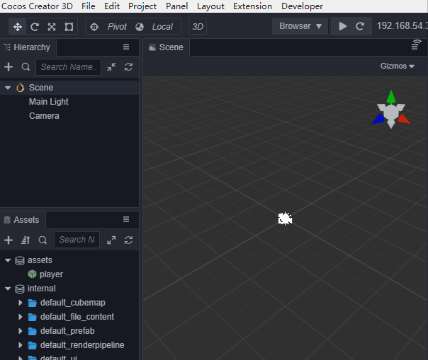
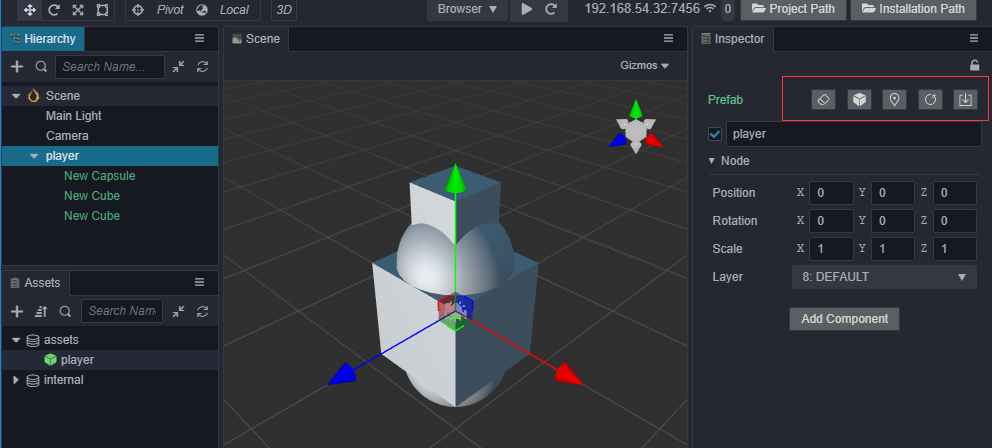
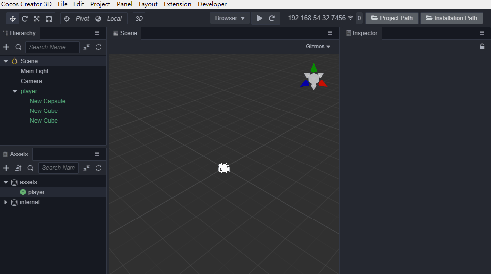

# Prefab

It is necessary to use __Prefabs__ for __Nodes__ that will be repeatedly generated in a project.

## Creating a Prefab

After editing the __Node__ in the __Scene__, drag the __Nodes__ directly from the __Hierarchy__ panel to the __Assets__ panel to complete the creation of the __Prefab__. After the creation is complete, the original __Node__ will automatically become a __Prefab Node__, showing in __green__.

## Using Prefabs

Drag a __Node__ from the __Assets__ panel to the __Hierarchy__ panel or the __Scene__ panel to create a __Prefab Node__ in the __Scene__.

In the __Scene__, the __Prefab Node__ objects data source comes from the deserialization of the __Prefab__ assets. They are completely independent of each other, multiples can coexist, and there is no data association with the __Prefab__ assets. __Assets__ and __Nodes__ are changed separately unless the `Restore from assets` or` Update to assets` (described below) is used. Otherwise, they will not affect each other.

## Editing Prefab Nodes in a Scene

In the __Hierarchy__ panel, select the __Prefab Node__, and notice there are several buttons that can be clicked at the top of the __Inspector__ panel. If you move the mouse up, there will be a text prompt for these functions. The following image describes the functions of the buttons in the red frame area:

__First__, revert to __normal node__. __Prefab Nodes__ can become ordinary __Nodes__, that is, completely separated from the relationship between assets. This function is available in the top-level menu `Edit`.

__Second__, associate the __Node__ to another __Prefab asset__. As a way for __Nodes__ to re-associate assets, you need to __first__ select a __Prefab asset__ in the __Asset Manager__, and then select a __Prefab Node__ in the __Hierarchy__ panel to re-associate it. This function is available in the top-level menu, __Edit__.

__Third__, locating assets is convenient to quickly locate __Prefab assets__ in the __Asset Manager__. When there are many assets, the efficiency is higher.

__Fourth__, you can deserialize a __Node__ object again from the asset and replace the existing node. This operation does not change the *uuid* of the existing __Node__. It is usually used when you want the __Node__ to be re-synchronized with the __Prefab Asset__.

__Fifth__, when there are new changes to the __Node__, and you want to update to the associated __Prefab__ asset, you can use this button.

## Status of prefab nodes

__Prefab Nodes__ in the __Inspector__ panel render __green__ to indicate normal association with assets and render __red__ to indicate that the associated assets no longer exist.

## Entering prefab editing mode

__Double-click__ the __Prefab Asset__ in the __Assets__ panel to switch from __Scene__ editing mode to __Prefab editing__ mode. You can edit the __Prefab Assets__ in the __Editor__. After editing, click __Save Prefab__ in the __Scene editor__ to save the edited __Prefab Assets__. __Next__, click __Close__ to return to the __Scene__ editing mode.

There is no automatic synchronization between __Prefab Nodes__ and __Assets__. Manual synchronization is required.

Modifying __Prefab Assets__ in this way will not affect existing __Prefab Nodes__ after saving. If you need to update other such __Prefab Nodes__ in the __Scene__, and the __Scene__ where the __Node__ is not open, the __Scene__ needs to be opened and edited. __Select__ the __Prefab Node__, click the __Restore__ option from the __Assets button__ at the top in the __Inspector__ panel. __Now__, the __Node__ can be *updated*, the scene *saved* and the __Asset__ synchronized to the __Node__.