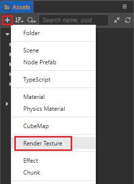
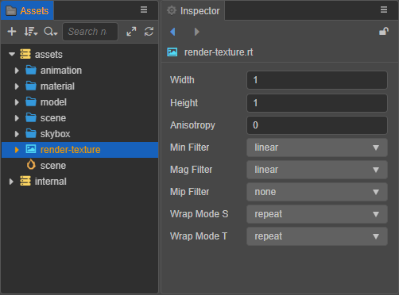
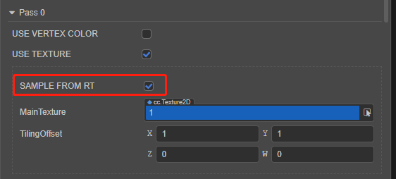

# Render Texture

A __render texture__ is a texture on the __GPU__. Usually, we set it to the camera's __target texture__, so that the content illuminated by the camera is drawn to the texture via the `frambuffer` off the screen. Typically can be used to create car mirrors, implement dynamic shadows, etc.

## Creating a RenderTexture

Click the **+** button in the top left of the **Assets** panel and select **RenderTexture** to create a Render Texture:



The properties associated with the render texture asset can then be set in the **Inspector** panel.



| Property | Description |
| :--- | :--- |
| **Width**  | Set the width of the render texture.  |
| **Height** | Set the height of the render texture. |
| **Anisotropy** | Anisotropy value. |
| **Min Filter** | Narrowing filtering algorithm.     |
| **Mag Filter** | Amplification filtering algorithm. |
| **Mip Filter** | Multi-level texture filtering algorithm. |
| **Wrap Mode S** | S(U) direction texture addressing mode. |
| **Wrap Mode T** | T(V) direction texture addressing mode. |

## Using RenderTexture

There are two ways to use RenderTexture:

- **Method 1**: Draw the contents illuminated by the 3D camera to the sprite frame of the UI.

    ```typescript
    export class CaptureToWeb extends Component {
        @property(Sprite)
        sprite: Sprite = null;
        @property(Camera)
        camera: Camera = null;

        protected _renderTex: RenderTexture = null;

        start () {
            const spriteframe = this.sprite.spriteFrame;
            const sp = new SpriteFrame();
            sp.reset({
                originalSize: spriteframe.getOriginalSize(),
                rect: spriteframe.getRect(),
                offset: spriteframe.getOffset(),
                isRotate: spriteframe.isRotated(),
                borderTop: spriteframe.insetTop,
                borderLeft: spriteframe.insetLeft,
                borderBottom: spriteframe.insetBottom,
                borderRight: spriteframe.insetRight,
            });

            const renderTex = this._renderTex = new RenderTexture();
            renderTex.reset({
                width: 256,
                height: 256,
                colorFormat: RenderTexture.PixelFormat.RGBA8888,
                depthStencilFormat: RenderTexture.DepthStencilFormat.DEPTH_24_STENCIL_8
            });
            this.camera.targetTexture = renderTex;
            sp.texture = renderTex;
            this.sprite.spriteFrame = sp;
            // Need to manually call this function to make RenderTexture display correctly on each platform
            this.sprite.updateMaterial();
        }
    }
    ```

- **Method 2**: Draw the contents illuminated by the 3D camera to the 3D model.

    ```typescript
    export class RenderCameraToModel extends Component {
        @property(MeshRenderer)
        model: MeshRenderer = null;

        start () {
            // Your initialization goes here.
            const renderTex = new RenderTexture();
            renderTex.reset({
                width: 256,
                height: 256,
                colorFormat: RenderTexture.PixelFormat.RGBA8888,
                depthStencilFormat: RenderTexture.DepthStencilFormat.DEPTH_24_STENCIL_8,
            });
            const cameraComp = this.getComponent(Camera);
            cameraComp.targetTexture = renderTex;
            const pass = this.model.material.passes[0];
            // Set the 'SAMPLE_FROM_RT' macro to 'true' so that RenderTexture can be displayed correctly on each platform
            const defines = { SAMPLE_FROM_RT: true, ...pass.defines };
            const renderMat = new Material();
            renderMat.initialize({
                effectAsset: this.model.material.effectAsset,
                defines,
            });
            this.model.setMaterial(renderMat, 0);
            renderMat.setProperty('mainTexture', renderTex, 0);
        }
    }
    ```

## Set RenderTexture as a texture map

Setting the RenderTexture to a texture map consists of the following two steps:

1. Process `uv` in `effect`

    Determine `SAMPLE_FROM_RT` and call `CC_HANDLE_RT_SAMPLE_FLIP` function:

    ```
    #if USE_TEXTURE
        v_uv = a_texCoord * tilingOffset.xy + tilingOffset.zw;
        #if SAMPLE_FROM_RT
            CC_HANDLE_RT_SAMPLE_FLIP(v_uv);
        #endif
    #endif
    ```

2. Select the corresponding material in the **Hierarchy** panel, and then check `SAMPLE FROM RT` in the **Inspector** panel.

    

For more information about the usage, please refer to the example [RenderTexture](https://github.com/cocos-creator/test-cases-3d/tree/v3.4/assets/cases/rendertexture).
