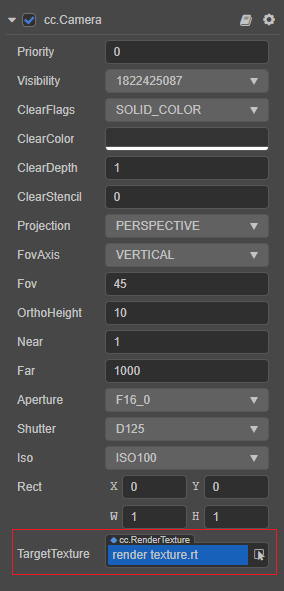
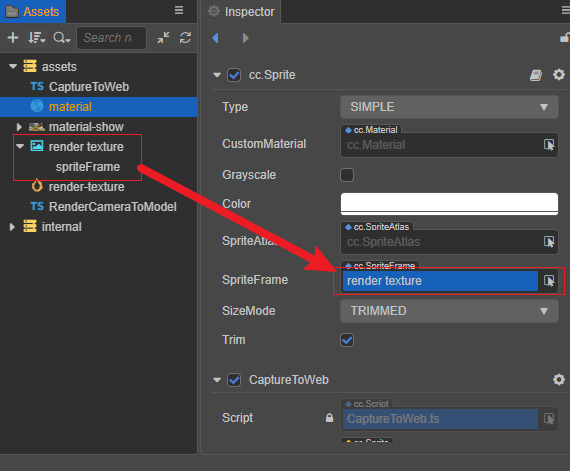
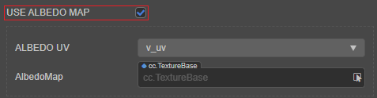

# Render Texture

A render texture is a texture on the GPU. Usually we set it to the camera's **target texture**, so that the content illuminated by the camera is drawn to the texture via an off-screen `frambuffer`. This can typically be used to create car mirrors, dynamic shadows, etc.

## Creating a RenderTexture

Click the **+** button in the top left of the **Assets** panel and select **Render Texture** to create a RenderTexture:


The properties associated with the RenderTexture can then be set in the **Inspector** panel.


| Property | Description |
| :--- | :--- |
| **Width**  | Set the width of the render texture.  |
| **Height** | Set the height of the render texture. |
| **Anisotropy** | Anisotropy value. |
| **Min Filter** | Narrowing filtering algorithm.     |
| **Mag Filter** | Amplification filtering algorithm. |
| **Mip Filter** | Multi-level texture filtering algorithm. |
| **Wrap Mode S** | S(U) direction texture addressing mode. |
| **Wrap Mode T** | T(V) direction texture addressing mode. |

## Using RenderTexture in the editor

In the camera component, assigning a RenderTexture to the **TargetTexture** property of the camera will draw the result of the camera illumination to the RenderTexture.



### Using RenderTexture in 2D / UI

RenderTexture can be used as a general texture. Take Sprite as an example, it can be dragged from the **Assets** panel to the **SpriteFrame** property.



### Set RenderTexture as a texture map

Setting the RenderTexture to a texture map consists of the following two steps:

1. Process uv in effect. Determine if `SAMPLE_FROM_RT` and call the `CC_HANDLE_RT_SAMPLE_FLIP` function.

   ```
    #if USE_TEXTURE
        v_uv = a_texCoord * tilingOffset.xy + tilingOffset.zw;
        #if SAMPLE_FROM_RT
            CC_HANDLE_RT_SAMPLE_FLIP(v_uv);
        #endif
    #endif
    ```

2. Select the corresponding material in **Assets** panel, then check `SAMPLE FROM RT` in **Inspector** panel.

    

## Using RenderTexture in code

There are two ways to use RenderTexture in code:

- **Method 1**: Draw the contents illuminated by the 3D camera to the sprite frame of the UI.

    ```typescript
    import { _decorator, Component, RenderTexture, SpriteFrame, Sprite, Camera } from 'cc';
    const { ccclass, property } = _decorator;

    @ccclass('CaptureToWeb')
    export class CaptureToWeb extends Component {
        @property(Sprite)
        sprite: Sprite = null;
        @property(Camera)
        camera: Camera = null;

        protected _renderTex: RenderTexture = null;

        start() {
            const sp = new SpriteFrame();
            const renderTex = this._renderTex = new RenderTexture();
            renderTex.reset({
                width: 256,
                height: 256,
            });
            this.camera.targetTexture = renderTex;
            sp.texture = renderTex;
            this.sprite.spriteFrame = sp;
        }
    }
    ```

- **Method 2**: Draw the contents illuminated by the 3D camera to the 3D model.

    ```typescript
    import { _decorator, Component, MeshRenderer, RenderTexture, Camera, Material } from 'cc';
    const { ccclass, property, requireComponent } = _decorator;

    @ccclass("RenderCameraToModel")
    @requireComponent(Camera)
    export class RenderCameraToModel extends Component {
        @property(MeshRenderer)
        model: MeshRenderer = null;

        start() {            
            const renderTex = new RenderTexture();
            renderTex.reset({
                width: 256,
                height: 256,
            });
            const cameraComp = this.getComponent(Camera);
            cameraComp.targetTexture = renderTex;
            const pass = this.model.material.passes[0];
            // The purpose of setting the 'SAMPLE_FROM_RT' Macro to 'true' is to enable the RenderTexture to display correctly on all platforms
            const defines = { SAMPLE_FROM_RT: true, ...pass.defines };
            const renderMat = new Material();
            renderMat.initialize({
                effectAsset: this.model.material.effectAsset,
                defines,
            });
            this.model.setMaterial(renderMat, 0);
            renderMat.setProperty('mainTexture', renderTex, 0);
        }
    }
    ```

    To display the drawing results correctly, make sure that the shader has the `mainTexture` property and is enabled in the material. If the buitin-standard shader is being used, the **USE ALBEDO MAP** option should be checked:

    

For more information about the usage, please refer to the example **RenderTexture** ([GitHub](https://github.com/cocos/cocos-test-projects/tree/v3.5/assets/cases/rendertexture)).
