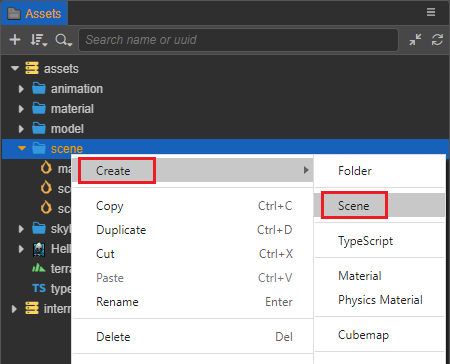
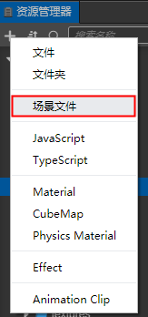
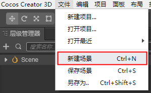
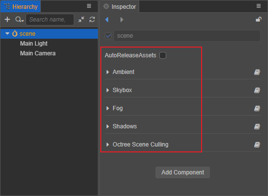
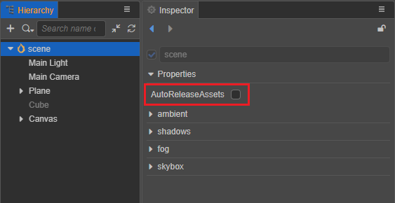
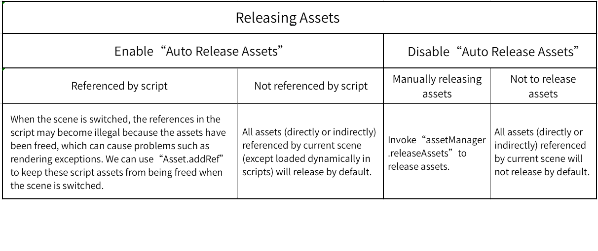

# Scene Assets

In **Cocos Creator**, the **Scene** is the cornerstone for organizing game content during development, and presenting all game content to the players. The **Scene** itself is a file, also considered a game asset, and saves most of the game's information.

> **Note**: please avoid multiple people modifying the same scene asset at the same time, as this may lead to conflicts that cannot be resolved by `git` merging.

## Creating a Scene

There are **three** ways to create a **Scene**:

1. Select the folder where you want to create the **Scene** file in the **Assets** panel. On the folder right click and select **Create -> Scene**, and then type the desired **Scene** name.

    

    In order to have a good directory structure in your project, it is strongly recommend that use this method to create a **Scene**.

2. Click the **Create (+)** button in the upper left corner of the **Assets** panel, and then select **Scene**.

    

3. Select **File -> New Scene** in the top menu bar, a new scene will be created directly in the **Scene** panel. But the new scene file will not appear in the **Assets** panel, you need to save the scene file manually in the **Save Scene** window that pops up when you save the scene, and the `scene.scene` file will appear in the root directory of the **Assets** panel only after the saving is done.

    

## Saving a Scene

Method 1: Use the shortcut keys <kbd>Ctrl</kbd> + <kbd>S</kbd> (Windows) or <kbd>Command</kbd> + <kbd>S</kbd> (MacOS) to quickly save the scene.

Method 2: Select **File -> Save Scene** in the top menu bar.

## Switching Scenes

In the **Assets** panel, **double-click** the **Scene** you want to open. 
When needing to switch **Scenes** in the game, use the [director.loadScene()](__APIDOC__/en/classes/core.director-2.html#loadscene) API to implement dynamic scene loading and switching in the game.

## Scene Properties

After double-clicking to open the **scene** file, the `scene` is the root node of the scene node tree in the **Hierarchy** panel. Select the `scene` node, and set whether the scene is automatically released or not in the **Inspector** panel, as well as the whole scene related properties, including **ambient light** settings, **shadows** settings, **global fog** and **sky box** settings.

Automatic release of scene assets, please refer to section **Change the policy of auto releasing assets from previous scene** below for details.

For a detailed description of each property, see the following documentations:

- [Ambient light](../concepts/scene/light/lightType/ambient.md)
- [Shadow](../concepts/scene/light/shadow.md)
- [Global Fog](../concepts/scene/fog.md)
- [Skybox](../concepts/scene/skybox.md)

## Change the Policy of Auto Releasing Assets from Previous Scene

In a large game where you have many scenes, as the engine continues to load different scenes, the memory usage will continue to increase. Besides using API such as `assetManager.releaseAsset` to accurately release unused assets, we can also use scene's auto releasing feature.

After double-clicking to open the scene file, select the `scene` node in the **Hierarchy** panel to set whether the scene is automatically released in the **Inspector** panel:

When switching from current scene to the next scene, if current scene disabled the auto releasing, then all assets (directly or indirectly) referenced by current scene (except loaded dynamically in scripts) will not release by default. On the other hand, if enable the auto releasing, then these assets will release by default.

### Prevent auto releasing for some specified assets

With the auto releasing enabled for a scene, if some of the scene's assets are saved in the script as "special reference", these references will become invalid once the scene switched, since the asset has been released, may cause rendering problems. To prevent these assets from being released automatically, we can use [Asset.addRef](__APIDOC__/en/classes/asset.asset-1.html#addref) to retain them.

> "Special reference" refer to references in the form of global variables, singleton, closures, "dynamic assets", and so on. 
> "Dynamic assets" refer to assets that are dynamically created or dynamically modified in a script.

The above content of the automatic release of scene assets can be summed up in the following diagram of several cases:

For additional information on asset release, please refer to the [Release of Assets](./release-manager.md#auto-release) documentation.
