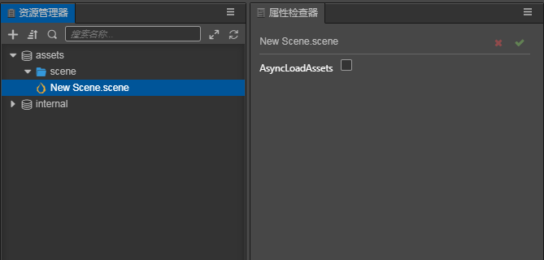

# Scene Assets

In __Cocos Creator__, the __Scene__ is the cornerstone for organizing game content during development, and presenting all game content to the players. The __Scene__ itself is a file, also considered a game asset, and saves most of the game's information.

## Creating a Scene

There are __three__ ways to create a __Scene__:

1. Select the folder where you want to create the __Scene__ file in the __Assets__. On the folder __Right click --> New --> Scene file__, and then type the desired __Scene__ name.

    

    In order to have a good directory structure in your project, it is strongly recommend that you use this method to create a __Scene__.

2. Click the __Create__ menu in the __Assets__ to create a new __Scene__.

    

3. Select __File -> New Scene__, a new __Scene__ will appear directly in the __Hierarchy__ panel, but a new __Scene__ will not appear in the __Assets__. You need to save it in the root of the asset folder. A `New Scene.scene` __Scene__ file appears in the directory.

    

## Saving a Scene

While creating __Scenes__, you can quickly save __Scenes__ with the shortcut keys __Ctrl + S__ (Windows) or __Command + S__ (Mac).

## Switching Scenes

In the __Assets__, __double-click__ the __Scene__ you want to open. When needing to switch __Scenes__ in the game, use the `director.loadScene()` API to implement dynamic scene loading and switching in the game. For further details, please see the [API documentation](__APIDOC__/en/#/docs/3.3/en/core/Class/Director?id=loadscene).

## Scene Asset Properties

Since the __Scene__ is an __Asset__ a property can be set in the __Assets__ to load assets asynchronously.

After opening the __Scene__ file, **Scene** is the root node of the __Scene__ node tree. Select the __Scene__ node in the __Hierarchy__ panel. In the __Inspector__ panel on the left, you can set the properties of the entire __Scene__, including **ambient light** settings, **shadow** settings and **sky box** settings.

For a detailed description of each attribute, see the following documents:

- [Ambient light](../concepts/scene/ambient.md)
- [Shadow](../concepts/scene/shadow.md)
- [Global Fog](../concepts/scene/fog.md)
- [Skybox](../concepts/scene/skybox.md)
