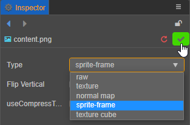
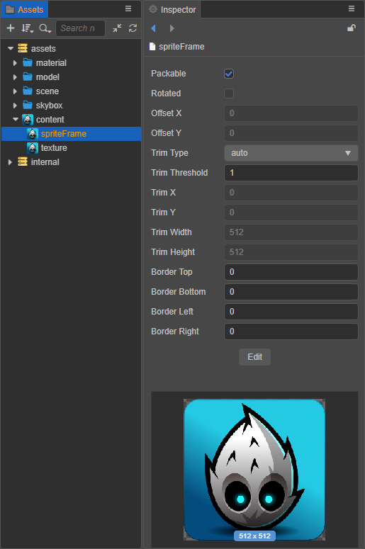

# Sprite Frame Assets

__Sprite Frame__ is a container for __UI rendering__ and basic graphics, which manages the clipping and tiling data on top of a __Texture2D__ asset (by holding a reference to it).

## Importing Sprite Frame Assets

Use the default [asset import](asset-workflow.md) method to import image assets into the project, then set the type of image as __sprite-frame__ in the __Inspector__ panel:



Creator will then automatically create a spriteFrame resource under it as shown below:



Image assets will use thumbnails of their own pictures as icons in the __Assets__ panel. When the image sub-asset is selected in the __Assets__ panel, a thumbnail of the image is displayed below the __Inspector__ panel.

The `spriteFrame` has the following properties:

| Property | Description |
| :--- | :--- |
| Packable | Whether to be packed into Dynamic Atlas. |
| Rotated  | Read-only property, cannot be changed. Used to see if the sub-asset in the Texture Packer asset is rotated. |
| Offset X, Y | Read-only property, cannot be changed. Used to view the offset of the rectangle in Texture Packer asset. |
| Trim Type | Set the trim type, including:<br>1. Auto -- Automatic trim. For details, please refer to the [Auto Trim for SpriteFrame](../ui-system/components/engine/trim.md) documentation.<br>2. Custom -- Custom trim<br>3. None -- No trim, use original texture. |
| Trim Threshold | Set the transparency threshold, trim off the pixels whose transparency is below the set value.<br>The default value is 1, and the range of values is 0~1.<br>Only takes effect when __Trim Type__ is set to __Auto__.  |
| Trim X, Y, Width, Height | Sets the trim rect, only takes effect when __Trim Type__ is set to __Custom__. |
| Border Top, Bottom, Left, Right | Set the texture margins of the 9-sliced, which can be edited visually by clicking on the __Edit__ button below.  |

## Using a Sprite Frame

### The object contained in the container is using textures

In the editor, drag the __SpriteFrame__ asset to the __Sprite Frame__ property of the __Sprite__ component to switch the image displayed by the __Sprite__. At runtime, taking the content picture in the above picture as an example, The entire asset is divided into image asset (`content`), its sub-asset (`spriteFrame`) and sub-asset (`texture`). The assets in the game package can be obtained by the following methods:

__Method 1__: (load __ImageAsset__):

```typescript
const self = this;
const url = 'test_assets/test_atlas/content';
resources.load(url, ImageAsset, (err: any, imageAsset) => {
  const sprite = this.getComponent(Sprite);
  const spriteFrame = new SpriteFrame();
  const tex = new Texture2D();
  tex.image = imageAsset;
  spriteFrame.texture = tex;
  sprite.spriteFrame = spriteFrame;
});
```

__Method 2__: (load SpriteFrame):

```typescript
const self = this;
const url = 'test_assets/test_altas/content/spriteFrame';
resources.load(url, SpriteFrame, (err: any, spriteFrame) => {
  const sprite = this.getComponent(Sprite);
  sprite.spriteFrame = spriteFrame;
});
```

__Assets__ on the server can only be loaded into __ImageAsset__. For specific methods, please refer to the [dynamic load asset](./dynamic-load-resources.md) documentation.

__Cocos Creator__ will provide a way to package an __Image Asset__ as a __SpriteFrame__ in a later release to make it easier for users to use image assets.

### The container contains objects that are used by RenderTexture

__RenderTexture__ is a rendering texture that renders content from the camera directly to a texture instead of the screen. __SpriteFrame__ can easily display 3D camera content on the UI by managing __RenderTexture__. Example:

```typescript
const cameraComp = this.getComponent(Camera);
const renderTexture = new RenderTexture();
const size = view.getVisibleSize();
renderTexture.reset({
   width: size.width,
   height: size.height,
   colorFormat: RenderTexture.PixelFormat.RGBA8888,
   depthStencilFormat: RenderTexture.DepthStencilFormat.DEPTH_24_STENCIL_8
});

cameraComp.targetTexture = renderTexture;
const spriteFrame = new SpriteFrame();
spriteFrame.texture = renderTexture;
const sprite = this.getComponent(Sprite);
sprite.spriteFrame = spriteFrame;
```

For API information, please refer to the [SpriteFrame](__APIDOC__/en/classes/asset.spriteframe-1.html) documentation.
