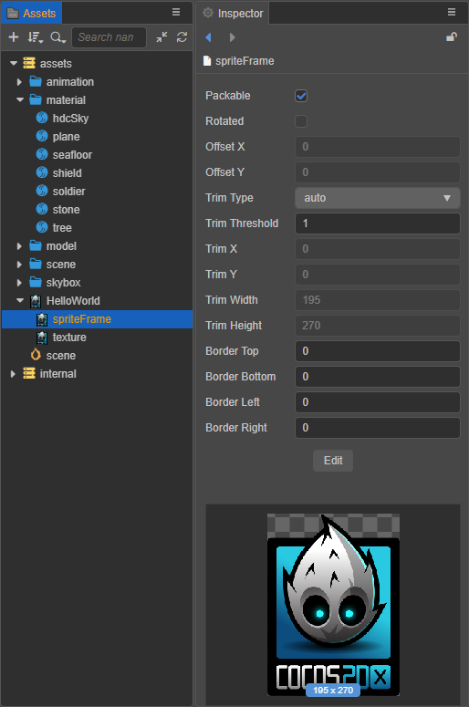

# Sprite Frame Assets

__Sprite Frame__ is a container for __UI rendering__ and basic graphics, which manages the clipping and tiling data on top of a __Texture2D__ asset (by holding a reference to it).

## Importing Sprite Frame Assets

Use the __default asset import__ method to import image assets into the project, then set the type of image as __sprite-frame__ and can then be seen in the **Assets** panel.



Image assets will use thumbnails of their own pictures as icons in the **Assets** panel. When the image sub-asset is selected in the **Assets** panel, a thumbnail of the image is displayed below the **Inspector** panel.

## Using a Sprite Frame

**1. The object contained in the container is using textures**

In the editor, drag the __SpriteFrame__ asset to the __Sprite Frame__ property of the **Sprite** component to switch the image displayed by the __Sprite__. At runtime, taking the content picture in the above picture as an example, The entire asset is divided into image asset (`content`), its sub-asset (`spriteFrame`) and sub-asset (`texture`). The assets in the game package can be obtained by the following methods:

__Method 1__: (load __ImageAsset__):

```typescript
const self = this;
const url = 'test_assets/test_altas/content';
loader.loadRes(url, ImageAsset,(err: any, imageAsset) => {
  const sprite = this.getComponent(Sprite);
  const spriteFrame = new SpriteFrame();
  const tex = new Texture2D();
  tex.image = imageAsset;
  spriteFrame.texture = tex;
  sprite.spriteFrame = spriteFrame;
});
```

__Method 2__: (load SpriteFrame):

```typescript
const self = this;
const url = 'test_assets/test_altas/content/spriteFrame';
loader.loadRes(url, SpriteFrame,(err: any, spriteFrame) => {
  const sprite = this.getComponent(Sprite);
  sprite.spriteFrame = spriteFrame;
});
```

__Assets__ on the server can only be loaded into __ImageAsset__. For specific methods, please refer to the [Asset Loading](./load-assets.md) documentation.

__Cocos Creator__ will provide a way to package an __Image Asset__ as a __SpriteFrame__ in a later release to make it easier for users to use image assets.

**2. The container contains objects that are used by RenderTexture**

__RenderTexture__ is a rendering texture that renders content from the camera directly to a texture instead of the screen. __SpriteFrame__ can easily display 3D camera content on the UI by managing __RenderTexture__. Use is as follows:

```typescript
const cameraComp = this.getComponent(Camera);
const renderTexture = new RenderTexture();
const size = view.getVisibleSize();
renderTexture.reset({
   width: size.width,
   height: size.height,
   colorFormat: RenderTexture.PixelFormat.RGBA8888,
   depthStencilFormat: RenderTexture.DepthStencilFormat.DEPTH_24_STENCIL_8
});

cameraComp.targetTexture = renderTexture;
const spriteFrame = new SpriteFrame();
spriteFrame.texture = renderTexture;
const sprite = this.getComponent(Sprite);
sprite.spriteFrame = spriteFrame;
```

<!-- API 接口文档如下：
* [SpriteFrame 资源类型](https://docs.cocos.com/creator/2.1/api/zh/classes/SpriteFrame.html) -->
