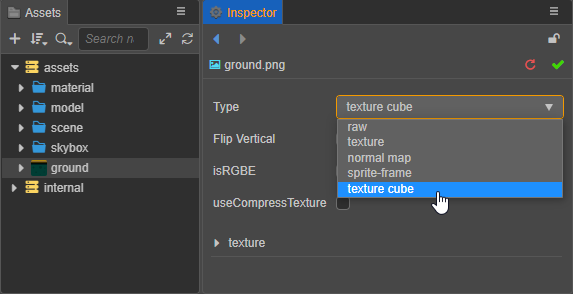
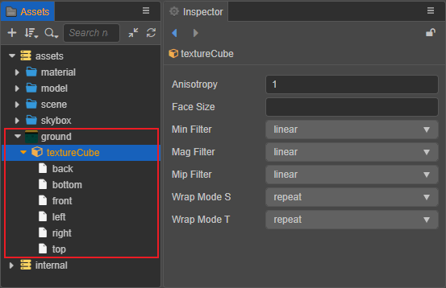

# Texture Cube

TextureCube is a cube texture, often used to set the scene's [skybox](../concepts/scene/skybox.md). The cube texture can be obtained by setting the panorama ImageAsset to the TextureCube type, or it can be generated in the Creator.

## Set to Cube Mapping

After [importing](asset-workflow.md#) the ImageAsset into Creator, you can set it to **texture cube** type in the **Inspector** panel, and click the green checkbox in the upper right corner to save the changes.

Once set up, you can see in the **Assets** panel that a **textureCube** subresource has been created below the original image resource, along with the six textures that make up the TextureCube.

## Create CubeMap

The TextureCube obtained by making a CubeMap in Creator is as follows:

For the specific use of TextureCube and how to make CubeMap, please refer to [Skybox - Setting up CubeMap](../concepts/scene/skybox.md).
