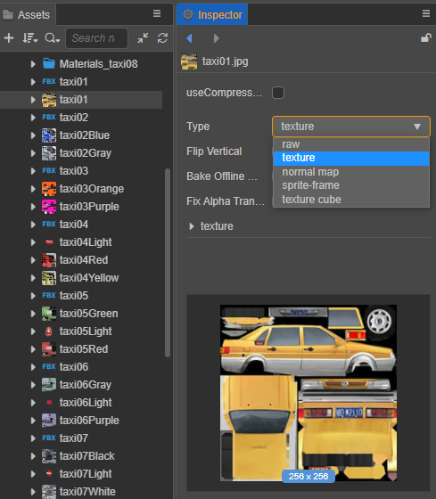
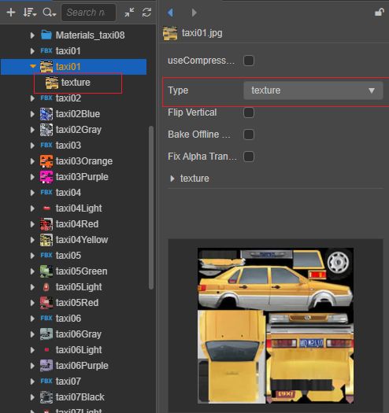
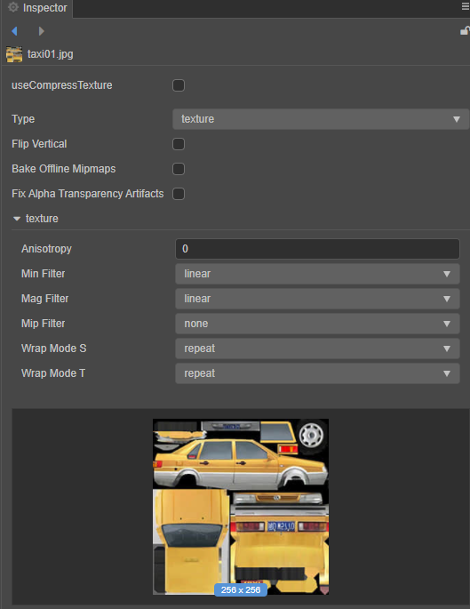
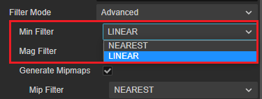
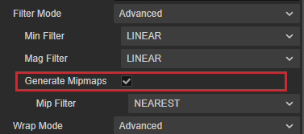
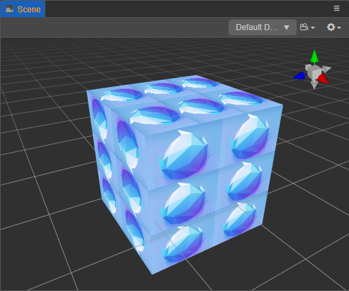
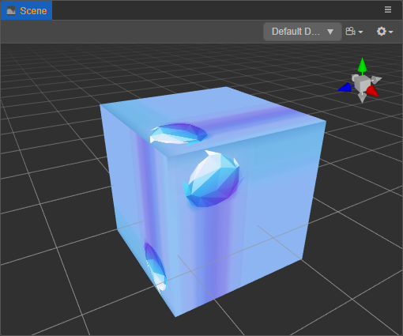
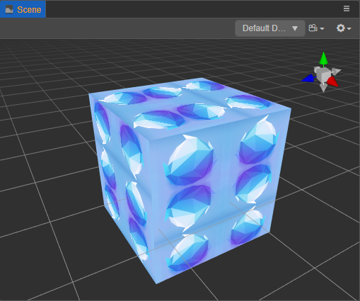
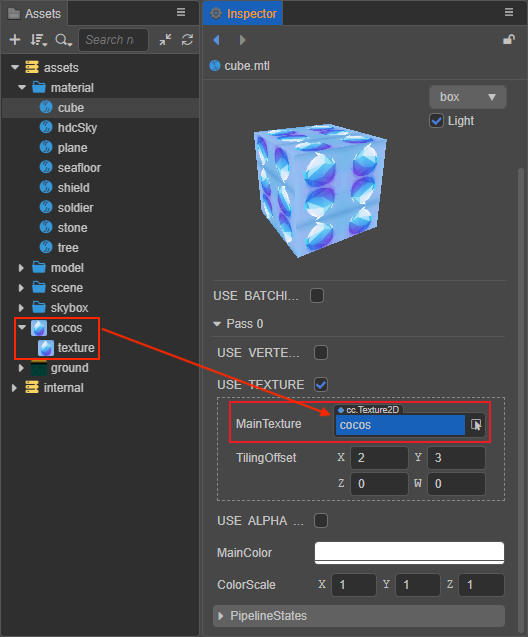

# Texture Assets

**Texture** assets are assets used for procedural sampling, such as **textures on models** and the **UI on Sprites**. When the UI or model are rendered, the corresponding texture is sampled, then filled on the model grid, plus a series of processing such as lighting to render the entire scene.

**Texture assets** can be generated from **ImageAsset**. Some common image formats, including `.png`, `.jpeg`, etc. can be used in **ImageAsset**.

## Texture2D

Texture2D is a type of texture mapping asset, usually used for rendering 3D models, such as reflection mapping in model materials, ambient light mask mapping, etc.

After you [import](asset-workflow.md) the image asset into Creator, you can set it to **texture** type in **Inspector** panel, the texture type is the Texture2D asset.



## Properties

When importing an image asset, the editor sets it to **texture** type by default, and one or more sub-assets will be created automatically under the imported image asset, click the triangle icon to the left of the image asset in **Asset Manager** to expand it to see all the sub-assets, as shown in the following figure:



When the generated Texture2D sub-asset is selected, the relevant properties can be set in the **Inspector** panel.



| Properties         | Description |
| :----------------- |:---  |
| **Anisotropy**     | Anisotropy value, applying the maximum threshold of the anisotropy filtering algorithm |
| **Filter Mode**    | Filter mode, options are **Nearest (None)**, **Bilinear**, **Bilinear with mipmaps**, **Trilinear with mipmaps** and **Advanced**, please refer to **Filter mode** below for more information |
| **Wrap Mode**      | Set the addressing mode, the options are **Repeat**, **Clamp**, **Mirror**, and **Advanced** <br> When selecting **Advanced**, set the texture addressing mode in the S(U)/T(V) direction, that is, the pixel-to-texture mapping mode in the S(U) or T(V) direction, see **Addressing Mode** below for more information  |

> **Note**: Since the default Wrap Mode may show black edges when rendering transparent edges of images, the Creator automatically adjusts the Wrap Mode S and Wrap Mode T properties of texture asset to **clamp-to-edge** automatically when setting the image asset type to **sprite-frame**. Developers can change this if they have special needs.

Next we give a brief explanation of some of the properties.

### Filter Mode



When the original size of Texture2D does not match the size of the texture image mapped to the screen, different texture filtering methods for texture cell-to-pixel mapping will produce different results.

The **Min Filter** and **Mag Filter** properties in Texture2D are used to set the texture filtering method to be used when scaling down or scaling up the mapping, respectively.

1. Neareast

    Neareast filtering is the **default** texture filtering method used. The color value of the texture cell whose center position is closest to the sample point is used as the color value of that sample point, without considering the influence of other adjacent pixels. <br>
    It should be noted that the use of proximity filtering may result in uneven edges and more pronounced jaggedness.

2. Linear

    Linear filtering uses a 2 x 2 matrix of texture cells nearest to the sampling point for sampling. The average of the four texture cell color values is taken as the color of the sampling point, and the color value transition between pixels will be smoother. <br>
    Note that using the linear filtering method may result in black edges and, in the case of pixel-based games, may result in blurring.

### Generate Mipmaps

In order to speed up 3D scene rendering and reduce image jaggies, the mapping is processed as a sequence of pre-computed and optimized images, called a mipmap. mipmap is a scaled-down detailed replica of the original image at each level of the mipmap, and when the mapping is scaled down or only needs to be viewed from a distance, the mipmap is converted to the appropriate level.



When the **Generate Mipmaps** property is checked or **Filter Mode** for texture is selected as **Bilinear with mipmaps** or **Trilinear with mipmaps**, the mipmap is automatically generated by interpolating between two similar layers. mipmap mapping is smaller than the original image when rendering distant objects, which improves the cache hit rate during graphics card sampling, so the rendering speed is improved. At the same time, the mipmap mapping is less precise, which reduces moiré and reduces jaggedness on the screen. In addition, mipmap takes up about a third of the memory space because of the extra mipmap generation.

Texture2D can dynamically select the range of the mipmap at runtime. After setting the mipmap range, only the mipmaps within the range can be used. This allows us to save bandwidth by skipping low levels and avoid using too many high levels to reduce the effect.

The mipmap level range for Texture2D can be set as follows.

```Javascript
texture.setMipRange(minLevel, maxLevel);
```

Where `minLevel` specifies the minimum limit and `maxLevel` specifies the maximum limit.

> **Note**.
> 1. The limit cannot exceed the existing mipmap level.
> This method is not available for WebGL and GLES2 backends.

### Wrap Mode

In general, the texture coordinates in the horizontal (U) and vertical (V) axes are in the range `[0, 1]`. When the texture coordinates in the passed vertex data are out of the range `[0, 1]`, different addressing modes can be used to control how the out-of-range texture coordinates are mapped.

The **Wrap Mode S** and **Wrap Mode T** properties in Texture2D are used to set the addressing mode of the texture in the UV direction, respectively.

1. Repeat

    Repeat addressing mode is the default texture addressing mode used. For texture coordinates outside the `[0, 1]` range, the contents of the texture coordinates inside `[0, 1]` are repeated, i.e. the texture map is repeatedly placed outside the texture coordinate range.

    > **Note**: On WebGL 1.0, the `repeat` addressing mode is disabled when the texture width and height are not powers of two. The runtime will automatically switch it to `clamp-to-edge` addressing mode, which will disable properties like `tilingOffset` of the material.

    When the **Wrap Mode S** and **Wrap Mode T** properties of Texture2D are both set to `repeat`, the effect looks like this.

    

2. Clamp-to-edge

    Constrain the texture coordinates to be between 0 and 1, copying the texture coordinates of `[0, 1]` only once. For the part outside of `[0, 1]`, the texture coordinate content of the edge will be used to extend, producing an effect similar to the edge being stretched.

    When both properties are set to `clamp-to-edge`, the effect looks like this.

    

3. Mirrored-repeat

    Similar to repeat-addressing mode, except that the mapping is mirrored and repeated.

    When both properties are set to `mirrored-repeat`, the effect looks like this.

    

## Use Texture2D

Texture2D is a very widely used asset, and its use in Creator consists of using it in the editor and getting it dynamically.

- In the editor's **Inspector** panel, any property marked as Texture2D type can be used by dragging and dropping a Texture2D asset into the property box. For example, to set a Texture2D type asset for a material asset.

  

    > **Note**: If `USE TEXTURE` is not defined in the material, there is no such property.

- To use it dynamically, you need to get the ImageAsset first, and then instantiate the Texture2D asset based on the ImageAsset you got.

  ```ts
  resources.load("testAssets/image/texture", Texture2D, (err: any, texture: Texture2D) => {
    const spriteFrame = new SpriteFrame();
    spriteFrame.texture = texture;
    this.node.getComponent(Sprite).spriteFrame = spriteFrame;
  });
  ```

  For more details, please refer to [Asset Loading](./dynamic-load-resources.md)。
