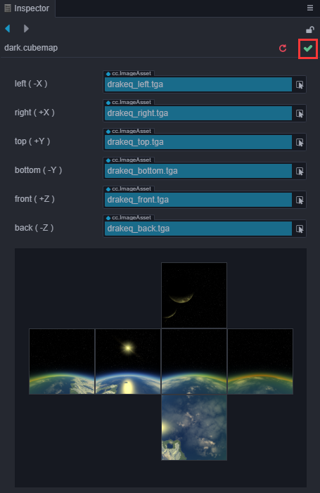

# Texture Assets

__Texture__ assets are assets used for procedural sampling, such as __textures on models__ and the __UI on Sprites__. When the UI or model are rendered, the corresponding texture is sampled, then filled on the model grid, plus a series of processing such as lighting to render the entire scene.

__Texture assets__ can be generated from __ImageAsset__. Some common image formats, including `.png`, `.jpeg`, etc. can be used in __ImageAsset__.

## Texture2D

__Texture2D__ is a type of __texture asset__ that is usually used for rendering of __3D models__, such as __reflection map__, __ambient occlusion map__, etc... in model materials.

__Texture2D__ in __Cocos Creator__:


> __Note__: the texture type is a __Texture2D__ asset.

### Adjusting the Properties of a Texture2D

When importing an __ImageAsset__, it will be set to __Texture2D__ by default. At this same time, one or more sub-assets will be generated on the original asset. Click the arrow in front of the original asset to see all the sub-assets. Example:


After selecting the generated __Texture2D__ sub-asset, you can see the following panel:


#### Sub-Asset Texture2D Properties Panel


The following describes the properties of the panel:

| Property        | Explanation                             |
| :-------------- | :-------------------------------------- |
| __Anisotropy__  | Anisotropy value                        |
| __Min Filter__  | Narrowing Filter Algorithm              |
| __Mag Filter__  | Magnification Filter Algorithm          |
| __Mip Filter__  | Multi-level texture filtering algorithm |
| __Wrap Mode S__ | S (U) direction texture addressing mode |
| __Wrap Mode T__ | T (V) direction texture addressing mode |

> __Note__: since the default __Wrap Mode__ may result in black edges when rendering transparent edges of an image, Creator will change the __Wrap Mode S__ and __Wrap Mode T__ properties of the texture resource to __clamp-to-edge__ automatically when setting the image resource type to __sprite-frame__, which can be modified by the developer if there is a special need.

### Using Texture2D

__Texture2D__ is a very widely used asset. Any property marked as __Texture2D__ in the __Inspector__ panel can be dragged into a __Texture2D__ asset type.

The usage scenario is mainly in the __Editor__ environment and for __dynamic acquisition__:

- In the __Editor__, just drag the assets in;
- For __dynamic acquisition__, you need to obtain the __ImageAsset__ asset first, and then instantiate the __Texture2D__ asset based on the obtained __ImageAsset__.

## TextureCube

__TextureCube__ is a cube texture, which can be used to set the scene's [Skybox](../concepts/scene/skybox.md). It can be obtained by setting the __panorama__ __ImageAsset__ to the __TextureCube__ type. It can also be obtained by making __CubeMap__ assets.

__TextureCube__ obtained from a __panorama__ in __Cocos Creator__:


__TextureCube__ obtained by making a __CubeMap__ in __Cocos Creator__:



To learn more about the use of __TextureCube__ and __CubeMaps__, please refer to the [Skybox](../concepts/scene/skybox.md) documentation.

## Set MipMap range during runtime

The mipmap range of __Texture2D__ and __TextureCube__ can be set during runtime. After setting the limits, the program will only use the mipmaps in the given range. We can avoid the use of low-level mipmaps to save bandwidth, and avoid the use of high-level mipmaps to ensure render quality.

The method is as follow:

```Javascript
texture2d.setMipRange(minLod, maxLod);
// or
textureCube.setMipRange(minLod, maxLod);
```

where `minLod` specifies the minimum limit, and `maxLod` specifies the maximum limit.

> __Note__:
> 1. The limit exceeding the origin `mipmapLevel` is invalid.
> 2. This method doesn't work on WebGL 1 and GLES2.
