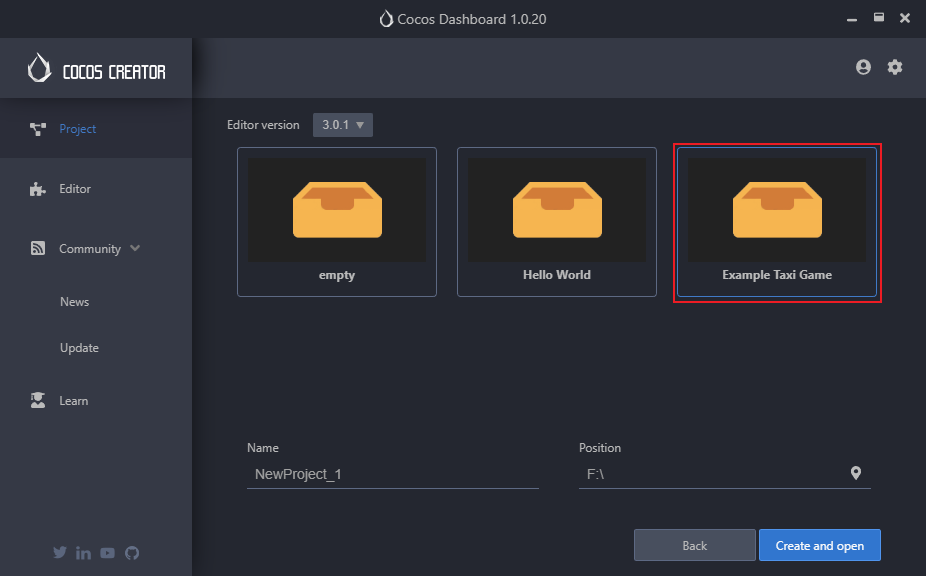

# Audio Playback Examples

Since Cocos Creator 3.x removes the v2.x `cc.audioEngine` series API and uses AudioSource to control audio playback, it is necessary to declare the [AudioSource component](./audiosource.md) as the resident root node and wrap a manager to use it. You can refer to the following code:

```typescript
import { assert, AudioSource, Component, game } from 'cc';
const { ccclass, property } = _decorator;

@ccclass('GameRoot')
export class GameRoot extends Component {
    
    @property(AudioSource) 
    _audioSource: AudioSource = null!

    onLoad () {
        const audioSource = this.node.getComponent(AudioSource)! ;
        assert(audioSource);
        this._audioSource = audioSource;
        // Declare the resident root node, which will not be destroyed in a scene switch. The target node must be the root node, otherwise it is invalid.
        game.addPersistRootNode(this.node);

        // Wrap the node in the manager.
        audioManager.instance.init(this._audioSource);
    }
}
```

The specific implementation of the audio manager can be found in the following code:

```typescript
import { AudioClip, AudioSource, assert, warn, clamp01, resources } from "cc";
export class audioManager {

    private static _instance: audioManager;
    private static _audioSource?: AudioSource;

    static get instance () {
        if (this._instance) {
            return this._instance;
        }

        this._instance = new audioManager();
        return this._instance;
    }

    /**Manager initialization*/
    init (audioSource: AudioSource) {
        audioManager._audioSource = audioSource;
    }

      /**
     * Play music
     * @param {Boolean} loop Whether to loop
     */
    playMusic (loop: boolean) {
        const audioSource = audioManager._audioSource!
        assert(audioSource, 'AudioManager not inited!');

        audioSource.loop = loop;
        if (!audioSource.playing) {
            audioSource.playing();
        }
    }

     /**
     * Play a sound effect
     * @param {String} name The name of the sound effect
     * @param {Number} volumeScale Playback volume multiplier
     */
    playSound (name: string, volumeScale: number = 1 ) {
        const audioSource = audioManager._audioSource!
        assert(audioSource, 'AudioManager not inited!');
            
        // Note that the second parameter "volumeScale" is a multiple of the playback volume, the final playback volume is "audioSource.volume * volumeScale"
        audioSource.playOneShot(audioClip, volumeScale);

    }
    // Set the music volume
    setMusicVolume (flag: number) {
        const audioSource = audioManager._audioSource!
        assert(audioSource, 'AudioManager not inited!');

        flag = clamp01(flag);
        audioSource.volume = flag;
    }

}
```

The above code snippet is just an example of one way to use the AudioSource component for playback, and is not complete. Cocos Creator provides a complete example of how to use the wrapped audio playback manager in the [tutorial-taxi-game](https://github.com/cocos-creator/tutorial-taxi-game) project. Developers can open the **Project** page in Dashboard, click the **New** button in the bottom right corner to enter the New Project page, and find the **Example Taxi Game**, fill in the project name and project location as needed to create and open.


