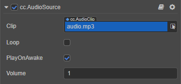

# AudioSource Component



## Properties

|Property          | Description                                                    |

|:--                 | :--                                                                     |
|**Clip**                | The audio resource object to be played                                           |

|**Loop**                | Whether to loop                                                      |

|**PlayOnAwake**         | Whether to play audio automatically after the component is activated    |
|**Volume**              | Audio volume, ranging from 0 to 1                                  |


## Register AudioSource Event Callback

Cocos Creator supports registering event callbacks on AudioSource components, with the following usage examples:

```typescript
@ccclass('AudioDemo')
export class AudioDemo extends Component {

    @property(AudioSource)
    audioSource: AudioSource = null!;

    onEnable () {
        // Register the started event callback
        this.audioSource.node.on(AudioSource.EventType.STARTED, this.onAudioStarted, this);
        // Register the ended event callback
        this.audioSource.node.on(AudioSource.EventType.ENDED, this.onAudioEnded, this);
    }

    onDisable () {
        this.audioSource.node.off(AudioSource.EventType.STARTED, this.onAudioStarted, this);
        this.audioSource.node.off(AudioSource.EventType.ENDED, this.onAudioEnded, this);
    }

    onAudioStarted () {
        // TODO...
    }

    onAudioEnded () {
        // TODO...
    }
}
``` 

For more script interfaces for AudioSource, please refer to the [AudioSource API](__APIDOC__/en/classes/component_audio.audiosource.html). For specific playback controls, please refer to the [Audio System Overview](./overview.md) documentation.
