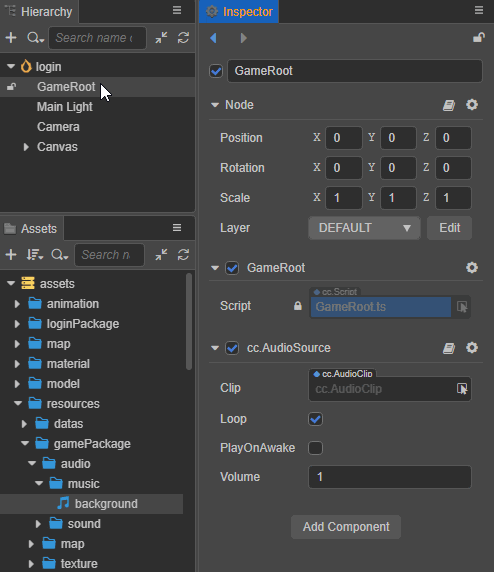
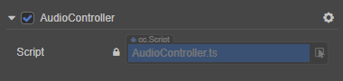

# Audio System Overview

The interface to the audio system is geared towards two main types of needs, "music" of longer length, played continuously in a loop, and "sound effects" of shorter length, played all at once. All audio assets are imported as AudioClip assets within the editor.

## Music Playback

1. Create an empty node on the **Hierarchy** panel
2. Select the empty node and click **Add Component -> Components -> AudioSource** at the bottom of the **Inspector** panel to add the AudioSource component
3. Drag and drop the required audio assets from the **Assets** panel into the Clip of the AudioSource component as shown below:

    

Set the other parameters of the AudioSource component as needed. For the detailed properties, please refer to the [AudioSource Component Reference](./audiosource.md) documentation.

If you only need the audio to be played automatically after the game is loaded, check **PlayOnAwake** of the AudioSource component. For more flexible control of AudioSource playback, get the **AudioSource component** in a custom script and call the corresponding API as follows:

```typescript
// AudioController.ts
@ccclass("AudioController")
export class AudioController extends Component { 
    
    @property(AudioSource)
    public audioSource: AudioSource = null!

    play () {
        this.audioSource.play();
    }

    pause () {
        this.audioSource.pause();
    }
}
```

Then add the corresponding userscript component in the editor's **Inspector** panel. Select the corresponding node and click **Add Component -> Custom Script -> Userscript** at the bottom of the **Inspector** panel to add the script component. Then drag the node with the AudioSource component to **Audio Source** in the script component as follows:



## Audio Playback

Compared to long music playback, sound effect playback has the following characteristics:
- Short playback time
- The number of simultaneous playback is large

For such playback needs, AudioSource component provides `playOneShot` interface to play sound effects. The specific code implementation is as follows:

```typescript
// AudioController.ts
@ccclass("AudioController")
export class AudioController extends Component {     

    @property(AudioClip)
    public clip: AudioClip = null!   

    @property(AudioSource)
    public audioSource: AudioSource = null!

    playOneShot () {
        this.audioSource.playOneShot(this.clip, 1);
    }
}
```

> **Note**: `playOneShot` is a one-time play operation, the audio cannot be paused or stopped after playing, and you can't listen to the end-of-play event callback.

## Playback Restrictions on the Web Platform

Currently, audio playback on the Web platform is subject to the latest [Audio Playback Policy](https://www.chromium.org/audio-video/autoplay), and even if the AudioSource component is set to `playOnAwake`, it will only start playing when it first receives user input. The first time user input is received, playback will begin. The example is as follows:

```typescript
// AudioController.ts
@ccclass("AudioController")
export class AudioController extends Component {      

    @property(AudioSource)
    public audioSource: AudioSource = null!

    start () {
        let btnNode = find('BUTTON_NODE_NAME');
        btnNode!.on(Node.EventType.TOUCH_START, this.playAudio, this);
    }
    
    playAudio () {
        this.audioSource.play();
    }
}
```

## Related links

[Audio Assets](../asset/audio.md)  
[AudioSource Component Reference](./audiosource.md)