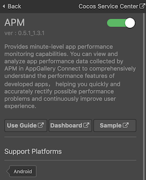
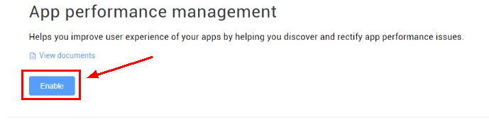
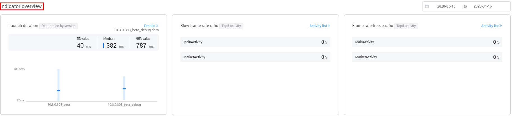

> **Note**: this version of the documentation has been archived and is no longer maintained. Please move to the [latest version](https://service.cocos.com/document/en/agc-apm.html).

# APM (AppGallery Connect) Quick Start

[App Performance Management (APM)](https://developer.huawei.com/consumer/en/doc/development/AppGallery-connect-Guides/agc-apms-introduction) Service of HUAWEI AppGallery Connect provides minute-level app performance monitoring capabilities. You can view and analyze app performance data collected by APM in AppGallery Connect to comprehensively understand the performance features of developed apps, helping you quickly and accurately rectify possible performance problems and continuously improve user experience.

### Functions

| Function | Description |
| :--- | :--- |
| Automatically collects performance data about app launches, app screen rendering, and HTTP/HTTPS network requests. | The APM SDK automatically collects key performance data about app launches, app screen rendering, and HTTP/HTTPS network requests.<br>1. App launch: app launch time in cold and warm launch modes.<br>2. App screen rendering: number of slow frames and frozen frames during app screen rendering.<br>3. HTTP/HTTPS network request: indicators such as the response duration, success rate, and response size. |
| Allows you to view and analyze app performance data to accurately identify the aspects that can be improved. | APM displays app performance indicators from multiple dimensions (such as the version number, country/region, device model, level-1 region, system version, carrier, and network), helping you quickly understand the aspects that can be improved. |
| Allows you to create custom traces to monitor app performance data in specific scenarios. |  With the APM SDK, you can:<br>1. Create custom traces to monitor your app's performance in scenarios such as sign-in and scene loading.<br>2. Add indicators (such as the number of sign-in times) and properties (such as whether the sign-in is successful) for a custom trace. |

### Version Update Description

- Latest Version: 0.5.2_1.3.1.300

    - Fix some bugs.

- v0.5.1_1.3.1

    - Integrated Huawei AGC APM service.

## Enable APM Service

- Use Cocos Creator to open the project that needs to be connected to APM service.

- Click on **Panel -> Service** in the menu bar to open the Service panel, select APM service to go to the service detail page, and then click on the **Enable** button in the top right to enable the service. For details, please refer to the Cocos Service [Operation Guide](./index.md#usage) documentation.

  

- If APM is not enabled in the [AppGallery Connect](https://developer.huawei.com/consumer/en/service/josp/agc/index.html) console, go to **Quality -> APM** , click **Enable** button to enable the service.

  

### Configs HUAWEI Config File

Most of HUAWEI Services need the `agconnect-services.json` configuration file. If there are operations such as newly opened services, please update the file in time.

- Sign in to [AppGallery Connect](https://developer.huawei.com/consumer/en/service/josp/agc/index.html) find your project from the project list and select the app on the project card.

- On the **Project Setting** page, click the configuration file **agconnect-services.json** to download it. The `agconnect-services.json` file **must be copied manually** to the `settings` directory of the project directory after downloading or updating.

  

- For Creator v2.4.3 and above, if you want to publish to the [HUAWEI AppGallery Connect](../publish/publish-huawei-agc.md), you can select the downloaded or updated configuration file directly in the **Build** panel, no need to copy it manually.

  

### Verify whether the service is integrated successfully

- Once the APM service is integrated, you can [publish to the Android platform](../publish/publish-native.md) without changing your code. Please make sure that the **Package Name** on the **Build** panel is consistent with the **Package Name** set in the AppGallery Connect console.

- Login the [AppGallery Connect](https://developer.huawei.com/consumer/en/service/josp/agc/index.html) console, open the project, go to **Quality -> APM**. If you can see App Performance information (usually displayed within 15 minutes), which means the integrate is successful.

  

## Sample Project

Developer can get a quick taste of the APM service with the sample project.

- Click on the **Sample** button in the APM service panel, clone or download, and open the project in Cocos Creator.

- After enabling the APM service and configuring the HUAWEI configuration file as described above, you can open the **Build** panel to compile the project by clicking **Project -> Build** in the Creator editor menu bar. Cocos Creator v2.4.1 and above, you could [publish to HUAWEI AppGallery Connect](../publish/publish-huawei-agc.md). Below Creator v2.4.1 could [publish to the Android platform](../publish/publish-native.md).

- Once the Sample project is running on the phone, click the **APMS** button on the homepage for testing.

  

## Developer Guide

### Enables or disables APM

`enableCollection(enable: boolean): void`

 The default value is true, indicating that APM app performance data collection is enabled. To disable app performance data collection of APM, set this parameter to false. You can refer to [Disabling APM Performance Monitoring in Apps](https://developer.huawei.com/consumer/en/doc/development/AppGallery-connect-Guides/agc-apms-stopapms#h1-1584589061111) documentation for details.

The priority of the disabling configuration in apps is **higher** than that through Remote Configuration in AppGallery Connect. If users disable performance monitoring in apps, the APM does not collect performance data even if the performance monitoring function is enabled through Remote Configuration in AppGallery Connect.

**Parameter Description**:

| Parameter | Description | 
| :---------- | :------------- |  
|  enable | Indicates whether to enable APM to collect performance monitoring data.<br>**true**: performance data collection is enabled.<br>**false**: performance data collection is disable. | 

**Example**:

```js
huawei.agc.apms.apmsService.enableCollection(true);
```

### Creating a Custom Trace (Optional)

Custom traces can be used to monitor the performance of your app in specific scenarios, such as app sign-in and that the page fails to respond for a long time. Compared with the AGC APM SDK, the APM plug-in needs to add the `name` parameter to get the object. If the object with the current name does not exist, a new object will be created. You can refer to [Creating a Custom Trace](https://developer.huawei.com/consumer/en/doc/development/AppGallery-connect-Guides/agc-apms-addtrace) documentation for details.

#### Start

`startCustomTrace(name: string): void`

Starts a custom trace. You can refer to [start](https://developer.huawei.com/consumer/en/doc/development/AppGallery-connect-References/customtrace#start) documentation for details.

**Parameter Description**:

| Parameter | Description |   
| :---------- | :------------- |  
| name | The name of the custom trace. The value can contain only Chinese characters, letters (case-insensitive), digits, and underscores (_), with up to 100 characters. The following methods need to get the object call based on the name. If the object with the current name does not exist, a new object will be created. | 

**Example**:

```js
huawei.agc.apms.apmsService.startCustomTrace("traceID");
```

#### Stop

`stopCustomTrace(name: string): void`

Stops a custom trace. You can refer to [stop](https://developer.huawei.com/consumer/en/doc/development/AppGallery-connect-References/customtrace#stop) documentation for details.

**Parameter Description**:

| Parameter | Description |   
| :---------- | :------------- |  
| name | The name of the custom trace. The value can contain only Chinese characters, letters (case-insensitive), digits, and underscores (_), with up to 100 characters. The following methods need to get the object call based on the name. If the object with the current name does not exist, a new object will be created. | 

**Example**:

```js
huawei.agc.apms.apmsService.stopCustomTrace("traceID");
```

#### Put Property

`putCustomTraceProperty(name: string, propertyName: string, propertyValue: string): void`

Sets the attribute names and values of a custom trace. Up to **5** custom attributes can be set for each **CustomTrace** instance.

**Parameter Description**:

| Parameter | Description |   
| :---------- | :------------- |  
| name | The name of the custom trace. The value can contain only Chinese characters, letters (case-insensitive), digits, and underscores (_), with up to 100 characters. The following methods need to get the object call based on the name. If the object with the current name does not exist, a new object will be created. | 
| propertyName | Name of a custom attribute. The name can contain only Chinese characters, letters (case-insensitive), digits, and underscores (_), with up to 40 characters. | 
| propertyValue | Value of a custom attribute. The value can contain only Chinese characters, letters (case-insensitive), digits, and underscores (_), with up to 100 characters. | 

**Example**:

```js
let traceID = "testTrace";
let pName = "product";
let pValue = "food";

huawei.agc.apms.apmsService.putCustomTraceProperty(traceID, pName, pValue);
```

#### Remove Property

`removeCustomTraceProperty(name: string, propertyName: string): void`

Removes an existing attribute from a CustomTrace instance.

**Parameter Description**:

| Parameter | Description |   
| :---------- | :------------- |  
| name | The name of the custom trace. The value can contain only Chinese characters, letters (case-insensitive), digits, and underscores (_), with up to 100 characters. The following methods need to get the object call based on the name. If the object with the current name does not exist, a new object will be created. | 
| propertyName | Name of the attribute to be removed. The value can contain only Chinese characters, letters (case-insensitive), digits, and underscores (_), with up to 40 characters. | 

**Example**:

```js
let traceID = "testTrace";
let pName = "product";

huawei.agc.apms.apmsService.removeCustomTraceProperty(traceID, pName);
```

#### Get Property

`getCustomTraceProperty(name: string, propertyName: string): string`

Obtains a custom attribute value. You can refer to [getProperty](https://developer.huawei.com/consumer/en/doc/development/AppGallery-connect-References/customtrace#getProperty) documentation for details.

**Parameter Description**:

| Parameter | Description |   
| :---------- | :------------- |  
| name | The name of the custom trace. The value can contain only Chinese characters, letters (case-insensitive), digits, and underscores (_), with up to 100 characters. The following methods need to get the object call based on the name. If the object with the current name does not exist, a new object will be created. | 
| propertyName | Name of the attribute to be removed. The value can contain only Chinese characters, letters (case-insensitive), digits, and underscores (_), with up to 40 characters. | 

**Example**:

```js
let traceID = "testTrace";
let pName = "product";
let propertValue = huawei.agc.apms.apmsService.getCustomTraceProperty(traceID, pName);
console.log("pValue = ", propertValue);
```

#### Increment Measure

`incrementCustomTraceMeasure(name: string, measureName: string, measureValue: number): void`

Adds an indicator value for a custom trace. If the indicator does not exist, a new one is created. If the custom trace is not started or has been stopped, the API does not take effect.

**Parameter Description**:

| Parameter | Description |   
| :---------- | :------------- |  
| name | The name of the custom trace. The value can contain only Chinese characters, letters (case-insensitive), digits, and underscores (_), with up to 100 characters. The following methods need to get the object call based on the name. If the object with the current name does not exist, a new object will be created. | 
| measureName | Name of the custom trace indicator to which an indicator value is to be added. | 
| measureValue | Indicator value to be added. Corresponds to `long` type on Java side. | 

**Example**:

```js
let traceID = "testTrace";
let mName = "MeasureName";
let mValue = 12000;

huawei.agc.apms.apmsService.incrementCustomTraceMeasure(traceID, mName, mValue);
```

#### Get Measure

`getCustomTraceMeasure(name: string, measureName: string): string`

Obtains an indicator value for a custom trace. You can refer to [getMeasure](https://developer.huawei.com/consumer/en/doc/development/AppGallery-connect-References/customtrace#getMeasure) documentation for details.

**Parameter Description**:

| Parameter | Description |   
| :---------- | :------------- |  
| name | The name of the custom trace. The value can contain only Chinese characters, letters (case-insensitive), digits, and underscores (_), with up to 100 characters. The following methods need to get the object call based on the name. If the object with the current name does not exist, a new object will be created. | 
| measureName | Name of the custom trace indicator to which an indicator value is to be added. | 

**Example**:

```js
let traceID = "testTrace";
let mName = "MeasureName";

let measureValue = huawei.agc.apms.apmsService.getCustomTraceMeasure(traceID, mName);
console.log("mValue = ", measureValue);
```

#### Put Measure

`putCustomTraceMeasure(name: String, measureName: String, measureValue: number): void`

Adds an indicator for a custom trace. If the indicator already exists, the value of the indicator is updated. You can refer to [putMeasure](https://developer.huawei.com/consumer/en/doc/development/AppGallery-connect-References/customtrace#putMeasure) documentation for details.

**Parameter Description**:

| Parameter | Description |   
| :---------- | :------------- |  
| name | The name of the custom trace. The value can contain only Chinese characters, letters (case-insensitive), digits, and underscores (_), with up to 100 characters. The following methods need to get the object call based on the name. If the object with the current name does not exist, a new object will be created. | 
| measureName | Name of the custom trace indicator to which an indicator value is to be added. | 
| measureValue | Indicator value to be added. Corresponds to `long` type on Java side. | 

**Example**:

```js
let traceID = "testTrace";
let mName = "MeasureName";
let mValue = 12000;

huawei.agc.apms.apmsService.putCustomTraceMeasure(traceID, mName, mValue);
```

#### Get Properties

`getCustomTraceProperties(name: string): string`

Obtains the custom attribute values by JSON object.

**Parameter Description**:

| Parameter | Description |   
| :---------- | :------------- |  
| name | The name of the custom trace. The value can contain only Chinese characters, letters (case-insensitive), digits, and underscores (_), with up to 100 characters. The following methods need to get the object call based on the name. If the object with the current name does not exist, a new object will be created. | 

**Example**:

```js
let traceID = "testTrace";
let tProp = huawei.agc.apms.apmsService.getCustomTraceProperties(traceID);
console.log("tProp = ", JSON.stringify(tProp));
```

### Adding Indicators to Monitor Specific Network Requests (Optional)

APM automatically collects performance data of most network requests for your app. However, if a framework other than URLConnection or Okhttp is used, APM may miss some network requests. In this case, use the method described in this section to collect network performance data to preventing request loss. In addition, you can add custom properties to refine network performance data analysis. For details, please refer to [addnetworkmeasure](https://developer.huawei.com/consumer/en/doc/development/AppGallery-connect-Guides/agc-apms-addnetworkmeasure) documentation for details.

#### Init

`initNetworkMeasure(url: string, httpMethod: string): string`

[Creates a network request indicator instance](https://developer.huawei.com/consumer/en/doc/development/AppGallery-connect-References/apms#createNetworkMeasure) for each network request to collect network performance data. The return value is the **id** required by the methods below.

**Parameter Description**:

| Parameter | Description | 
| :---------- | :------------- |  
| url | Network request URL.| 
| httpMethod | Request method. Only the GET, PUT, POST, DELETE, HEAD, PATCH, OPTIONS, TRACE, and CONNECT methods are supported. | 

**Example**:

```js
let id = huawei.agc.apms.apmsService.initNetworkMeasure(url, "POST");
console.log("createNetworkMeasure, id = ", id);
```

#### Start

`startNetworkMeasure(id: string): void`

Sets the request start time. You can refer to [start](https://developer.huawei.com/consumer/en/doc/development/AppGallery-connect-References/networkmeasure#start) documentation for details.

**Parameter Description**:

| Parameter | Description | 
| :---------- | :------------- |  
| id | The object id returned by the `initNetworkMeasure` method. There may be **multiple ids** at the same time. All other methods need to send the parameter. | 

**Example**:

```js
huawei.agc.apms.apmsService.startNetworkMeasure(id);
```

#### Stop

`stopNetworkMeasure(id: string): void`

Sets the request end time and reports network request indicators and custom attribute data. You can refer to [stop](https://developer.huawei.com/consumer/en/doc/development/AppGallery-connect-References/networkmeasure#stop) documentation for details.

**Parameter Description**:

| Parameter | Description | 
| :---------- | :------------- |  
| id | The object id returned by the `initNetworkMeasure` method. There may be **multiple ids** at the same time. All other methods need to send the parameter. | 

**Example**:

```js
huawei.agc.apms.apmsService.stopNetworkMeasure(id);
```

#### Set Status Code

`setNetworkMeasureStatusCode(id: string, statusCode: number): void`

Sets the response code of a request. You can refer to [setStatusCode](https://developer.huawei.com/consumer/en/doc/development/AppGallery-connect-References/networkmeasure#setStatusCode) documentation for details.

**Parameter Description**:

| Parameter | Description | 
| :---------- | :------------- |  
| id | The object id returned by the `initNetworkMeasure` method. There may be **multiple ids** at the same time. All other methods need to send the parameter. | 
| statusCode | Response code of a request. | 

**Example**:

```js
huawei.agc.apms.apmsService.setNetworkMeasureStatusCode(id, 500);
```

#### Set Bytes Sent

`setNetworkMeasureBytesSent(id: string, length: number): void`

Sets the request body size. You can refer to [setBytesSent](https://developer.huawei.com/consumer/en/doc/development/AppGallery-connect-References/networkmeasure#setBytesSent) documentation for details.

**Parameter Description**:

| Parameter | Description | 
| :---------- | :------------- |  
| id | The object id returned by the `initNetworkMeasure` method. There may be **multiple ids** at the same time. All other methods need to send the parameter. | 
| length | Request body size. Corresponds to `long` type on Java side. | 

**Example**:

```js
huawei.agc.apms.apmsService.setNetworkMeasureBytesSent(id, 10000);
```

#### Set Bytes Received

`setNetworkMeasureBytesReceived(id: string, length: number): void`

Sets the response body size. You can refer to [setBytesReceived](https://developer.huawei.com/consumer/en/doc/development/AppGallery-connect-References/networkmeasure#setBytesReceived) documentation for details.

**Parameter Description**:

| Parameter | Description | 
| :---------- | :------------- |  
| id | The object id returned by the `initNetworkMeasure` method. There may be **multiple ids** at the same time. All other methods need to send the parameter. | 
| length | Response body size. Corresponds to `long` type on Java side. | 

**Example**:

```js
huawei.agc.apms.apmsService.setNetworkMeasureBytesReceived(id, 10000);
```

#### Set Content Type

`setNetworkMeasureContentType(id: string, contentType: string): void`

Sets the response body type specified by **contentType**. You can refer to [setContentType](https://developer.huawei.com/consumer/en/doc/development/AppGallery-connect-References/networkmeasure#setContentType) documentation for details.

**Parameter Description**:

| Parameter | Description | 
| :---------- | :------------- |  
| id | The object id returned by the `initNetworkMeasure` method. There may be **multiple ids** at the same time. All other methods need to send the parameter. | 
| contentType | Response body type specified by **contentType**. | 

**Example**:

```js
huawei.agc.apms.apmsService.setNetworkMeasureContentType(id, "contentType1");
```

#### Put Property

`putNetworkMeasureProperty(id: string, propertyName: string, propertyValue: string): void`

Sets the custom attribute name and value of a network request. Up to **5** custom attributes can be set for each **NetworkMeasure** instance. You can refer to [putProperty](https://developer.huawei.com/consumer/en/doc/development/AppGallery-connect-References/networkmeasure#putProperty) documentation for details.

**Parameter Description**:

| Parameter | Description | 
| :---------- | :------------- |  
| id | The object id returned by the `initNetworkMeasure` method. There may be **multiple ids** at the same time. All other methods need to send the parameter. | 
| propertyName | Name of a custom attribute. The name can contain only Chinese characters, letters (case-insensitive), digits, and underscores (_), with up to 40 characters. | 
| propertyValue | Value of a custom attribute. The value can contain only Chinese characters, letters (case-insensitive), digits, and underscores (_), with up to 100 characters. | 

**Example**:

```js
let pName = "propName";
let pValue = "12000";
huawei.agc.apms.apmsService.putNetworkMeasureProperty(id, pName, pValue);
```

#### Remove Property

`removeNetworkMeasureProperty(id: string, propertyName: string): void`

Removes an existing attribute from a **NetworkMeasure** instance. You can refer to [removeProperty](https://developer.huawei.com/consumer/en/doc/development/AppGallery-connect-References/networkmeasure#removeProperty) documentation for details.

**Parameter Description**:

| Parameter | Description | 
| :---------- | :------------- |  
| id | The object id returned by the `initNetworkMeasure` method. There may be **multiple ids** at the same time. All other methods need to send the parameter. | 
| propertyName | Name of a custom attribute. The name can contain only Chinese characters, letters (case-insensitive), digits, and underscores (_), with up to 40 characters. | 

**Example**:

```js
let pName = "propName";
huawei.agc.apms.apmsService.removeNetworkMeasureProperty(id, pName);
```

#### Get Properties

`getNetworkMeasureProperties(id: string): string`

Obtains all attributes from a NetworkMeasure instance by JSON object. You can refer to [getProperties](https://developer.huawei.com/consumer/en/doc/development/AppGallery-connect-References/networkmeasure#getProperties) documentation for details.

**Parameter Description**:

| Parameter | Description | 
| :---------- | :------------- |  
| id | The object id returned by the `initNetworkMeasure` method. There may be **multiple ids** at the same time. All other methods need to send the parameter. | 

**Example**:

```js
let mProp = huawei.agc.apms.apmsService.getNetworkMeasureProperties(id);
console.log("mProp = ", JSON.stringify(mProp));
```

#### Get Property

`getNetworkMeasureProperty(id: string, propertyName: string): string`

Obtains a custom attribute value. You can refer to [getProperty](https://developer.huawei.com/consumer/en/doc/development/AppGallery-connect-References/networkmeasure#getProperty) documentation for details.

**Parameter Description**:

| Parameter | Description | 
| :---------- | :------------- |  
| id | The object id returned by the `initNetworkMeasure` method. There may be **multiple ids** at the same time. All other methods need to send the parameter. | 
| propertyName | Name of a custom attribute. The name can contain only Chinese characters, letters (case-insensitive), digits, and underscores (_), with up to 40 characters. | 

**Example**:

```js
let pName = "propName";
let nMeasure = huawei.agc.apms.apmsService.getNetworkMeasureProperty(id, pName);
console.log("nMeasure = ", JSON.stringify(nMeasure));
```

## API Reference

Please refer to the [APM - API Reference](https://service.cocos.com/document/api/modules/huawei.agc.apms.html).
