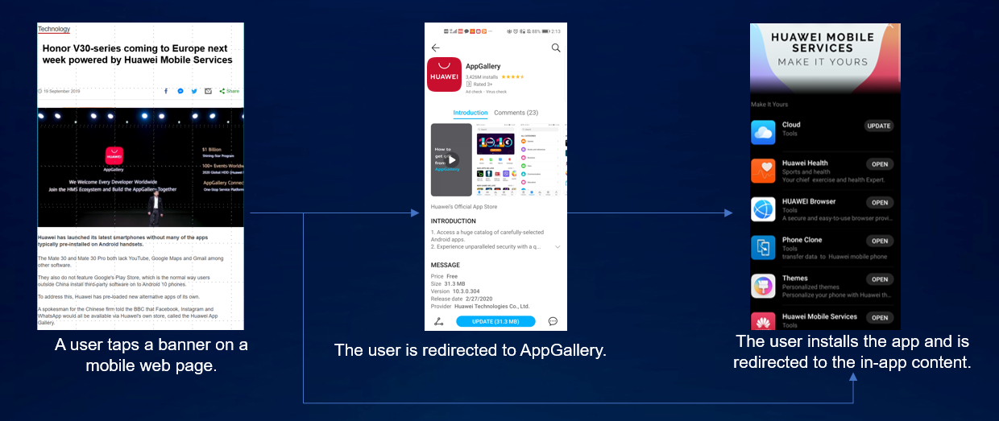
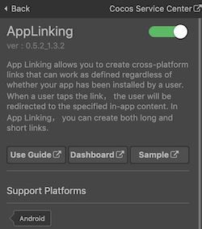
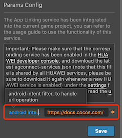
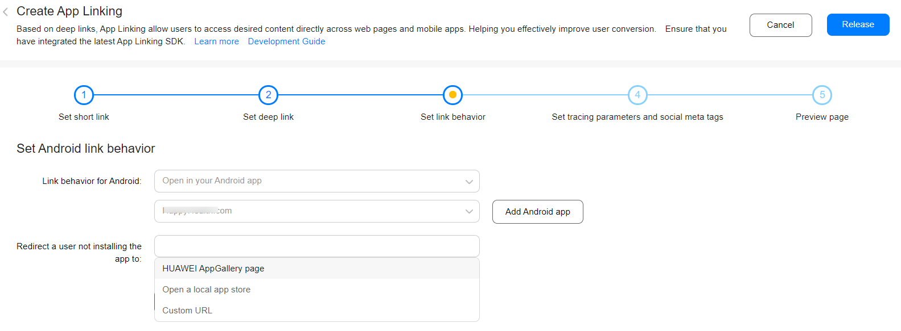

> **Note**: this version of the documentation has been archived and is no longer maintained. Please move to the [latest version](https://service.cocos.com/document/en/agc-applinking.html).

# App Linking (AppGallery Connect) Quick Start

[App Linking](https://developer.huawei.com/consumer/en/doc/development/AppGallery-connect-Guides/agc-applinking-introduction) allows you to create cross-platform links that can work as defined regardless of whether your app has been installed by a user. A link created in App Linking can be distributed through multiple channels to users. When a user taps the link, the user will be redirected to the specified in-app content. In App Linking, you can create both long and short links.

To identity the source of a user, you can set tracing parameters when creating a link of App Linking to trace traffic sources. By analyzing the link performance of each traffic source based on the tracing parameters, you can find the platform that can achieve the best promotion effect for your app.

### Use Cases

#### Waking Up Inactive Users/Increasing Views of a Specific Page

You can create a user waking-up activity under **Operate -> Promotion -> Manage promotions -> Activities** and then create a link of App Linking to direct users to the activity through social media, email, SMS message, or push message. If a user finds the activity attractive and taps the link, your app will be launched and the user will be redirected to the activity page and instructed to complete certain actions required by the activity, for example, sharing or making a payment. In this way, user activity is improved and the view count of the page increases.


#### Converting Mobile Website Users into Native App Users

When a mobile website user opens a common shared link (not a link of App Linking) on a page, the user needs to install the app first, go back to the page, and open the link again. App Linking can greatly improve user experience in this process by directly redirecting a user to the target in-app content after the user installs your app.



#### Tracing Traffic Sources in Daily Marketing to Identity the Most Effective Marketing Platform

You can set tracing parameters for a marketing link of App Linking to be placed on multiple marketing platforms so that you can identity which platform can achieve the best marketing result based on statistics collected for each platform and check whether users on this platform fit the user profile that you have defined at the beginning.


#### Encouraging Users to Share Links

App Linking can work with [Cloud Functions](https://developer.huawei.com/consumer/en/doc/development/AppGallery-connect-Guides/agc-cloudfunction-introduction) and [Cloud DB](https://developer.huawei.com/consumer/en/doc/development/AppGallery-connect-Guides/agc-clouddb-introduction) to encourage users to share links to their friends by offering incentives, effectively boosting user growth for your app.

### Main Functions

| Function | Description |
| :--- | :--- |
| Support for deferred deep links | Directs a user who has not installed your app to AppGallery to download your app first and then goes to the linked in-app content directly, without requiring the user to tap open the link again. |
| Link display in card form | Uses a sharing identifier to display a link of App Linking as a card, which will attract more users on social media. |
| Data statistics | Records the data of all link-related events, such as numbers of link taps, first app launches, and non-first app launches, for you to conduct analysis. |

### Create a link of App Linking

There are three ways to create a link of App Linking:

1. Creating a link in AppGallery Connect

2. Creating a link by calling APIs on the client

3. Manually constructing a link

The created links include **long link** and **short link**. The first two creation methods can create long/short links, while the third method can only create long links.

#### Long link

A long link is a link of App Linking in its entirety, and generally follows this format:

**URL prefix + [Deep link] + [Android app parameters] + [Preview type] + [Social sharing identifier parameters] + [Tracing parameters] + [Site ID]**

- The URL prefix is the URL contained in a link, which is in `https://Domain` name format. You can use the domain name provided by AppGallery Connect for free.
- The deep link is the URL of your app content. This is where a user will be directed when they tap the link. So if you want the user to see a specific page when they tap a link, you can set the URL of that page as the deep link.
- Android app parameters include the APK name, the link that will be opened if your app is not installed, and the earliest version of your app where the link can be opened.
- The preview type defines the type of the preview page displayed when a link of App Linking is opened in the browser.
- Social sharing identifier parameters define what information will appear when the link is shared on social platforms. Links can currently be shared on Facebook, Messenger, Twitter, and WhatsApp.
- A tracing parameter is added to a link to track the effectiveness of campaigns across traffic sources.
- The site ID is determined based on the data storage location of your app. It is used to identify the site that provides the App Linking service for your app.

For more information about long links, please refer to [Manually Constructing a Link](https://developer.huawei.com/consumer/en/doc/development/AppGallery-connect-Guides/agc-applinking-createlinks-defined).

#### Short link

Short link addresses are shortened by shortening the information contained in a long link address to a random string suffix in order to prevent the link address from being too long for sharing. A short link follows this format:

**URL prefix + Random suffix of the string type**

- URL prefix: Consistent with long links.
- The suffix of a short link can be **Long** or **Short**:
  - **Long** suffix contains 17 characters.
  - **Short** suffix contains at least four random characters.

### Open a link of App Linking

A link can be opened either in a **browser** or in your **app**, which is specified by you.

- If you set the link as to be opened in a browser, a user can open the link in a browser either from a **mobile device** or **PC**.

- If you set the link as to be opened in your app:
  - When a user who has not installed the app taps the link, the user will be redirected to AppGallery (or a custom address) and instructed to install your app. After the user installs the app, the app will be launched and the in-app content will be displayed.
  - When a user who has installed your app taps the link, the user will be directly redirected to the target in-app content.

### Version Update Description

- Latest Version: 0.6.0_1.4.2.301

    - Update SDK to v1.4.2.301.
    - Add **intent link type** option to the service panel.
    - Add **Clickboard Setting** option to the service panel.

- v0.5.9_1.4.1.300

    - Added support for AppLinking receives information mode.

- v0.5.7_1.4.1.300

    - Fix some bugs.

- v0.5.4_1.3.2

    - Integrated Huawei AGC App Linking service.

## Enable App Linking Service

- Use Cocos Creator to open the project that needs to be connected to App Linking service.

- App Linking service works with the HUAWEI Analytics Kit, please enable the [Analytics Kit (HMS Core)](./hms-analytics.md) before integrating the App Linking service.

- Click on **Panel -> Service** in the menu bar to open the Service panel, select **App Linking** service to go to the service detail page, and then click on the **Enable** button in the top right to enable the service. For details, please refer to the Cocos Service [Operation Guide](./index.md#usage) documentation.

  

- Fill in the **android intent filter** in the **Params Config** of the App Linking service panel with the address of the App Linking **original** website. Then set the **intent link type** option. The service plug-in will add the required configuration to the `AndroidManifest.xml` file when building. Please refer to the [Adding an Intent Filter](https://developer.huawei.com/consumer/en/doc/development/AppGallery-connect-Guides/agc-applinking-receivelinks#h1-1585311152686) for details.

    - Currently, your app can receive data through **AppLink** or **DeepLink**. **AppLink** is recommended.
    - If you select **AppLink**, the URL prefix must be `http://` or `https://`.
    - If you select **DeepLink**, you can use any URL prefix, such as `abc://`.

- The App Linking SDK reads content on the clipboard to obtain link information during the first launch and go to the linked content in the app. You can set the **Clipboard Settings** option to choose whether to read the clipboard every time when the app is started.
    
    - **Default**: App Linking SDK reads content on the clipboard only when the app is launched for the first time.
    - **Available**: App Linking SDK reads content on the clipboard each time when the app is launched.
    - **Unavailable**: App Linking SDK does not read content on the clipboard.

  

- Developer need to prefix the free domain name (for example, `drcn.agconnect.link`) provided by AppGallery Connect with a string to uniquely identify the URL prefix. Please refer to [Adding a URL Prefix](https://developer.huawei.com/consumer/en/doc/development/AppGallery-connect-Guides/agc-applinking-createlinks-byagc#h1-1585299576869).

- Find your project from the project list and click the app for which you need to enable App Linking service on the project card. Go to **Growing -> App Linking**, if it is the first time that you use App Linking service, click **Enable now** in the upper right corner.  

  

### Configs HUAWEI Config File

Most of HUAWEI Services need the `agconnect-services.json` configuration file. If there are operations such as newly opened services, please update the file in time.

- Sign in to [AppGallery Connect](https://developer.huawei.com/consumer/en/service/josp/agc/index.html) find your project from the project list and select the app on the project card.

- On the **Project Setting** page, click the configuration file **agconnect-services.json** to download it. The `agconnect-services.json` file **must be copied manually** to the `settings` directory of the project directory after downloading or updating.

  

- For Creator v2.4.3 and above, if you want to publish to the [HUAWEI AppGallery Connect](../publish/publish-huawei-agc.md), you can select the downloaded or updated configuration file directly in the **Build** panel, no need to copy it manually.

  

### Verify whether the service is integrated successfully

- Once the App Linking service is integrated, we can verify the success of the App Linking service integration by adding simple code to the script.

  ```js
  huawei.agc.applinking.appLinkingService.on(huawei.agc.applinking.AGC_APP_LINKING_EVENT_LISTENER_NAME.RECEIVE_LINK_CALLBACK, (data) => {
      console.log("getData, data.code =", data.code);
      if (data.code === 1) {
          this.console.log('receive deepLink:', data.getDeepLink());
      }
  }, this);
  ```

- [Publish to the Android platform](../publish/publish-native.md) after the code is added. Please make sure that the **Package Name** on the **Build** panel is consistent with the **Package Name** set in the AppGallery Connect console.

- Refer to [Creating a Link in AppGallery Connect](https://developer.huawei.com/consumer/en/doc/development/AppGallery-connect-Guides/agc-applinking-createlinks-byagc) documentation to create an App Linking. When setting the Android Linking behavior, select **Open in your Android app** and select the current app in the settings box below (if you have not created an application, you can click the **Add Android app** button to create).

  

- Get the App Linking address, open it in browser of test device, you can see the App Linking's interface as below. Click **Open** button and jump to the App.

  

- After jumping to the App, if you can see the **deepLink** address in **LogCat**, which means the integrate is successful.

## Sample Project

Developer can get a quick taste of the App Linking service with the sample project.

- Click on the **Sample** button in the App Linking service panel, clone or download, and open the project in Cocos Creator.

- After enabling the App linking service and configuring the HUAWEI configuration file as described above, you can open the **Build** panel to compile the project by clicking **Project -> Build** in the Creator editor menu bar. Cocos Creator v2.4.1 and above, you could [publish to HUAWEI AppGallery Connect](../publish/publish-huawei-agc.md). Below Creator v2.4.1 could [publish to the Android platform](../publish/publish-native.md).

- Once the Sample project is running on the phone, click the **AppLinking** button on the homepage for testing.

  

## Developer Guide

This article mainly introduces the [Creating a Link of App Linking in Your App](https://developer.huawei.com/consumer/en/doc/development/AppGallery-connect-Guides/agc-applinking-createlinks-bysdk) method. Other creating App Linking methods, please refer to [Creating a Link in AppGallery Connect](https://developer.huawei.com/consumer/en/doc/development/AppGallery-connect-Guides/agc-applinking-createlinks-byagc) and [Manually Constructing a Link of App Linking](https://developer.huawei.com/consumer/en/doc/development/AppGallery-connect-Guides/agc-applinking-createlinks-defined) documentations for details.

### Creating a Link of App Linking in Your App

If you want your app to dynamically create links for users to share, you can integrate the App Linking SDK into your app so that your app can use APIs provided by the SDK to create long or short links.

#### Creating a Long or Short Link

- Call [setBuilder](https://service.cocos.com/document/api/classes/huawei.agc.applinking.applinking.html#setbuilder) to set a Builder object. The `Builder` instance contains link parameters is set by [huawei.AGC.AppLinking.Builder](https://service.cocos.com/document/api/classes/huawei.agc.applinking.builder.html).

  ```js
  let linkInfo = new huawei.agc.applinking.AppLinking();
  let linkBuilder = new huawei.agc.applinking.Builder();
  linkBuilder.setUriPrefix("https://yourapp.drcn.agconnect.link");
  linkBuilder.setDeepLink("https://docs.cocos.com/creator/manual/en/");
  linkInfo.setBuilder(linkBuilder);
  ```

- To set Android app parameters, call the [setAndroidLinkInfo](https://service.cocos.com/document/api/classes/huawei.agc.applinking.applinking.html#setandroidlinkinfo) method. The `AndroidLinkInfo` instance contains Android app parameters is set by [huawei.AGC.AppLinking.AndroidLinkInfo](https://service.cocos.com/document/api/classes/huawei.agc.applinking.androidlinkinfo.html).

  ```js
  let linkInfo = new huawei.agc.applinking.AppLinking();
  let androidLinkInfo = new huawei.AGC.AppLinking.AndroidLinkInfo();
  androidLinkInfo.setFallbackUrl("https://yourapp.drhw.agconnect.com/applink");
  androidLinkInfo.setMinimumVersion(1);
  linkInfo.setAndroidLinkInfo(androidLinkInfo);
  ```

- To set social sharing identifier parameters, call the [setSocialCardInfo](https://service.cocos.com/document/api/classes/huawei.agc.applinking.applinking.html#setsocialcardinfo) method. The `SocialCardInfo` instance contains social sharing identifier parameters is set by [huawei.AGC.AppLinking.SocialCardInfo](https://service.cocos.com/document/api/classes/huawei.agc.applinking.socialcardinfo.html).

  ```js
  let linkInfo = new huawei.agc.applinking.AppLinking();
  let socialBuilder = new huawei.agc.applinking.SocialCardInfo();
  socialBuilder.setDescription('this is a test case');
  socialBuilder.setImageUrl('http://url1.com/pic1.jpg');
  socialBuilder.setTitle('AppLinking Test');
  linkInfo.setSocialCardInfo(socialBuilder);
  ```

- To set activity parameters, call the [setCampaignInfo](https://service.cocos.com/document/api/classes/huawei.agc.applinking.applinking.html#setcampaigninfo) method. The `CampaignInfo` instance contains activity parameters is set by [huawei.agc.applinking.CampaignInfo](https://service.cocos.com/document/api/classes/huawei.agc.applinking.campaigninfo.html).

  ```js
  let linkInfo = new huawei.agc.applinking.AppLinking();
  let campaignInfo = new huawei.agc.applinking.CampaignInfo();
  campaignInfo.setMedium('test-medium');
  campaignInfo.setSource('test-source');
  campaignInfo.setName('test-name');
  linkInfo.setCampaignInfo(campaignInfo);
  ```

#### Create a long link

`buildLongLink(linkInfo: AppLinking): string`

Call `buildLongLink` synchronization method to generate a long link.

```js
let getLinkInfo = new huawei.agc.applinking.AppLinking();
...
let longLink = huawei.agc.applinking.appLinkingService.buildLongLink(genLinkInfo);
```

#### Create a short link

`buildShortLink(linkInfo: AppLinking): void`

Call `buildShortLink` to create a short link.

```js
huawei.agc.applinking.appLinkingService.once(huawei.agc.applinking.AGC_APP_LINKING_EVENT_LISTENER_NAME.BUILD_SHORT_LINK, (data) => {
    if (data.code === 1) {
        console.log('build short link success:', data.data);
    }
}, this);

let linkInfo = new huawei.agc.applinking.AppLinking();
...
huawei.agc.applinking.appLinkingService.buildShortLink(linkInfo);
```

#### Converting a Long Link to a Short Link

`buildShortLinkFromLongLink(longLink: string): void`

If you have created a long link and want to convert it to a short link by `buildShortLinkFromLongLink` method.

```js
huawei.agc.applinking.appLinkingService.once(huawei.agc.applinking.AGC_APP_LINKING_EVENT_LISTENER_NAME.BUILD_SHORT_LINK_FROM_LONG_LINK, (data) => {
    if (data.code === 1) {
        console.log('build short link from long link success:', data.data);
    }
}, this);

huawei.agc.applinking.appLinkingService.buildShortLinkFromLongLink(longLink);
```

### Receiving Links of App Linking

`getAppLinking(): void`

Checks whether there is data to be received from a specified link of App Linking. Obtain data passed through the link from the listener, such as `DeepLink`.

```js
huawei.agc.applinking.appLinkingService.on(huawei.agc.applinking.AGC_APP_LINKING_EVENT_LISTENER_NAME.RECEIVE_LINK_CALLBACK, (data) => {
    if (data.code === 1) {
        console.log('receive deepLink: ', data.getDeepLink());
    }
}, this);

huawei.agc.applinking.appLinkingService.getAppLinking();
```

## Reference Links

- [Viewing Analytical Data](https://developer.huawei.com/consumer/en/doc/development/AppGallery-connect-Guides/agc-applinking-viewanalytics)
- [Debugging the Link of App Linking](https://developer.huawei.com/consumer/en/doc/development/AppGallery-connect-Guides/agc-applinking-debug)
- [Social Sharing Identifiers](https://developer.huawei.com/consumer/en/doc/development/AppGallery-connect-Guides/agc-applinking-socialdescription)
- [Restrictions](https://developer.huawei.com/consumer/en/doc/development/AppGallery-connect-Guides/agc-applinking-restrictions)

## API Reference

Please refer to the [App Linking - API Reference](https://service.cocos.com/document/api/modules/huawei.agc.applinking.html).
