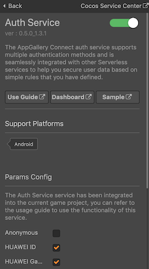
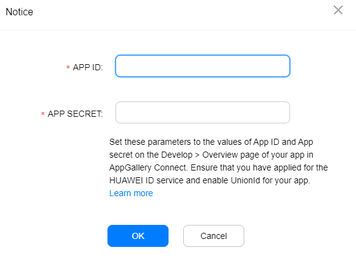
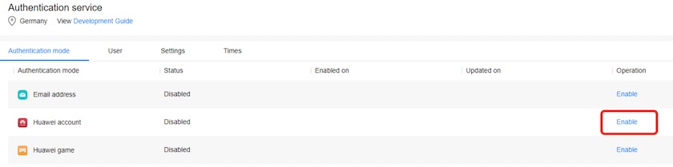

> **Note**: this version of the documentation has been archived and is no longer maintained. Please move to the [latest version](https://service.cocos.com/document/en/agc-auth.html).

# Auth Service (AppGallery Connect) Quick Start

AppGallery Connect provides a cloud-based [Auth Service](https://developer.huawei.com/consumer/en/doc/development/AppGallery-connect-Guides/agc-auth-introduction-0000001053732605) and SDKs to help you quickly build a secure and reliable user authentication system for your apps to verify user identity.

The AppGallery Connect auth service supports multiple authentication methods and is seamlessly integrated with other Serverless services to help you secure user data based on simple rules that you have defined.

### Functions

By using the AppGallery Auth Service SDK, you can integrate one or more of the following authentication methods into your app for achieving easy and efficient user registration and sign-in.

- Self-owned account: Your self-owned account is used to support the access of your existing authentication system so that your existing users can access other serverless services in a secure manner.
- Anonymous account: Anonymous accounts can be used to access your apps as visitors. The auth service can assign user IDs to your app visitors so that they can access other serverless services in a secure manner. A visitor can be registered as a formal user and retain the original user ID to ensure service continuity.
- Third-party accounts: AppGallery Connect allows user identity to be verified by using third-party authentication services. The AppGallery Auth Service SDK supports the following accounts for user identity verification:

  - HUAWEI account
  - HUAWEI Game Service account
  - Phone number 
  - Email account
  - WeChat account
  - Weibo account
  - QQ account 

  The following accounts, are supported **only at sites outside China**. You can use these authentication methods when the data storage location you select resides in Germany, Singapore, or Russia. The **Google account** and **Google Play Game account** authentication methods are supported only on devices installing Google Mobile Services (GMS).

  - Google account
  - Google Play Game account
  - Facebook account
  - Twitter account

### Service Process

- Obtain the authentication credential

  The authentication method determines how you can obtain the authentication credential.
  
  - For a third-party account, the authentication credential is the OAuth token issued by the third-party auth service.
  - For an anonymous account, the authentication credential is the unified identifier generated by the on-device SDK for the app installation instance.
  - For a self-created account, the authentication credential is the token generated by the existing authentication system through the Server SDK.

- Report the authentication credential

  The app reports the authentication credential to the auth service through the AppGallery Auth Service SDK.

- Verify the authentication credential

  The auth service verifies authentication credential in the cloud.

- Display the authentication result

  The Auth service sends the authentication results back to the app. At this point the app can access and maintain the user's basic profile information (nicknames, avatars), as well as access and manipulate data protected by security rules in other Serverless services.

### Version Update Description

- Latest Version: 0.5.2_1.4.1.300

    - Update the SDK and add some functions.

- v0.5.1_1.3.1

    - Integrated Huawei AGC Auth Service.
 
## Enable Auth Service

- Use Cocos Creator to open the project that needs to be connected to Auth Service.

- Click on **Panel -> Service** in the menu bar to open the Service panel, select Auth Service to go to the service detail page, and then click on the **Enable** button in the top right to enable the service. For details, please refer to the Cocos Service [Operation Guide](./index.md#usage) documentation.

  

- Login the [AppGallery Connect](https://developer.huawei.com/consumer/en/service/josp/agc/index.html) console, open the project. Go to **Build -> Auth Service**, if it is the first time that you use Auth Service, click **Enable now** in the upper right corner. For details, you can refer to the AGC Auth Service documentation - [Enabling Auth Service](https://developer.huawei.com/consumer/en/doc/development/AppGallery-connect-Guides/agc-auth-android-getstarted-0000001053053922#EN-US_TOPIC_0000001053053922__section916641174412).

  

- Select the required authentication method, click the **Enable** button on the right. 

  

- In the dialog box that is displayed, configure app information. Required information can be obtained refer to [Enabling Auth Service](https://developer.huawei.com/consumer/en/doc/development/AppGallery-connect-Guides/agc-auth-android-getstarted-0000001053053922#EN-US_TOPIC_0000001053053922__section916641174412) documentation for details.

  

- After console setting, return to the Creator Service panel, check the required authentication method to be enabled, and configure app information for client.

  

  > **Note**: if you are using **Google account** or **Google Play Game account** authentication method, **do not** check the **Generate App Bundle (Google Play)** option in the **Build** panel when publishing to Android.

### Configs HUAWEI Config File

Most of HUAWEI Services need the `agconnect-services.json` configuration file. If there are operations such as newly opened services, please update the file in time.

- Sign in to [AppGallery Connect](https://developer.huawei.com/consumer/en/service/josp/agc/index.html) find your project from the project list and select the app on the project card.

- On the **Project Setting** page, click the configuration file **agconnect-services.json** to download it. The `agconnect-services.json` file **must be copied manually** to the `settings` directory of the project directory after downloading or updating.

  

- For Creator v2.4.3 and above, if you want to publish to the [HUAWEI AppGallery Connect](../publish/publish-huawei-agc.md), you can select the downloaded or updated configuration file directly in the **Build** panel, no need to copy it manually.

  

### Verify whether the service is integrated successfully

- Let's take **HUAWEI account** authentication method as an example. Log in to [AppGallery Connect](https://developer.huawei.com/consumer/en/service/josp/agc/index.html) console, find your project and go to **Build -> Auth Service**, enable **HUAWEI account** authentication method and fill in the parameters.

  

- Add simple code to the script.

  ```js
  huawei.agc.auth.authService.switchAuthType(huawei.agc.auth.AuthProvider.HMS_Provider);
  huawei.agc.auth.authService.login();
  ```

- You can [publish to the Android platform](../publish/publish-native.md) after the code is added. Please make sure that the **Package Name** on the **Build** panel is consistent with the **Package Name** set in the AppGallery Connect console.

- Run the project on a phone, if the HUAWEI account login interface appears, which means the integrate is successful.

  

## Sample Project

Developer can get a quick taste of the Auth Service with the sample project.

- Click on the **Sample** button in the Auth Service panel, clone or download, and open the project in Cocos Creator.

- After enabling the Auth Service and configuring the HUAWEI configuration file as described above, you can open the **Build** panel to compile the project by clicking **Project -> Build** in the Creator editor menu bar. Cocos Creator v2.4.1 and above, you could [publish to HUAWEI AppGallery Connect](../publish/publish-huawei-agc.md). Below Creator v2.4.1 could [publish to the Android platform](../publish/publish-native.md).

- Need to test on Huawei or Honor brand phones with HMS Core service installed.

- Once the Sample project is running on the phone, click the **Auth** button on the homepage for testing.

  

## Developer Guide

The Auth Service plug-in in Cocos Service has unified encapsulation of various authentication methods of Java SDK. Please refer to this document and [Auth Service - API Document](https://service.cocos.com/document/api/modules/huawei.agc.auth.html) for integrate using JavaScript.

### Listener and callback

The Auth Service plug-in encapsulates the callbacks of each login method in a unified manner. The developer needs to set up a listener and bind the method, and the callback logic is unified in the binding method.

The callback enumeration value [AuthRetCode](https://service.cocos.com/document/api/enums/huawei.agc.auth.authretcode.html) has three length types:

- The four-digit **1XXX** is the **unified callback event enumeration value** defined by the Auth Service plug-in. Developers need to handle with key events. 
- The nine-digit **2038XXXXX** indicate backend server errors. 
- The one-digit **1 ~ 7** indicate SDK internal errors. 

The latter two length types are SDK error codes, which can be handled as needed.

**Example**:

```js
huawei.agc.auth.authService.setAuthListener(this.onAuthResult, this));

onAuthResult: function (code, msg) {
    switch (code) {
      ...
    }
}
```

### switchAuthType

`switchAuthType(authType: AuthProvider): void`

Select the current authentication method. You need to call this method first, before calling other methods such as `login`. The supported authentication method can be obtained by [getSupportAuthType](#getsupportauthtype).

**Parameter Description**:

| Parameter | Description | 
| :---------- | :------------- |  
|  authType  | enumeration value of [AuthProvider](https://service.cocos.com/document/api/enums/huawei.agc.auth.authprovider.html) type. | 

**Example**:

```js
huawei.agc.auth.authService.switchAuthType(huawei.agc.auth.AuthProvider.HMS_Provider);
```

### login

`login(): void`

Call the **login** method of the current authentication method.

**Example**:

```js
huawei.agc.auth.authService.login();
```

### logout

`logout(): void`

Call the **logout** method of the current authentication method.

**Example**:

```js
huawei.agc.auth.authService.logout();
```

### getUserInfo

`getUserInfo(): any`

Get current user info. The returned information may include:
- `isAnonymous`: is it a annoymous account
- `uid`: user id
- `displayName`: displays the user name
- `photoUrl`: icon photo url
- `email`: email account
- `phone`: phone number
- `providerId`: enumeration value of [AuthProvider](https://service.cocos.com/document/api/enums/huawei.agc.auth.authprovider.html) type
- `providerInfo`: auth provider info
- `emailVerified`: is it verified by email
- `passwordSetted`: set the password or not

**Example**:

```js
let userInfo = huawei.agc.auth.authService.getUserInfo();
console.log('getUserInfo...', 'info =', JSON.stringify(userInfo));
```

### setLoginInfo 

`setLoginInfo(loginInfo: any): void`

Set user registration or login information (for phone number or email account authentication methods only), the method needs to be called before other methods.

**Parameter Description**:

| Parameter | Description | 
| :---------- | :------------- |  
|  loginInfo  | JSON Object, according to the needs of phone or email account authentication method, require the following parameters:<br>`email`: Email account, for email account authentication method required.<br>`phoneNumber`: Phone number, for phone number authentication method required.<br>`countryCode`: Country/Region code, for phone number authentication method required.<br>`verifyCode`: The verification code that the user fills in after calling the `register` or `getVerifyCode` method, used to reset the login information.<br>`action`: `register` (for registration) or `reset` (for reset).<br>`locale`: Language in which the verification code message is sent for [updatePhone](#updatePhone) and [updateEmail](#updateEmail) method. The default is the current system language. | 

**Example**:

```js
let loginInfo = {
  email: '953xxxxx@gmail.com',
  phoneNumber: "181XXXXXXXX",
  countryCode: "86",
  verifyCode: code,
  action: "register",
  locale: "zh",
}
huawei.agc.auth.authService.setLoginInfo(loginInfo);
```

### register

`register(): void`

User register (for phone number or email account authentication methods only).

**Example**:

```js
huawei.agc.auth.authService.register();
```

### getVerifyCode

`getVerifyCode(): void`

Get verification code (for phone number or email account authentication methods only).

**Example**:

```js
huawei.agc.auth.authService.getVerifyCode();
```

### getSupportAuthType

`getSupportAuthType(): string`

Get supported authentication methods, such as "[0, 1, 2]", refer to [AuthProvider](https://service.cocos.com/document/api/enums/huawei.agc.auth.authprovider.html) type.

**Example**:

```js
let supAuthType = huawei.agc.auth.authService.getSupportAuthType();
console.log("getSupportAuthType...", "type = ", supAuthType);
```

### getToken

`getToken(forceRefresh: boolean): void`

Obtains the Access Token of a user from AppGallery Connect, update results via the asynchronous callback. Callback code is `huawei.agc.auth.AuthRetCode.GET_TOKEN_SUCCESS` or `huawei.agc.auth.AuthRetCode.GET_TOKEN_FAIL`.

**Parameter Description**:

| Parameter | Description | 
| :---------- | :------------- |  
|  forceRefresh  | Indicates whether to forcibly update the Access Token for new users.<br>**true**: Forcible update is required.<br>**false**: The cached Access Token is obtained. | 

**Example**:

```js
huawei.agc.auth.authService.getToken(true);
```

### link

`link(authType: AuthProvider): void`

Associate a new authentication login method for the current user.

**Parameter Description**:

| Parameter | Description | 
| :---------- | :------------- |  
|  authType  | Enumeration value of [AuthProvider](https://service.cocos.com/document/api/enums/huawei.agc.auth.authprovider.html) type. | 

**Example**:

```js
huawei.agc.auth.authService.link(huawei.agc.auth.AuthProvider.HMS_Provider);
```

### unlink

`unlink(authType: AuthProvider): void`

Disassociates the current user from the associated login method.

**Parameter Description**:

| Parameter | Description | 
| :---------- | :------------- |  
|  authType  | Enumeration value of [AuthProvider](https://service.cocos.com/document/api/enums/huawei.agc.auth.authprovider.html) type. | 

**Example**:

```js
huawei.agc.auth.authService.unlink(huawei.agc.auth.AuthProvider.HMS_Provider);
```

### updateProfile

`updateProfile(displayName: string, photoUrl: string): void`

Updates information (profile image and nickname) for the current user.

This API verifies the Access Token and Refresh Token of a user. Ensure that the Refresh Token is within its validity period. Otherwise, result code `INVALID_REFRESH_TOKEN = 203817986` will be returned, indicating that the user's Refresh Token has expired. When receiving the result code, prompt your user to sign in again so that you can obtain the new Access Token and Refresh Token.

**Parameter Description**:

| Parameter | Description | 
| :---------- | :------------- |  
|  displayName  | Display/nick name. | 
|  photoUrl  | Icon photo url. |

**Example**:

```js
huawei.agc.auth.authService.updateProfile("name1", photoUrl);
```

### updatePassword

`updatePassword(newPassword: string, verifyCode: string, provider: AuthProvider): void`

Updates the current user's password, update results via the asynchronous callback. After the password is updated successfully, the user's Access Token is refreshed and the user is asked to re-sign in. Otherwise, the API call may fail due to the Access Token matching failure. You can refer to [updatePassword](https://developer.huawei.com/consumer/en/doc/development/AppGallery-connect-References/agconnectuser#updatePassword) documentation for details.

**Parameter Description**:

| Parameter | Description | 
| :---------- | :------------- |  
|  newPassword  | New password. | 
|  verifyCode  | Verification code. |
|  provider  | Enumeration value of [AuthProvider](https://service.cocos.com/document/api/enums/huawei.agc.auth.authprovider.html) type, which is used to distinguish the email account from the phone number account. |

**Example**:

```js
huawei.agc.auth.authService.updatePassword("neWPaSSwOrd", "1234", huawei.agc.auth.AuthProvider.Phone_Provider);
```

### updateEmail

Updates the email account of the current user, update results via the asynchronous callback. Before calling this interface, call `getVerifyCode` function to apply a verification code for the new phone number to make sure the new number is owned by the current user. Please set the language of the verification code message in the [setLoginInfo](#setLoginInfo) method. You can refer to [updateEmail](https://developer.huawei.com/consumer/en/doc/development/AppGallery-connect-References/agconnectuser-0000001054522513#EN-US_TOPIC_0000001054522513__section39401634112717) documentation for details.

**Parameter Description**:

| Parameter | Description | 
| :---------- | :------------- |  
|  newEmail  | New email account. | 
|  newVerifyCode  | Verification code. |

**Example**:

```js
huawei.agc.auth.authService.updateEmail("newUser1@gmail.com", "1234");
```

### updatePhone

`updatePhone(countryCode: string, phoneNumber: string, newVerifyCode: string): void`

Updates the phone number of the current user, update results via the asynchronous callback. Before calling this method, call the `getVerifyCode` function to apply for a verification code of the new email account. The verification code is used to verify that the current user owns the new email account. Please set the language of the verification code message in the [setLoginInfo](#setLoginInfo) method. You can refer to [updatePhone](https://developer.huawei.com/consumer/en/doc/development/AppGallery-connect-References/agconnectuser-0000001054522513#EN-US_TOPIC_0000001054522513__section1668015437285) documentation for details.

**Parameter Description**:

| Parameter | Description | 
| :---------- | :------------- |  
|  countryCode  | Country/Region code. For example, 86 indicates China, 49 indicates Germany, 7 indicates Russia, and 65 indicates Singapore. This parameter supports multiple formats. Taking China as an example, the code can be 86, 0086, or +86. | 
|  phoneNumber  | Phone number. The number does not include the plus sign (+) and country/region code. For example, for the phone number +86132xxxxxxxx, the value of this parameter is 132xxxxxxxx. |
|  newVerifyCode  | Verification code. |

**Example**:

```js
huawei.agc.auth.authService.updatePhone("0086", "132xxxxxxxx", "1234");
```

### getUserExtra

`getUserExtra(): void`

Obtains UserExtra of the current user, update results via the asynchronous callback. This API verifies the Access Token and Refresh Token of a user. Ensure that the Refresh Token is within its validity period. Otherwise, result code `INVALID_REFRESH_TOKEN = 203817986` will be returned, indicating that the user's Refresh Token has expired. You can refer to [getUserExtra](https://developer.huawei.com/consumer/en/doc/development/AppGallery-connect-References/agconnectuser-0000001054522513#EN-US_TOPIC_0000001054522513__section191819193315) documentation for details.

**Example**:

```js
huawei.agc.auth.authService.getUserExtra();
```

### deleteUser

`deleteUser(): void`

Deletes the current user information and cache information from the AppGallery Connect server.

**Example**:

```js
huawei.agc.auth.authService.deleteUser();
```

### resetPassword

`resetPassword(emailOrPhone: string, newPassword: string, verifyCode: string, countryCode = ""): void`

Resets the password using a phone number (for phone number or email account authentication methods only). If the `countryCode` parameter is sent, it is the phone number authentication method, otherwise it is email account authentication method. Callback code is `huawei.agc.auth.AuthRetCode.RESET_PASS_SUCCESS` or `huawei.agc.auth.AuthRetCode.RESET_PASS_FAIL`.

**Parameter Description**:

| Parameter | Description | 
| :---------- | :------------- |  
|  emailOrPhone  | Email account or phone number. | 
|  newPassword  | New password. | 
|  verifyCode  | Verification code. |
|  countryCode  | Country/Region code. For example, 86 indicates China, 49 indicates Germany, 7 indicates Russia, and 65 indicates Singapore. This parameter supports multiple formats. Taking China as an example, the code can be 86, 0086, or +86. |

**Example**:

```js
huawei.agc.auth.authService.resetPassword("132xxxxxxxx", "neWPaSSwOrd", "1234", "0086");

huawei.agc.auth.authService.resetPassword("newUser1@gmail.com", "neWPaSSwOrd", "1234");
```

## API Reference

Please refer to the [Auth Service - API Reference](https://service.cocos.com/document/api/modules/huawei.agc.auth.html).
