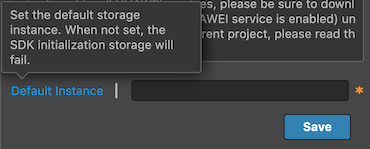

> **Note**: this version of the documentation has been archived and is no longer maintained. Please move to the [latest version](https://service.cocos.com/document/en/agc-cloudstorage.html).

# Cloud Storage (AppGallery Connect) Quick Start

[Cloud Storage](https://developer.huawei.com/consumer/en/doc/development/AppGallery-connect-Guides/agc-cloudstorage-introduction) is scalable and maintenance-free. It allows developer to store high volumes of data such as images, audios, and videos generated by your users securely and economically with direct device access.

The service is stable, secure, efficient, and easy-to-use, and can free you from development, deployment, O&M, and capacity expansion of storage servers. You do not need to pay attention to indicators such as availability, reliability, and durability and can focus on service capability building and operations, improving user experience.

### Advantages

Cloud Storage provides a client SDK for you to store files generated by users, such as images, videos, and audios. The SDK provides simple, secure, efficient, and robust APIs.

- Transmitted data is encrypted using HTTPS, and files are encrypted and stored on the cloud using secure encryption protocols.
- If an operation is terminated manually or due to a network fault, the app client only needs to pass the position where the operation is terminated to resume the operation.
- EB-level data storage is available for massive data storage.
- You can easily locate the cause of an error according to the result code.

### Working Principles

With the client SDK provided by Cloud Storage, an app client can upload files to the cloud storage space. Cloud Storage stores the uploaded files in the default storage instance. You can access these files through AppGallery Connect. You can also use the Cloud Storage SDK to download, delete, and manage files on the app client.

### Apply for Test Qualification

Cloud Storage is still in Beta testing. To use Cloud Storage, send an application email to `agconnect@huawei.com` to apply for the service.

Set your email title format as: **[Cloud Storage]-[Company name]-[Developer account ID]-[Project ID]**. For details about how to query thedeveloper account ID and project ID, please refer to [Querying the Developer Account ID and Project ID](https://developer.huawei.com/consumer/en/doc/development/AppGallery-connect-Guides/agc-query-ID). Huawei operation personnel will reply within 1 to 3 working days.

### Charge

Cloud Storage is in beta testing and uses a **limited free** usage policy. That is, you can use the service for free within a specified quota.

### Version Update Description

- Latest Version: 0.5.2_1.3.1.100

    - Fix the crash of the `updateFileMetadata` method.
    - Add some AGCStorageReference interfaces.
    - Add a new part to obtain the Android application storage directory interface.

- v0.5.0_1.3.0.300

    - Integrated Huawei AGC Cloud Storage service.

## Enable Cloud Storage Service

- Ensure that the Cloud Storage service test qualification application has been passed.

- Use Cocos Creator to open the project that needs to be connected to Cloud Storage service.

- Cloud Storage service depends on Auth Service, please enable the [Auth Service (AGC)](./agc-auth.md) before integrating the Cloud Storage service.

- Click on **Panel -> Service** in the menu bar to open the Service panel, select **Cloud Storage** service to go to the service detail page, and then click on the **Enable** button in the top right to enable the service. For details, please refer to the Cocos Service [Operation Guide](./index.md#usage) documentation.

  

- Please refer to [Enabling Cloud Storage](https://developer.huawei.com/consumer/en/doc/development/AppGallery-connect-Guides/agc-cloudstorage-getstarted#h1-1585569414384) document, set **Storage instance** and enabling cloud storage. Then fill in the name of the storage instance used by default into the **Default Instance** parameter at the bottom of the Cloud Storage service panel.

  

### Configs HUAWEI Config File

Most of HUAWEI Services need the `agconnect-services.json` configuration file. If there are operations such as newly opened services, please update the file in time.

- Sign in to [AppGallery Connect](https://developer.huawei.com/consumer/en/service/josp/agc/index.html) find your project from the project list and select the app on the project card.

- On the **Project Setting** page, click the configuration file **agconnect-services.json** to download it. The `agconnect-services.json` file **must be copied manually** to the `settings` directory of the project directory after downloading or updating.

  

- For Creator v2.4.3 and above, if you want to publish to the [HUAWEI AppGallery Connect](../publish/publish-huawei-agc.md), you can select the downloaded or updated configuration file directly in the **Build** panel, no need to copy it manually.

  

### Verify whether the service is integrated successfully

- Once the Cloud Storage service is integrated, we can verify the success of the Cloud Storage service integration by adding simple code to the script.

  ```js
  huawei.agc.storage.storageService.on("list-file", data => this.console.log("Cloud Storage, list-file", JSON.stringify(data)), this);
  var rootReference = storageManagement.getStorageReference();
  rootReference.listAll();
  ```

- Please refer to [Upload a file](https://developer.huawei.com/consumer/en/doc/development/AppGallery-connect-Guides/agc-cloudstorage-manage#h1-1591181343625) document, upload any [legal file](#legality-of-files).

- [Publish to the Android platform](../publish/publish-native.md) after the code is added. Please make sure that the **Package Name** on the **Build** panel is consistent with the **Package Name** set in the AppGallery Connect console.

- Run the project on a phone, if you can see the file name of the uploaded file in Logcat, which means the integrate is successful.

## Sample Project

Developer can get a quick taste of the Cloud Storage service with the sample project.

- [Upload](https://developer.huawei.com/consumer/en/doc/development/AppGallery-connect-Guides/agc-cloudstorage-manage#h1-1591181343625) a [legal file](#legality-of-files) named `output.json`.

- Click on the **Sample** button in the Cloud Storage service panel, clone or download, and open the project in Cocos Creator.

- After enabling the Cloud Storage service and configuring the HUAWEI configuration file as described above, you can open the **Build** panel to compile the project by clicking **Project -> Build** in the Creator editor menu bar. Cocos Creator v2.4.1 and above, you could [publish to HUAWEI AppGallery Connect](../publish/publish-huawei-agc.md). Below Creator v2.4.1 could [publish to the Android platform](../publish/publish-native.md).

- Once the Sample project is running on the phone, click the **Auth** button first, after completing user authentication, then back to homepage and press **Storage** button for testing.

  

## Developer Guide

### Legality of files

When you upload a file or directory, the system strictly checks the name of the file or directory against the following rules:

- When you use UTF-8 for encoding, the total length of the complete address of the cloud file cannot exceed 1024 characters.
- The name cannot contain carriage return characters or line breaks.
- Do not use special characters including the following: `# * : ? ' " < > | [ ]`.
- The maximum size of a file to be uploaded cannot exceed 50GB. The Cloud Storage SDK of AppGallery Connect uploads a maximum of 5 GB data to the server each time until 50GB data is uploaded. If the upload fails, the SDK retries the upload until the configured maximum number of retry times is reached.
- The name of a file or directory can contain up to 255 characters. Otherwise, compatibility problems may occur in some operating systems.

### Initializing

Developer need to initialize the cloud storage instance by calling `getInstance` method before using the Cloud Storage service.

```js
var storageManagement = huawei.agc.storage.storageService.getInstance();
```

If you need to use a [non-default](#enable-cloud-storage-service) cloud storage instance, you need to pass in the **storage instance name**.

```js
var customManagement = huawei.agc.storage.storageService.getInstance("custom-bucket-name");
```

### Set listener

Set up types of event listeners, and handle them in the callback if necessary.

**Description of callback event types**:

| Event Type | Description |  
| :--- | :--- |
| "error" | [Error](#error-event-callback) |
| "get-file-metadata" | [Get file metadata](#get-file-metadata-event-callback) |
| "update-file-metadata" | [Update file metadata](#update-file-metadata-event-callback) |
| "delete-file" | [Delete file](#delete-file-event-callback) |
| "list-file" | [List file](#list-file-event-callback) |
| "get-download-url" | [Get download url](#get-download-url-event-callback) |
| "task" | [Upload or download files task](#task-event-callback) |

**Example**:

```js
huawei.agc.storage.storageService.on("error", data => this.console.log("Cloud Storage, error:", `${data.errCode}:${data.errMsg}`), this);
huawei.agc.storage.storageService.on("get-file-metadata", data => this.console.log("Cloud Storage, get-file-metadata", JSON.stringify(data)), this);
huawei.agc.storage.storageService.on("update-file-metadata", data => this.console.log("Cloud Storage, update-file-metadata", JSON.stringify(data)), this);
huawei.agc.storage.storageService.on("delete-file", data => this.console.log("Cloud Storage, delete-file", JSON.stringify(data)), this);
huawei.agc.storage.storageService.on("list-file", data => this.console.log("Cloud Storage, list-file", JSON.stringify(data)), this);
huawei.agc.storage.storageService.on("get-download-url", data => this.console.log("Cloud Storage, get-download-url", JSON.stringify(data)), this);
huawei.agc.storage.storageService.on("task", data => this.console.log("Cloud Storage, task", JSON.stringify(data)), this);
```

#### error event callback

All error messages will be returned to the `error` event callback.

| Parameter | Type | Description |
| :--- | :--- | :--- |
| errCode | Number | Error code, please refer to [Troubleshooting](https://developer.huawei.com/consumer/en/doc/development/AppGallery-connect-Guides/agc-cloudstorage-troubleshooting) document. |
| errMsg | String | Error message description. |

### Creating a Reference

If developer need to upload, download, and delete a file, or update file metadata, developer need to create a reference to a root directory, a specified file or directory on the cloud by calling `getStorageReference` method.

**Example**:

```js
var rootReference = storageManagement.getStorageReference();
var dirReference = storageManagement.getStorageReference("images/");
var fileReference = storageManagement.getStorageReference("images/demo.jpg");
```

Developer can also call `child`, `getParent` and `getRoot` methods to create the reference.

**Example**:

```js
var fileReference = rootReference.child("images/demo.jpg");
var dirReference = fileReference.getParent();
var nRootReference = fileReference.getRoot();
```

### Uploading a File

Reference files on the local device to upload the files to the storage instance on the AppGallery Connect cloud by calling `putFile` method.

`putFile(filePath: string, metadata = {}, offset = -1): AGCUploadTask`

| Parameter | Description |
| :--- | :--- |
| filePath | Binary data of a file to be uploaded. The total size cannot exceed 50GB. |
| metadata | Metadata of a file or directory. |
| offset | Position of resumable download. Set this parameter to the number of bytes that have been passed. You can obtain the value of this parameter from `bytesTransferred` of `task` callback. |

**Example**:

```js
var fileReference = storageManagement.getStorageReference("images/demo.jpg");
var uploadTask = fileReference.putFile(jsb.fileUtils.getWritablePath() + "/images/demo.jpg");
```

Call the `pause`, `resume`, or `cancel` method to change the upload task status.

- `pause(): boolean`: Pauses an upload task that is being executed.
- `resume(): boolean`: Resumes a paused upload task.
- `cancel(): boolean`: Cancels a task, will cause the upload task to fail.

**Example**:

```js
uploadTask.pause();
uploadTask.resume();
uploadTask.cancel();
```

#### task event callback

Developer can obtain information from the `task` event callback.

| Parameter | Type | Description |
| :--- | :--- | :--- |
| bytesTransferred | Number | Obtains passed bytes. |
| totalByteCount | Number | Obtains the total number of bytes of an uploaded file. |
| metadata | Map | Obtain file metadata and return it only on upload. |

### Listing Files

Call `listAll` to obtain all files and subdirectories in the current directory.

`listAll(): void`

**Example**:

```js
var dirReference = storageManagement.getStorageReference("images/");
dirReference.listAll();
```

You can also call `list` method to get a list of files in the current directory, including files and subdirectories.

`list(max: number, marker = ""): void`

| Parameter | Description |
| :--- | :--- |
| max |  Total number of files and subdirectories to be obtained in pagination mode. The value of **max** ranges from 1 to 1000. |
| marker |  Pagination identifier. Obtain the pagination identifier of the next page from `pageMaker` of `list-file` callback, and then call this method to obtain the data of the next page. |

**Example**:

```js
var dirReference = storageManagement.getStorageReference("images/");
dirReference.list(100, "file100.json");
```

#### list-file event callback

Developer can obtain information from the `list-file` event callback.

| Parameter | Type | Description |
| :--- | :--- | :--- |
| pageMarker | String | Start pagination identifier. This parameter will be returned when calling the `list(max: number, marker = "")` method. |
| fileList | JSONArray | References of all files in the list. |
| dirList | JSONArray | References of all directories in the list.  |

### Downloading a File

After files are uploaded to the cloud, call `getFile` method to download files on the cloud to the local device.

The `getFile` method supports resumable download. If the download fails due to an exception, call `getFile` again to continue the download, improving user experience.

`getFile(filePath: string): AGCDownloadTask`

| Parameter | Description |
| :--- | :--- |
| filePath | Path of the file which data needs to be written in, the file must be created in advance. |

**Example**:

```js
var fileReference = storageManagement.getStorageReference("images/demo.jpg");
var downloadTask = fileReference.getFile(jsb.fileUtils.getWritablePath() + "/images/demo.jpg");
```

Developer can obtain information from the [task](#task-event-callback) event callback.

### Deleting a File

Call `delete` method to delete a file on the cloud. The deletion operation is **irreversible**, once the operation is performed, the file will be physically deleted and cannot be retrieved.

`delete(): void`

**Example**:

```js
var fileReference = defaultInstance.getStorageReference("images/demo.jpg");
fileReference.delete();
```

#### delete-file event callback

If the file is successfully deleted, the message will be received in the `delete-file` event callback, and no parameters need to be processed. If the file deletion fails, it will be will be received in the `error` event callback.

### Obtaining Metadata

After a file is saved to the cloud, you can obtain the metadata of the file to determine whether to download the file.

`getFileMetadata(): void`

**Example**:

```js
var fileReference = storageManagement.getStorageReference("images/demo.jpg");
fileReference.getFileMetadata();
```

#### get-file-metadata event callback

Developer can obtain information from the `get-file-metadata` event callback.

| Parameter | Type | Description |
| :--- | :--- | :--- |
| bucket | String | Name of a storage instance.  |
| cTime | String | Creation time, in the following format: "Thu, 12 Mar 2020 12:10:03 GMT". |
| dirList | String | Last update time, in the following format: "Thu, 12 Mar 2020 12:10:03 GMT". |
| name | String | Name of a file on the cloud server. |
| path | String | Path of a file on the cloud server. Example: `images/demo.jpg`. |
| size | String | Size of a file on the cloud server, in bytes. |
| sha256 | String | SHA-256 value set during file upload. |
| contentType | String | Type of a file on the cloud server. |
| cacheControl | String | **CacheControl** setting of a user. |
| contentDisposition | String | **ContentDisposition** setting of a user. |
| contentEncoding | String | **ContentEncoding** setting of a user. |
| contentLanguage | String | **ContentLanguage** setting of a user. |
| customMetadata | Map | Custom file attributes. |

### Setting Metadata

Set file metadata before uploading a file or after a file is uploaded to the cloud. Configurable file metadata includes custom file attributes.

`updateFileMetadata(metedata: any): void`

Modifiable parameters: `sha256`, `contentType`, `cacheControl`, `contentDisposition`, `contentEncoding`, `contentLanguage`, `customMetadata`.

**Example**:

```js
var metadata = {"contentType": "jpg", "customMetadata": {"key1": "values1", "key2": "value2"}};
fileReference.updateFileMetadata(metadata);
```

#### update-file-metadata event callback

Developer can obtain information from the `update-file-metadata` event callback.

| Parameter | Type | Description |
| :--- | :--- | :--- |
| bucket | String | Name of a storage instance.  |
| cTime | String | Creation time, in the following format: "Thu, 12 Mar 2020 12:10:03 GMT". |
| dirList | String | Last update time, in the following format: "Thu, 12 Mar 2020 12:10:03 GMT". |
| name | String | Name of a file on the cloud server. |
| path | String | Path of a file on the cloud server. Example: `images/demo.jpg`. |
| size | String | Size of a file on the cloud server, in bytes. |
| sha256 | String | SHA-256 value set during file upload. |
| contentType | String | Type of a file on the cloud server. |
| cacheControl | String | **CacheControl** setting of a user. |
| contentDisposition | String | **ContentDisposition** setting of a user. |
| contentEncoding | String | **ContentEncoding** setting of a user. |
| contentLanguage | String | **ContentLanguage** setting of a user. |
| customMetadata | Map | Custom file attributes. |

### Get Download Url

Obtains the download URL of a cloud file.

`getDownloadUrl(): void`

**Example**:

```js
var fileReference = storageManagement.getStorageReference("images/demo.jpg");
fileReference.getDownloadUrl();
```

#### get-download-url event callback

Developer can obtain information from the `get-download-url` event callback.

| Parameter | Type | Description |
| :--- | :--- | :--- |
| url | String | Download url address |

## API Reference

Please refer to the [Cloud Storage - API Reference](https://service.cocos.com/document/api/modules/huawei.agc.cs.html).
