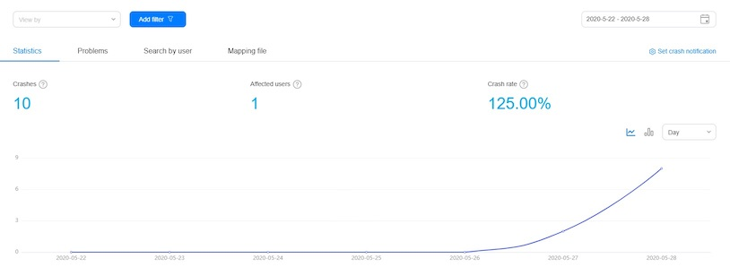
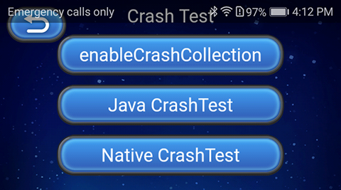

# Crash (AppGallery Connect) Quick Start

[Crash](https://developer.huawei.com/consumer/en/doc/development/AppGallery-connect-Guides/agc-crash-introduction) Service of AppGallery Connect is a lightweight crash analysis service, in which Huawei provides a Crash SDK that can be quickly integrated into your app, **without the need for coding**.

### Functions

- The Crash service provides real-time reports for the last hour, allowing you to monitor the quality of your application in real time.

- In addition, the Crash service automatically categorizes crashes, and provides indicator data of the crashes, allowing you to prioritize the most important crashes. You can view information about a specific crash, and analyze the app and Android versions with the crash. You can also view information about the app, operating system, and device corresponding to a specific crash, as well as the crashed stack. All the information is enormously helpful in locating and resolving crashes.

- The Crash service can also detect major crashes in real time. After you enable crash notifications, AppGallery Connect can send you an email when a major crash occurs.

## Enable Crash Service

- Use Cocos Creator to open the project that needs to be connected to Crash service.

- Since the Crash service uses the HUAWEI Analytics Kit to report crash event, please enable the [Analytics Kit (HMS Core)](./hms-analytics.md) before integrating the Crash Service.

- Click on **Panel -> Service** in the menu bar to open the Service panel, select Crash service to go to the service detail page, and then click on the **Enable** button in the top right to enable the service. For details, please refer to the Cocos Service [Operation Guide](./index.md#usage) documentation.

  

### Configs HUAWEI Config file

Most of HUAWEI Services need the `agconnect-services.json` configuration file. If there are operations such as newly opened services, please update the file in time.

- Login to AppGallery Connect and click on **My projects** to select the project. Then select the app to enable the Remote Configuration service from the app list of the project.

- On the **Project Setting** page, click the configuration file **agconnect-services.json** to download it. The `agconnect-services.json` file **must be copied manually** to the settings directory of the project directory after downloading or updating.

  

### Verify whether the service is integrated successfully

Generally, there is a low probability of an application crashing, so the Crash service SDK provides a method to manually create a crash, which can be invoked to determine if the Crash service was successfully accessed.

- Add simple code to the script.

  ```js
  console.log("Call crash method after 5 seconds.");
  this.scheduleOnce(function(){
      huawei.AGC.Crash.CrashService.testIt();
  },5);
  ```

- You can [publish to the Android platform](../publish/publish-native.md) after the code is added. Please make sure that the **Package Name** on the **Build** panel is consistent with the **Package Name** set in the AppGallery Connect console.

- Login the [AppGallery Connect](https://developer.huawei.com/consumer/en/service/josp/agc/index.html) console, open the project, go to **Quality -> Crash**. If you can see crash data (usually displayed within 15 minutes), which means the integrate is successful.

  

## Sample Project

Developer can get a quick taste of the Analytics Kit with the sample project.

- Click on the **Sample** button in the Crash service panel, clone or download, and open the project in Cocos Creator.

- After enabling the Crash service and configuring the HUAWEI configuration file as described above, you can open the **Build** panel to compile the project by clicking **Project -> Build** in the Creator editor menu bar. Cocos Creator v2.4.1 and above, you could [publish to HUAWEI AppGallery Connect](../publish/publish-huawei-agc.md). Below Creator v2.4.1 could [publish to the Android platform](../publish/publish-native.md).

- Need to test on Huawei or Honor brand phones with HMS Core service installed.

- Once the Sample project is running on the phone, click the **Crash** button on the homepage for testing.

  

## Developer Guide

Crash service without the need for coding. The following methods are optional.

### Enable Crash Collection

`enableCrashCollection(enable: boolean): void`

This method is used to enable or disable the crash data reporting function. The function is enabled by default, indicating that the Crash service will collect and report crash data. If you do not want the Crash service to automatically collect or report crash data, disable the function.

**Parameter Description**:

| Parameter | Description | 
| :---------- | :------------- |  
|  enable    | 	Indicates whether to enable the crash data reporting function.<br>**false**: disable the Crash service.<br>**true**: enable the Crash service. | 

**Example**:

```js
huawei.AGC.Crash.CrashService.enableCrashCollection(false);
```

### Trigger a Crash

`testIt(): void`

This method is used to trigger a crash for testing an app. This method can be used to test the Crash service of your app during debugging. Do not use it in any formally release app.

**Example**:

```js
huawei.AGC.Crash.CrashService.testIt();
```

## Service Reference Documents

- [Analyzing a Crash](https://developer.huawei.com/consumer/en/doc/development/AppGallery-connect-Guides/agc-crash-locate)
- [Receiving Crash Notifications](https://developer.huawei.com/consumer/en/doc/development/AppGallery-connect-Guides/agc-crash-notice)
- [Obtaining an NDK Crash Report](https://developer.huawei.com/consumer/en/doc/development/AppGallery-connect-Guides/agc-crash-report)
- [Obtaining a Readable Crash Report](https://developer.huawei.com/consumer/en/doc/development/AppGallery-connect-Guides/agc-crash-mapping)
- [Customizing a Crash Report](https://developer.huawei.com/consumer/en/doc/development/AppGallery-connect-Guides/agc-crash-customreport)
- [Crash FAQs](https://developer.huawei.com/consumer/en/doc/development/AppGallery-connect-Guides/agc-crash-faq)

## API Documentation

Please refer to the [Crash - API Documentation](https://docs.cocos.com/service/api/modules/huawei.agc.crash.html).