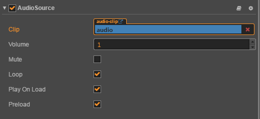

# AudioSource Component

## Properties

Properties          | Function Explanation
--                  | --
Clip                | Audio resource object to play
Volume              | Audio volume, the range is between 0~1
Mute                | Whether it is muted
Loop                | Whether it is loop
Play on load        | Whether to play audio automatically after the component is activated
preload             | Whether to load preloaded when it is not playing

More audio interface to the script interface [AudioSource API](../../../api/en/classes/AudioSource.html).