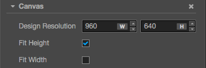
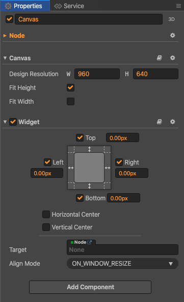

# Canvas component reference

The **Canvas** component can get the actual resolution of the device screen and zoom in and out of all the rendered elements in the scene. There can only exist one Canvas component in the scene at a time. We recommend you set all the UI and renderable elements as Canvas' child nodes.

## Property

| Property          | Explanation |
| :--               | :--         |
| Design Resolution | Design resolution (the resolution blueprint used while the content producer builds the scene) |
| Fit Height        | Auto-fit height (the height of the design resolution will auto-fit to the screen height) |
| Fit Width         | Auto-fit width (the width of the design resolution will auto-fit to the screen width) |

## Adapt the screen size

When Canvas adapts the screen, it only scales or stretches the entire game's screen, and does not modify the size of the node. The node size will be the same as the design resolution by default, so it will not fit exactly to the actual screen size. So in order for the child nodes to properly fit the actual screen size, usually we need to align the size of the node where the Canvas is located to the full screen. Therefore, when adding the Canvas in the editor, a Widget component is also added automatically, so that the node where the Canvas is located can automatically fill the full screen (New in v2.3).

If you want to use the size of the Canvas as the design resolution, you can manually remove or disable the Widget component. In addition, when the old project is upgraded to v2.3, the editor will add Widget components automatically.

Please refer to the [Canvas API](../../../api/en/classes/Canvas.html) for the script interface.
