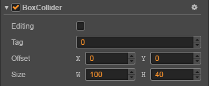

# Collider component reference

Click **Add Component** button at the bottom of **Properties** panel and then select **Collider** component from **Collider Component**, then you add the Collider component to the node.

## Collider component properties

| property |   Function Explanation
| -------------- | ----------- |
| Tag | The collider tag. If there are several collider components in a node, you can use the tag to judge which collider component on the node is collided.
| Editing | Whether to edit this collider component, only used in the editor.

## Detailed Explanation

One node can have several collider components, and these collider components can be different type.

We have three collider component types now, they are **Polygon**, **Circle**, **Box**. These components all inherit from **Collider** component, so the properties of the Collider component are also enjoyed.

### Polygon collider component properties

| property |   Function Explanation
| -------------- | ----------- |
| Regenerate Points | The vertices of the corresponding outline are automatically generated based on the texture pixels of the Sprite component on the node where the component is located.
| Threshold | Indicates the minimum distance between the vertices of the generated texture outline. The larger the value, the fewer points are generated, which can be adjusted according to the requirements.
| Offset | Position offset from Component to Node.
| Points | Component vertices array

### Circle collider component properties

| property |   Function Explanation
| -------- | -------- |
| Offset | Position offset from Component to Node.
| Radius | Component radius.

### Box collider component properties

| property |   Function Explanation
| -------------- | ----------- |
| Offset | Position offset from Component to Node.
| Size | Component size.

More information about **Collider** can be find in [Collider System](../physics/collision/index.md).
