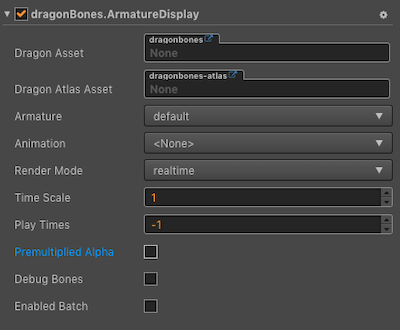
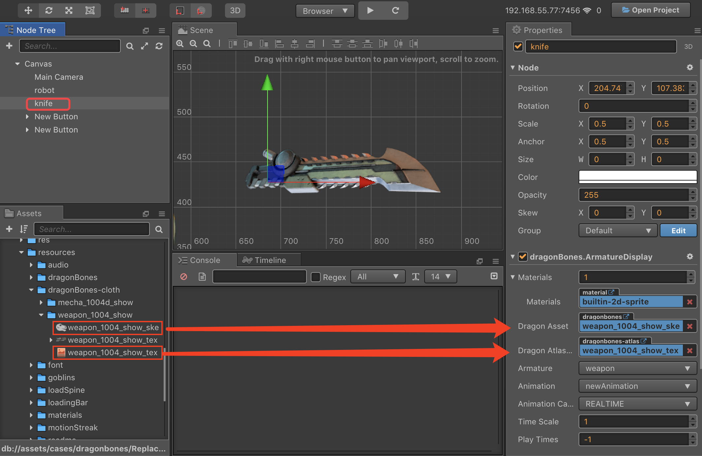

# DragonBones Component Reference

The DragonBones component can render and play DragonBones resources.



Click the **Add Component** button at the bottom of the **Properties** panel and select **DragonBones** from **Renderer Component** to add the DragonBones component to the node.

- The operation of the DragonBones component in the script refer to the [DragonBones test](https://github.com/cocos/example-projects/tree/master/assets/cases/dragonbones) in the [example-cases](https://github.com/cocos/example-projects).
- About the DragonBones's scripting interface please refer to [DragonBones API](../../../api/en/modules/dragonBones.html)

## DragonBones Properties

| property |   Function Explanation
| --------------------- | ------------------ |
| Dragon Asset          | The json data contains the DragonBones information (bind pose bones, slots, draw order,attachments, skins, etc) and animations, but does not hold any state.<br>Multiple ArmatureDisplay can share the same DragonBones data.<br>You can drag and drop the bone resources exported from DragonBones here.
| Dragon Atlas Asset    | The json data contains the Texture information. You can drag and drop the Atlas resources exported from DragonBones here.
| Armature              | The name of current armature.
| Animation             | The name of current playing animation.
| Animation Cache Mode  | Render mode, default is `REALTIME` mode. (new in v2.0.9)<br>1. **REALTIME** model, realtime calculate, support all functions of DragonBones.<br>2. **SHARED_CACHE** mode, caching and sharing dragonbones animation data, the equivalent of pre baked skeletal animation, have high performance, does not support the action blend, superposition and nest bone nested, only supports the start and end events, as for memory, when creating some same bones and the same action of animation, can present advantages of memory, the greater the amount of skeleton, the more obvious advantages, in conclusion `SHARED_CACHE` mode is suitable for the scene animation, special effects, monster, NPC and so on, can greatly increase the frame rate and reduce memory.<br>3. **PRIVATE_CACHE** mode, similar to `SHARED_CACHE`, but not share animation and texture data, so there is no advantage in memory, there is only a performance advantage, when trying to take advantage of caching pattern of high performance, but there is a change of texture, so you can't share the map data, then `PRIVATE_CACHE` is suitable for you.
| Time Scale            | The time scale of this armature.
| Play Times            | The play times of the default animation.<br>**-1** means using the value of config file.<br>**0** means repeat for ever.<br>**>0** means repeat times.
| Premultiplied Alpha   | Indicates whether to enable premultiplied alpha, default is True. (New in v2.0.7)<br>You should disable this option when image's transparent area appears to have opaque pixels.<br>Enable this option when image's half transparent area appears to be darken.
| Debug Bones           | Indicates whether open debug bones.
| Enable Batch          | Whether to enable animation batch, default is disabled. (New in v2.0.9)<br>When enable, drawcall will reduce, which is suitable for a large number of simple animations to play at the same time.<br>When disabled, drawcall will rise, but it can reduce the computational burden of the CPU. Suitable for complex animations.

**Note**: When the DragonBones component is used, the `Anchor` and `Size` properties on the Node component in the **properties** panel are invalid.

## DragonBones ReplaceTexture

Here is an example of how DragonBones replace the textures. By change the display object of the slot and replace the knife in the green box below with the knife in the red box. This method is suitable for **v2.0.10** or **v2.1.1** and above.


1. Create a new empty node in **Node Tree** and rename it as knife, then add the DragonBones component in **Properties**. And drag the resources of knife in the red box into the property box of the DragonBones component, as shown in the following image:

    

2. Create an empty node again and rename it as robot, then add the DragonBones component in **Properties** and drag the robot's resources into the property box of the DragonBones component, as shown in the following image. You can change the Animation property of the DragonBones component to set the animation that the user wants to play.

    

3. Create a new JavaScript script in **Assets** and double-click to open to write. The sample script code is as follows:

    ```js
    cc.Class({
        extends: cc.Component,

        properties: {
            robot: {
                type: dragonBones.ArmatureDisplay,
                default: null,
            },
            knife: {
                type: dragonBones.ArmatureDisplay,
                default: null,
            }
        },

        start () {
            let robotArmature = this.robot.armature();
            let robotSlot = robotArmature.getSlot("weapon_hand_r");
            let factory = dragonBones.CCFactory.getInstance();
            factory.replaceSlotDisplay(
                this.knife.getArmatureKey(), 
                "weapon", 
                "weapon_r", 
                "weapon_1004c_r", 
                robotSlot
            );
        },
    });
    ```

4. Mount the script component onto the Canvas, it means dragging and dropping the script into the **Properties** of the Canvas. Then drag the robot node and knife node in **Node Tree** to the corresponding property box of script component, and save the Scene.

    

5. Click the preview button at the top of the editor, we can see that the knife on the robot's right hand has been replaced.

    
