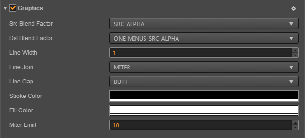

# Graphics Component Reference

The Graphics component provides a series of drawing interfaces that reference the canvas's drawing interface.

Create a new empty node, and then click the **Add Component** button below the **Properties** panel and select **Graphics** from **Renderer Component**. Then you can add the Graphics component to the node.

## Graphic Properties

| Properties |   Function Explanation
| -------------- | ----------- |
| [lineCap](../render/graphics/lineCap.md)         | lineCap determines how the end points of every line are drawn
| [lineJoin](../render/graphics/lineJoin.md)       | lineJoin determines how two connecting segments (of lines, arcs or curves) with non-zero lengths in a shape are joined together
| [lineWidth](../render/graphics/lineWidth.md)     | Current line width
| [miterLimit](../render/graphics/miterLimit.md)   | Sets the miter limit ratio
| [strokeColor](../render/graphics/strokeColor.md) | stroke color
| [fillColor](../render/graphics/fillColor.md)     | fill color

## Graphics API

### Path

| Function |   Function Explanation
| -------------- | ----------- |
| [moveTo](../render/graphics/moveTo.md) (x, y)  | Move path start point to (x,y)
| [lineTo](../render/graphics/lineTo.md) (x, y)  | Adds a straight line to the path
| [bezierCurveTo](../render/graphics/bezierCurveTo.md) (c1x, c1y, c2x, c2y, x, y) | Adds a cubic Bézier curve to the path
| [quadraticCurveTo](../render/graphics/quadraticCurveTo.md) (cx, cy, x, y) | Adds a quadratic Bézier curve to the path
| [arc](../render/graphics/arc.md) (cx, cy, r, a0, a1, counterclockwise)    | Adds an arc to the path which is centered at (cx, cy) position with radius r starting at startAngle and ending at endAngle going in the given direction by counterclockwise (defaulting to false).
| [ellipse](../render/graphics/ellipse.md) (cx, cy, rx, ry)                 | Adds an ellipse to the path
| [circle](../render/graphics/circle.md) (cx, cy, r)                        | Adds an circle to the path
| [rect](../render/graphics/rect.md) (x, y, w, h)                           | Adds an rectangle to the path
| [close](../render/graphics/close.md) ()         | Adds an round corner rectangle to the path
| [stroke](../render/graphics/stroke.md) ()       | Draws a filled rectangle
| [fill](../render/graphics/fill.md) ()           | Erasing any previously drawn content
| [clear](../render/graphics/clear.md) ()         | Causes the point of the pen to move back to the start of the current path. It tries to add a straight line from the current point to the start
