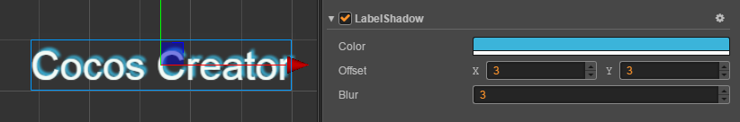

# LabelShadow Component Reference

The LabelShadow component can add shadow effects to the Label component, but only for system fonts or TTF fonts.

Click the **Add Component** button at the bottom of the **Properties** panel and select **LabelShadow** from **Renderer Component** to add the LabelShadow component to the node.

LabelShadow script interface, please refer to [LabelShadow API](../../../api/zh/classes/LabelShadow.html) for details.

## LabelShadow Properties

| Properties | Function Explanation
| ---------- | ---------- |
| Color  | The shadow color
| Offset | Offset between font and shadow
| Blur   | A non-negative float specifying the level of shadow blur
