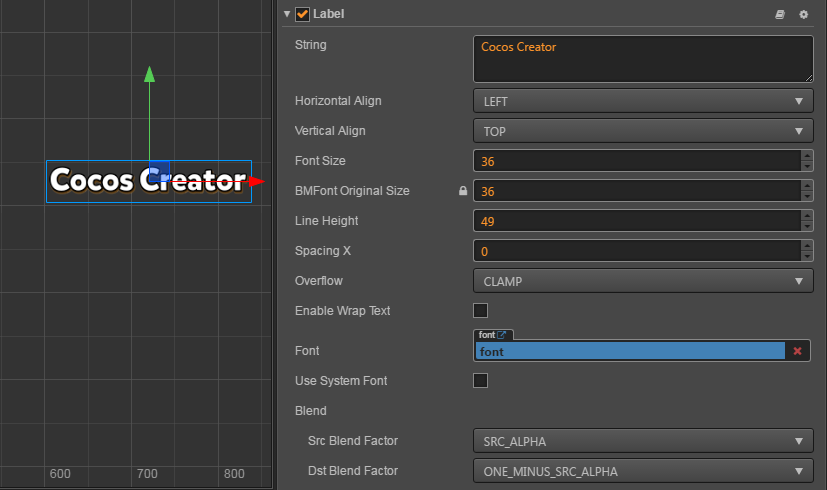

# Label component reference

The Label component is used to show a piece of text in the system font, TrueType font or BMFont and LabelAtlas. Label also has a composing function.

Click the **Add Component** button at the bottom of the **Properties** panel and select `Label` from `Add Rendering Component` to add the Label component to the node.

# Label attribute

| Attribute |   Function Explanation
| -------------- | ----------- |
|String| Text content character string.
|Horizontal Align| Horizontal alignment pattern of the text. The options are LEFT, CENTER and RIGHT.
|Vertical Align| Vertical alignment pattern of the text. The options are TOP, CENTER and BOTTOM.
|Font Size| Font size of the text.
|SpacingX | The spacing between font characters, only available in BMFont.
|Line Height| Line height of the text.
|Overflow| Layout pattern of the text. Currently supports CLAMP, SHRINK and RESIZE_HEIGHT. See `Label Layout` for more detailed information.
|Enable Wrap Text| Enable or disable the text line feed.
|Font | Designate the font file needed for rendering the text. If the system font is used, then this attribute can be set to null.
|Use System Font| Boolean value, choose whether to use the system font or not.

# Label Layout

| Attribute |   Function Explanation
| -------------- | ----------- |
|CLAMP| The text size won't zoom in or out as the Bounding Box size changes. When Wrap Text is disabled, parts exceeding the Bounding Box won't be shown according to the normal character layout. When Wrap Text is enabled, it will try to wrap the text exceeding the boundaries to the next line. If the vertical space is not enough, any not completely visible text will also be hidden.
|SHRINK| The text size will zoom in or out (it won't zoom out automatically, the maximum size that will show is specified by Font Size) as the Bounding Box size changes. When Wrap Text is enabled, if the width is not enough, it will try to wrap the text to the next line before automatically adapting the Bounding Box's size to make the text show completely. If Wrap Text is disabled, then it will compose according to the current text and zoom automatically if it exceeds the boundaries.
|RESIZE_HEIGHT| The text Bounding Box will adapt to the layout of the text. The user cannot manually change the height of text in this status; it is automatically calculated by the internal algorithm.

# Detailed explanation

By dragging the TTF font file and BMFont font file into the `file` attribute in the **Properties** panel the Label component can alter the rendering font type. If you want to stop using a font file, you can use the system font again by checking `Use System Font`?

If you want to use LabelAtlas, you should create a LabelAtlas font asset at first. Please refer to [LabelAtlas asset](../asset-workflow/label-atlas.html) for more information.

## BMFont and UI auto batch
From Creator v1.4, BMFont could be batch drawing with UI elements.
In theory, if you don't use TTF font and System font in your UI scene, and all of your UI elements including BMFont texture and LabelAtlas texture could be packed into one 
Image Atlas, you UI scene could be rendering with only one Draw Call.

For more info of this feature, please refer to [BMFont and UI auto batch](../advanced-topics/ui-auto-batch.html) topic.

---`

Continue on to read about [Spine component reference](spine.md).
