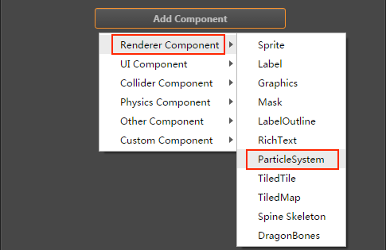

# ParticleSystem Component Reference

## Overview

This component is used to read [Particle Resources](../asset-workflow/particle.md) data and perform a series of operations such as play, pause, destroy, etc.


## How to create

ParticleSystem component can be created in the following two ways:

### 1. Create in the editor

Click the **Add Component** button at the bottom of the **Properties** panel and select **ParticleSystem** from **Renderer Component** to add the ParticleSystem component to the node.



### 2. Create in code

```js
// Create a node
var node = new cc.Node();
// And add nodes to the scene
cc.director.getScene().addChild(node);
// And add particle components to Node
var particleSystem = node.adComponent(cc.ParticleSystem);
// Next you can particleSystem this object for a series of operations
```

Please refer to the script interface of the Particle System [ParticleSystem API](../../../api/en/classes/ParticleSystem.html).

## ParticleSystem Properties

| Property |   Function Explanation
| :------------- | :---------- |
| Preview               | Play particle in edit mode.
| Play On Load          | If set to true, the particle system will automatically start playing on onLoad.
| Auto Remove On Finish | Indicate whether the owner node will be auto-removed when it has no particles left.
| File                  | The plist file.
| Custom                | If set custom to true, then use custom properties instead of read particle file. When this property is turned on, you can customize the following part of the particle properties
| Sprite Frame          | SpriteFrame of Particle System.
| Duration              | How many seconds the emitter wil run. -1 means `forever`.
| Emission Rate         | Emission rate of the particles.
| Life                  | Life and variation of each particle setter.
| Total Particle        | Maximum particles of the system.
| Start Color           | Start color of each particle.
| Start Color Var       | Variation of the start color.
| End Color             | Ending color of each particle.
| End Color Var         | Variation of the end color.
| Angle                 | Angle and variation of each particle setter.
| Start Size            | Start size and variation in pixels of each particle.
| End Size              | End size and variation in pixels of each particle.
| Start Spin            | Start angle and variation of each particle.
| End Spin              | End angle and variation of each particle.
| Source Pos            | Source position of the emitter.
| Pos Var               | Variation of source position.
| Position Type         | Particles movement type. Including `FREE`, `RELATIVE`, `GROUPED` three types, refer to [PositionType API](../../../api/en/enums/ParticleSystem.PositionType.html) for details.
| Emitter Mode          | Particles emitter modes. Including `GRAVITY`, `RADIUS` three types, refer to [EmitterMode API](../../../api/en/enums/ParticleSystem.EmitterMode.html) for details.
| Gravity               | Gravity of the emitter, which takes effect only when the Emitter Mode is set to `GRAVITY`
| Speed                 | Speed and variation of the emitter.
| Tangential Accel      | Tangential acceleration and variation of each particle. Only available in `Gravity` mode.
| Radial Accel          | Acceleration and variation of each particle. Only available in `Gravity` mode.
| Rotation Is Dir       | Indicate whether the rotation of each particle equals to its direction. Only available in `Gravity` mode.
| Start Radius          | Starting radius and variation of the particles. Only available in `Radius` mode.
| End Radius            | Ending radius and variation of the particles. Only available in `Radius` mode.
| Rotate Per S          | Number of degress to rotate a particle around the source pos per second and variation. Only available in `Radius` mode.
| Src Blend Factor      | The source image blend mode. Refer to [BlendFactor API](../../../api/en/enums/BlendFactor.html) for details.
| Dst Blend Factor      | The destination image blend mode. Refer to [BlendFactor API](../../../api/en/enums/BlendFactor.html) for details.
