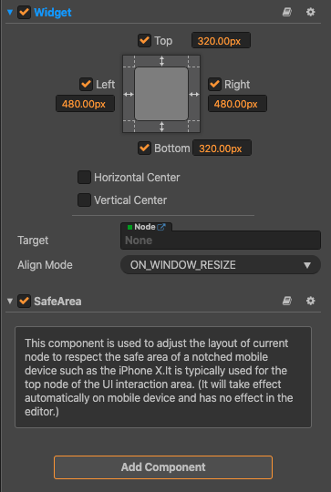

# SafeArea component reference

This component is used to adjust the layout of current node to respect the safe area of a notched mobile device such as the iPhone X.

It is typically used for the top node of the UI interaction area. For specific usage, refer to the [SafeArea](https://github.com/cocos-creator/example-cases/tree/master/assets/cases/02_ui/16_safeArea) in the example-cases.

The concept of safe area is to give you a fixed inner rectangle in which you can safely display content that will be drawn on screen.

You are strongly discouraged from providing controls outside of this area. But your screen background could embellish edges.

The developer only need to add the component on the node, without any settings, this component internally uses the API `cc.sys.getSafeAreaRect();` to obtain the safe area of the current iOS or Android device and implements the adaptation by using the Widget component and set anchor. (If there is no Widget component, it will be added automatically)
