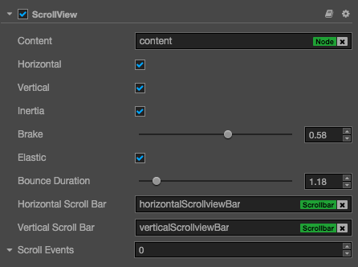
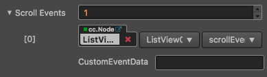

# ScrollView component reference

ScrollView is a container with a scroll function. It provides a way to browse more contents within a limited display area. Generally, ScrollView will be used
along with the `Mask` component and the `ScrollBar` component can also be added to show the location of the browsing content.




Click the `Add component` button at the bottom of the **Properties** panel and select `ScrollView` from `add UI component` You can then add the ScrollView component to the node.


## ScrollView property

| Property |   Function Explanation
| -------------- | ----------- |
| Content| A reference node for creating scrollable content from ScrollView. It could be a node containing a very large picture.
| Horizontal | Boolean value, whether horizontal scroll is allowed or not.
| Vertical | Boolean value, whether vertical scroll is allowed or not.
| Inertia | Is there an accelerating velocity when scrolling?
| Brake | Floating point number, the deceleration coefficient after scrolling. The value range is 0-1 where if set to 1, then the scroll will stop immediately; if set to 0, then the scroll will continue until the content border.
|Elastic | Boolean value, whether to bounce back or not.
|Bounce Duration | Floating point number, the time duration for bounce back. The calue range is 0-10.
|Horizontal ScrollBar| A reference node for creating a scroll bar showing the horizontal position of the contents.
|Vertical ScrollBar| A reference node for creating a scroll bar showing vertical position of the contents.
|ScrollView Events| Default list type is null. Each event added by the user is composed of the node reference, component name and a response function. Please check more detailed information in the chapter `ScrollView Event`.

## ScrollView Event


| Property |   Function Explanation
| -------------- | ----------- |
|Target| Node with the script component.
|Component| Script component name.
|Handler| Assign a callback function which will be triggered when the scrollview events emitted.

The scrollview event callback will have two parameters, the first one is the ScrollView itself and the second one is the event type.

## Detailed explanation

The ScrollView component can only work with the specified content node. It calculates location information during scrolling using both the designated scroll direction and the length of the content node in this direction. The content node can also set to auto resize through the `UI Widget`?

Normally a ScrollView node tree resembles the following:


Here, the Viewport is used to define a scroll area that can be displayed. As a result, the Mask component will normally be added to the Viewport. Contents that can scroll can be put in the content node or added to its child node.

## ScrollBar settings

ScrollBar is optional. You can choose to set either a horizontal or vertical ScrollBar or of course set them both.

To build a connection, you can drag a node with the ScrollBar component in the **Node Tree** over to the corresponding field in ScrollView.

#### Add a callback through the script code

##### Method one

This method adds the same event callback as the event callback that is added using the editor，By adding code, you need to first construct a `cc.Component.EventHandler` object, and then set the corresponding target, component, handler and customEventData parameters.

```js

//here is your component file, file name = MyComponent.js 
cc.Class({
    extends: cc.Component,
    properties: {},
    
    onLoad: function () {
        var scrollViewEventHandler = new cc.Component.EventHandler();
        scrollViewEventHandler.target = this.node; //This node is the node to which your event handler code component belongs
        scrollViewEventHandler.component = "MyComponent";//This is the code file name
        scrollViewEventHandler.handler = "callback";
        scrollViewEventHandler.customEventData = "foobar";
        
        var scrollview = node.getComponent(cc.ScrollView);
        scrollview.scrollEvents.push(scrollViewEventHandler);
    },

	//Note that the order and type of parameters are fixed
    callback: function (scrollview, eventType, customEventData) {
        //here scrollview is a Scrollview component object instance
        //here the eventType === value in the cc.ScrollView.EventType enum
        //here the customEventData parameter is equal to you set before the "foobar"
    }
});
```

##### Method two

By `scrollview.node.on ('scroll-to-top', ...)` way to add

```js
//Suppose we add an event handler callback to the onLoad method of a component and handle the event in the callback function:

cc.Class({
    extends: cc.Component,

	
    properties: {
       scrollview: cc.ScrollView
    },
    
    onLoad: function () {
       this.scrollview.node.on('scroll-to-top', this.callback, this);
    },
    
    callback: function (event) {
       //here the event is an EventCustom object, you can get through the event.detail ScrollView components
       var scrollview = event.detail;
       //do whatever you want with scrollview
       //in addition, attention to this way registered events, can not pass customEventData
    }
});
```

Similarly, you can register events such as 'scrolling', 'touch-up', 'scrolling', etc. The events of the callback function parameters and 'scroll-to-top' parameters.

For a full list of ScrollView events, refer to the ScrollView API documentation.

---

---

Continue on to read about [ScrollBar component reference](scrollbar.md).
