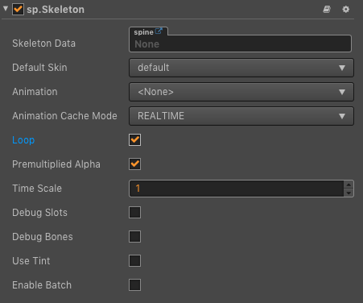
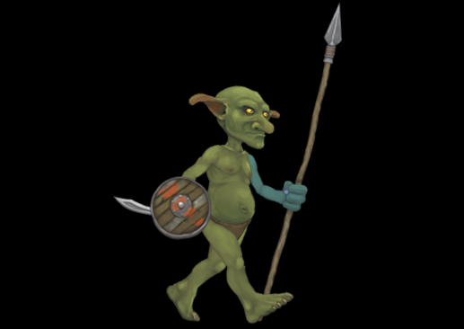
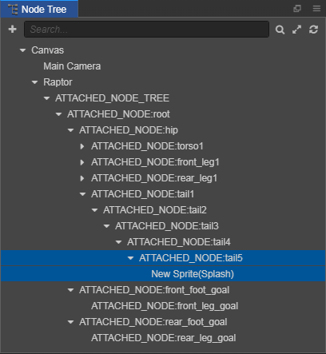

# Spine Component Reference

The Spine component supports the data formats exported by Spine, and renders and plays Spine resources.



Click the **Add Component** at the bottom of **Properties** and select **Spine Skeleton** from **Renderer Component** in order to add the **Spine** component to the node.

About the Spine's scripting interface please refer to [Skeleton API](../../../api/en/classes/Skeleton.html)

## Spine Properties

| property |   Function explanation
| --------------------- | ------------------ |
| Skeleton Data         | The skeleton data contains the skeleton information, drag the bone resources exported from Spine into this property.
| Default Skin          | Choose the default skin texture
| Animation             | The name of current playing animation
| Animation Cache Mode  | Render mode, default is `REALTIME` mode. (new in v2.0.9)<br>1. **REALTIME** model, realtime calculate, support all functions of Spine.<br>2. **SHARED_CACHE** mode, caching and sharing animation data, the equivalent of pre baked skeletal animation, have high performance, does not support the action blend and superposition, only supports the start and end events, as for memory, when creating some same bones and the same action of animation, can present advantages of memory, the greater the amount of skeleton, the more obvious advantages, in conclusion `SHARED_CACHE` mode is suitable for the scene animation, special effects, monster, NPC and so on, can greatly increase the frame rate and reduce memory.<br>3. **PRIVATE_CACHE** mode, similar to `SHARED_CACHE`, but does not share animation and texture data, and will occupy extra memory, there is only a performance advantage, and it may cause stutter if using this mode a lot to play animation. When trying to take advantage of caching pattern of high performance, but there is a change of texture, so you can't share the map data, then `PRIVATE_CACHE` is suitable for you.
| Loop                  | Whether loop current animation
| Premultiplied Alpha   | Indicates whether to enable premultiplied alpha, default is True.<br>You should disable this option when image's transparent area appears to have opaque pixels, or enable this option when image's half transparent area appears to be darken.
| Time Scale            | The time scale of animation of this skeleton
| Debug Slots           | Indicates whether show debug slots
| Debug Bones           | Indicates whether show debug bones
| Debug Mesh            | Indicates whether show debug mesh
| Use Tint              | Indicates whether open tint, default is close. (New in v2.0.9)
| Enable Batch          | Whether to enable animation batch, default is disabled. (New in v2.0.9)<br>When enable, drawcall will reduce, which is suitable for a large number of simple animations to play at the same time.<br>When disabled, drawcall will rise, but it can reduce the computational burden of the CPU. Suitable for complex animations.

> **Note**: when using the Spine component, the `Anchor` and `Size` properties on the Node component in the **Properties** panel are invalid.

## Spine ReplaceTexture

Here is an example of how Spine replace the textures. By change the attachment object of the slot and replace the arm in the green box below with the arm in the red box.


1. Create a new empty node in **Node Tree** and rename it as `goblingirl`, then add the Spine component in **Properties**. And drag the resources of spine into the Skeleton Data property box of the Spine component, set the skin in the red box to replace in the Default Skin property. You can change the Animation property of the Spine component to set the animation that you want to play.

    

2. Create an empty node again and rename it as goblin, then add the Spine component in **Properties** and drag the resources of spine into the Skeleton Data property box of the Spine component, set the skin you want to replace in the green box in the Default Skin property.

    

3. Create a new JavaScript script in **Assets** and double-click to open to write. The sample script code is as follows:

    ```js
    cc.Class({
        extends: cc.Component,

        properties: {
            goblin: {
                type: sp.Skeleton,
                default: null,
            },
            goblingirl: {
                type: sp.Skeleton,
                default: null,
            }
        },

        start () {
            let parts = ["left-arm", "left-hand", "left-shoulder"];
            for (let i = 0; i < parts.length; i++) {
                let goblin = this.goblin.findSlot(parts[i]);
                let goblingirl = this.goblingirl.findSlot(parts[i]);
                let attachment = goblingirl.getAttachment();
                goblin.setAttachment(attachment);
            }
        }
    });
    ```

4. Mount the script component onto the Canvas or other node, it means dragging and dropping the script into the **Properties** panel of the node. Then drag the `goblingirl` node and `goblin` node in **Node Tree** to the corresponding property box of script component, and save the scene.

    

5. Click the preview button at the top of the editor, we can see that the arm on the green box has been replaced.

    

## Vertex Effect

Vertex effect is only valid when the Animation Cache Mode property of Spine component is in REALTIME mode. Next we use an example to show how to set the vertex effect of Spine.

1. Create a new empty node in **Node Tree** and rename, then add the Spine component in **Properties**. And drag the resources of spine into the Skeleton Data property box of the Spine component, set the Spine component properties.

2. Create a new JavaScript script in **Assets** and double-click to open to write. The sample script code is as follows:

    ```js
    cc.Class({
        extends: cc.Component,

        properties: {
            skeleton : {
                type: sp.Skeleton,
                default: null,
            }
        },

        start () {
            this._jitterEffect = new sp.VertexEffectDelegate();
            // Set the jitter parameters
            this._jitterEffect.initJitter(20, 20);
            // Call the setVertexEffectDelegate method of the Spine component to set the effect
            this.skeleton.setVertexEffectDelegate(this._jitterEffect);
        }
    });
    ```

3. Mount the script component onto the Canvas or other node, it means dragging and dropping the script into the **Properties** of the node. Then drag the node in **Node Tree** to the corresponding property box of script component, and save the scene.

4. You can see the vertex jitter effect of the Spine animation by clicking the preview button above the editor. For the code, please refer to [SpineMesh](https://github.com/cocos/example-projects/tree/master/assets/cases/spine) for details.

## Spine Attachments

When using skeleton animation, nodes are often mounted on a certain part of the skeleton animation to achieve the effect of linkage between the nodes and the skeleton animation.

We can implement the Spine Attachments by using both the editor and the script. Here is an example of how Spine uses attach node to attach a star to a dragon's tail, and shakes with the dragon's tail.


### Implement in the editor

1. Create a new empty node in **Node Tree** and rename, then add the Spine component in **Properties**. And drag the spine skeleton animation resources into the Skeleton Data property box of the Spine component, set the Spine component properties. And then click the **Generate Attached Node** button under the Spine component.

    

2. After clicking the **Generate Attached Node** button, all skeletons will be generated in the form of a node tree below the node where the Spine component is located in the **Node Tree** panel.

    

3. Select the target bone node (dragon's tail) as the parent node in the **Node Tree** panel, and create a Sprite node as a child node.

    

    You can see that a Sprite is already attached to the dragon's tail in the **Scene** panel.

    

4. Finally, drag the star resource to the `Sprite Frame` property of the Sprite component. Save the scene and click the **Preview** button above the editor, then you can see a star hanging on the dragon's tail and shaking with the dragon's tail. For details, please refer to the [SpineAttach](https://github.com/cocos/example-projects/tree/master/assets/cases/spine) in example-case.

> **Note**: after finish the Spine Attachments, you can delete unused skeleton nodes in the **Node Tree** panel to reduce the computational overhead at runtime. Note that the parent node of the target bone node cannot be deleted.

### Implement in the script

1. Similar to the steps of implement in the editor, first create a node with a Spine component and set the properties of the Spine component.

2. Create the prefab of the star to be mounted on the skeleton animation. About Prefab please refer to [documentation](../asset-workflow/prefab.md) for details.

3. Create a new JavaScript script in **Assets** and double-click to open to write. The sample script code is as follows:

    ```js
    cc.Class({
        extends: cc.Component,

        properties: {
            skeleton: {
                type: sp.Skeleton,
                default: null,
            },
            // The prefab to be added to the skeleton animation
            targetPrefab: {
                type: cc.Prefab,
                default: null,
            },
            // Target bone name
            boneName: "",
        },

        onLoad () {
            this.generateSomeNodes();
        },

        generateAllNodes () {
            // Get the attach node tool
            let attachUtil = this.skeleton.attachUtil;
            attachUtil.generateAllAttachedNodes();
            // Because there may be multiple skeletons with the same name, you need to return an array
            let boneNodes = attachUtil.getAttachedNodes(this.boneName);
            // Take the first skeleton as the attaching node
            let boneNode = boneNodes[0];
            boneNode.addChild(cc.instantiate(this.targetPrefab));
        },

        destroyAllNodes () {
            let attachUtil = this.skeleton.attachUtil;
            attachUtil.destroyAllAttachedNodes();
        },

        // A method to generate a tree of nodes with the specified skeleton name
        generateSomeNodes () {
            let attachUtil = this.skeleton.attachUtil;
            let boneNodes = attachUtil.generateAttachedNodes(this.boneName);
            let boneNode = boneNodes[0];
            boneNode.addChild(cc.instantiate(this.targetPrefab));
        },

        // A method to destroy a tree of nodes with the specified skeleton name
        destroySomeNodes () {
            let attachUtil = this.skeleton.attachUtil;
            attachUtil.destroyAttachedNodes(this.boneName);
        }
    });
    ```

4. Mount the script component onto the Canvas or other node, it means dragging and dropping the script into the **Properties** of the node. Then drag the node and resource to the corresponding properties box of script component, and save the scene.

    

    If you don't know the target bone name, click the **Generate Attached Node** button in the Spine component, and then search in the skeleton node tree generated under the Spine node in the **Node Tree** panel. After the search is complete, delete the skeleton node tree under the Spine node.

## Spine Collision Detection

The Spine Attachments can be used to perform collision detection on a certain part of the skeleton animation. For how to achieve the Spine Attachments, please refer to the previous chapter.

Here is an example of Spine how to implement collision detection. And determines whether the character's foot is in contact with the ground to dynamically change the ground color while the character is running.


1. As with the first two steps of implement the Spine Attachments in the editor. After creating the Spine node, click the **Generate Attached Node** button in the Spine component.

2. Then select the target bone node (the character's foot) as the parent node in the skeleton node tree under the Spine node of the **Node Tree** panel, and create a child node names "FrontFootCollider".

    

3. Select the FrontFootCollider node in the **Node Tree** panel, click the **Add Component -> Collider Component -> Polygon Collider** button in the **Properties** panel to add a collider component, and then set the Polygon Collider component properties. Then the node will move with the skeleton animation, and the bounding box of the Collider component will be synchronized with the skeleton animation in runtime.

    

4. Create a Sprite node in the **Node Tree** panel as the ground. Then select the node, set properties such as `Position` and `Size` in the **Properties** panel, and add **BoxCollider** component.

5. Create a new JavaScript script in **Assets** and double-click to open to write. The sample script code is as follows:

    ```js
    cc.Class({
        extends: cc.Component,

        properties: {
            
        },

        start () {
            cc.director.getCollisionManager().enabled = true;
            cc.director.getCollisionManager().enabledDebugDraw = true;
            this.stayCount = 0;
        },

        onCollisionEnter (other, self) {
            this.stayCount++;
        },

        onCollisionExit (other, self) {
            this.stayCount--;
        },

        update () {
            if (this.stayCount > 0) {
                this.node.color = cc.color(0, 200, 200);
            } else {
                this.node.color = cc.color(255, 255, 255);
            }
        }
    });
    ```

6. Set the group of the node where the collider component is located. For how to set the group, please refer to the document [Collision Group Management](../physics/collision/collision-group.md) for details.

     

    

7. You can see the effect by clicking the preview button above the editor. For details, please refer to the [SpineCollider](https://github.com/cocos/example-projects/tree/master/assets/cases/spine) in example-case.

> **Note**: due to the implementation mechanism of Spine Attachments, there is a delay of one frame in the collision detection based on Spine Attachments.
