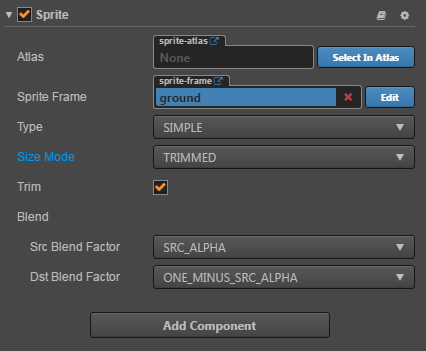

# Sprite component reference

Using Sprites is the most common way to display images in a 2D game. By adding the Sprite component to a node you can display images from the project resources within the scene.

Click the **Add Component** button at the bottom of the **Properties** panel and select `Sprite` from `Add Rendering Component` to add the Sprite component to the node.

## Sprite attribute

| Attribute |   Function Explanation
| -------------- | ----------- |
| Atlas | [Atlas resource](../asset-workflow/atlas.md) which the Sprite display image resource belongs to.
| Sprite Frame | [SpriteFrame image resource](../asset-workflow/sprite.md) which is used to render the Sprite.
| Type | Rendering mode, currently includes Simple and Sliced rendering modes.
| Use Original Size | Whether to use the original size of the image resource as the Sprite node size.

## Detailed explanation

After adding the Sprite component, drag the Texture or SpriteFrame type resource from the **Assets** to the `Sprite Frame` attribute reference. The resource image can then be displayed through the Sprite component.

If this SpriteFrame resource is contained within an Atlas resource, then the `Atlas` attribute of the Sprite will be set up along with it. Later you can click the **choose** button next to the `Atlas` attribute to choose another SpriteFrame from this Atlas to assign to the Sprite.

### Rendering mode

Currently, the Sprite component supports two rendering modes:

- Simple mode: rendering the Sprite according to the original image resource. It is normally used along with `Use Original Size` to guarantee the image shown in the scene is in full accordance with the image designed by the graphic designer.
- Sliced mode: the image is cut up into a nine square grid and according to certain rules is scaled to fit freely set dimensions (`size`). It is usually used in UI elements or to make images that can be enlarged infinitely without influencing the image quality into images cut up into a grid to save game resource space. Please read [use Sprite editor to make a Sudoku image](../asset-workflow/sprite.md#-sprite-) for detailed information.

---

Continue on to read about [Label component reference](label.md).
