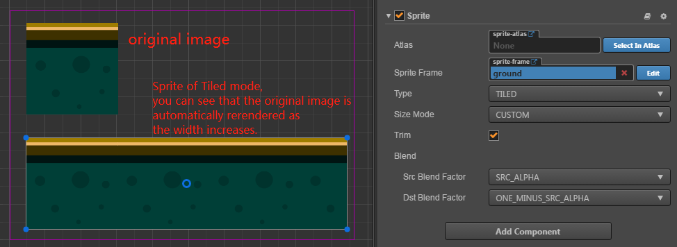

# Sprite Component Reference

Using `Sprite` is the most common way to display images in 2D games. By adding a
`Sprite` component to a `Node`, you can display the images in the project's resources
in the `Scene`.

You can add a `Sprite` component to the node by clicking the **Add Component** button below the **Properties** and selecting **Sprite** from the **Add Renderer Component** menu.

Please refer to [Sprite API](../../../api/en/classes/Sprite.html) for the script interface.

## Sprite Properties

| Properties | Description
| -------------- | ----------- |
| Atlas | Sprite shows the [Atlas Atlas Resource](../asset-workflow/atlas.md) to which the image asset belongs
| Sprite Frame | Render [SpriteFrame Image Resource](../asset-workflow/sprite.md) used by Sprite
| Type | Render mode, includes four modes: **Simple**, **Sliced**, **Tiled**, **Filled** and **Mesh**
| Size Mode | Specify the size of the Sprite, **Trimmed** will use the original image resource to crop the size of the transparent pixel; **Raw** will use the original image uncut size; when the user manually modified the **size** attribute, **Size Mode** will be automatically set to **Custom** unless it is specified again for the first two sizes.
| Trim | Whether to render the transparent pixel area around the original image. For details, please refer to [Auto Clipping of Image Resources](../asset-workflow/trim.md).
| Src Blend Factor | Current Image Blending Mode
| Dst Blend Factor | Background image blend mode, combined with the above properties, can blend foreground and background Sprite in different ways. Preview of effect can refer to [glBlendFunc Tool](http://www.andersriggelsen.dk/glblendfunc.php)

After adding the **Sprite** component, you can display the resource image through the Sprite component by dragging a resource of type **Texture** or **SpriteFrame** from the **Assets** panel into the **Sprite Frame** property reference.

If the dragged **SpriteFrame** resource is contained in an **Atlas** resource, the **Sprite's Atlas** property will also be set together. You can then select another **SpriteFrame** from the **Atlas** and assign it to the **Sprite** by clicking the **Select** button next to the **Atlas** property.

## Rendering mode

The `Sprite` component supports five rendering modes:

- __Normal mode:__ Render Sprite according to the original image resource. Generally, in this mode, we do not manually modify the size of the node to ensure that the image displayed in the scene is consistent with the image produced by the artist.
- __Sliced:__ The image will be split into nine squares and scaled to fit the arbitrarily set size (`size`). Usually used for UI elements, or to make a picture that can be infinitely magnified without affecting image quality into a nine-square grid to save game space. For more information, please read the [Using the Sprite Editor to Make a Jiugongge Image](../ui/sliced-sprite.md#-) section.
- __Tiled mode:__ When the size of the Sprite is increased, the image will not be stretched, but will be repeated according to the size of the original image, just like the tile, the original image will be covered by the entire Sprite. size.
  
- __Filled:__ Draws a portion of the original image in a certain direction and scale according to the settings of the origin and fill mode. Often used for dynamic display of progress bars.
- __Mesh:__ Only support .plist file which is built by __TexturePacker__ (4.0 or higher version) with ploygon algorithm.

### Filled mode

After the **Type** attribute is selected, the **Fill Mode**, a new set of properties will be available for configuration, the below table explains the properties in detail:

| Properties | Description
| -------------- | ----------- |
| Fill Type | Fill type selection, with `HORIZONTAL` (horizontal fill), `VERTICAL` (vertical fill), and `RADIAL` (fan fill).
| Fill Start | The normalized value of the fill start position (from 0 to 1, the percentage of the total fill). When the horizontal fill is selected, the `Fill Start` is set to 0, and the fill will start from the leftmost edge of the image.
| Fill Range | The normalized value of the fill range (also from 0 to 1), set to 1, fills up to the entire range of the original image.
| Fill Center | Fills the center point and this property appears only if the `RADIAL` type is selected. Determining which point on the Sprite will surround the fan fill, the coordinate system is the same as when setting [Anchor Anchor](../content-workflow/transform.md#-anchor-).

#### Fill Range Filling Range Supplement

Under the two fill types **HORIZONTAL** and **VERTICAL**, the value set by **Fill Start** will affect the total fill. If **Fill Start** is set to **0.5**, then even if **Fill Range** is set to **1.0**, the actual fill The range is still only half the total size of the Sprite.

In the **RADIAL** type, **Fill Start** only determines the direction in which to start filling. When **Fill Start** is **0**, the filling starts from the positive direction of the x-axis, **Fill Range** determines the total amount of filling, and a value of **1** fills the entire circle shape. **Fill Range** is **counterclockwise** filled for **positive** values ​​and **clockwise** for **negative** values.
