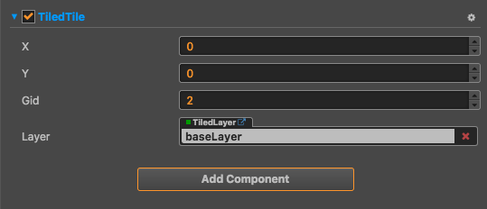

# TiledTile Component Reference

TiledTile can control the specified map tile.

### Usage

1. Create a Node under the Layer node and click the `Add Component` button under the Node ** Properties **, 
select the `TiledTile` component from the 'Rendering Component' and add it to the node, 
then set the properties on the component. Operate the map block.

TiledTile API reference [TiledTile API](../../../api/zh/classes/TiledTile.html)

2.Get the Layer component in the code，use api `setTileGIDAt` set the tiletile

TiledLayer API reference [TiledLayer API](../../../api/zh/classes/TiledLayer.html)

### Attribute

| Attribute |   Details
| ------| ----------- |
| x     | Specify the TiledTile horizontal coordinate，use map tile as the unit
| y     | Specify the TiledTile vertical coordinate，use map tile as the unit
| gid   | Specify the TiledTile gid
| layer | Specify which TiledLayer the TiledTile belong to

### Detailed explanation

 TiledTile can control the specified map tile. It will apply the node rotation, scale, translate to the map tile.
You can change the TiledTile's gid to change the map tile's style.
 
 Note: You can only switch the style of a tiledtile by using the existing gid in the map, unable switch the tiledtile style by customizing the sprite frame.

