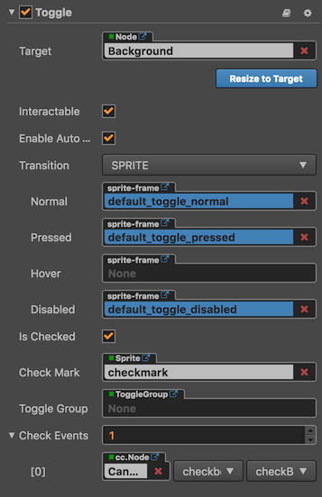

# Toggle component reference

The toggle component is a CheckBox, when it used together with a ToggleGroup, it could be treated as a RadioButton.



Click the **Add Component** button at the bottom of the **Properties** panel and select **Toggle** from **UI Component**. Then you can add the Toggle component to the node.

The API reference of Toggle is here: [Toggle API](../../../api/en/classes/Toggle.html).

## Toggle properties

| Properties     |   Function Explanation |
| :------------- | :---------- |
| isChecked      | Boolean type. When this value is true, the check mark component will be enabled, otherwise the check mark component will be disabled. |
| checkMark      | `cc.Sprite` type. The image displayed when Toggle is selected. |
| toggleGroup    | `cc.ToggleGroup` type. The toggle group which the toggle belongs to, when it is null, the toggle is a CheckBox. Otherwise, the toggle is a RadioButton. |
| Check Events   | Default list type is null. Each event added by the user is composed of the node reference, component name and a response function. Please see the **Toggle Event** section below for details. |

> **Note**: because Toggle is inherited from Button, so the attributes exists in Button also apply to Toggle, please refer to the [Button Component](button.md) for more information.

## Toggle Event

| Properties      | Function Explanation |
| :-------------  | :----------     |
| Target          | Node with the script component.    |
| Component       | Script component name.      |
| Handler         | Assign a callback function which will be triggered when the user clicks and releases the Toggle. |
| customEventData | A user-defined string value passed as the last event argument of the event callback.   |

The Toggle event callback has two parameters, the first one is the Toggle itself and the second is the `customEventData`.

## Detailed explanation

The generic node hierarchy of Toggle is as below:


> **Note**: the checkMark node needs to be placed on the upper level of the background node in the **Scene**.

## Add a callback through the script code

### Method one

The event callback added by this method is the same as the event callback added by the editor, all added by code. First you need to construct a `cc.Component.EventHandler` object, and then set the corresponding `target`, `component`, `handler` and `customEventData` parameters.

```js
var checkEventHandler = new cc.Component.EventHandler();
checkEventHandler.target = this.node; // This Node is the node to which your event processing code component belongs.
checkEventHandler.component = "cc.MyComponent"
checkEventHandler.handler = "callback";
checkEventHandler.customEventData = "foobar";

toggle.checkEvents.push(checkEventHandler);

// here is your component file
cc.Class({
    name: 'cc.MyComponent'
    extends: cc.Component,

    properties: {
    },

    callback: function(toggle, customEventData) {
        // The toggle here is the Toggle component that the event emits.
        // The customEventData parameter here is equal to the "foobar" you set earlier.
    }
});
```

### Method two

Added by the way of `toggle.node.on('toggle', ...)`.

```js
// Suppose we add an event handler callback inside a component's onLoad method and event handlers in the callback function:

cc.Class({
    extends: cc.Component,

    properties: {
       toggle: cc.Toggle
    },

    onLoad: function () {
       this.toggle.node.on('toggle', this.callback, this);
    },

    callback: function (toggle) {
       // The parameter of the callback is the toggle component.
       // do whatever you want with toggle
    }
});
```
