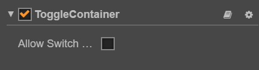

# ToggleContainer component reference

ToggleContainer is not a visible UI component but a way to modify the behavior of a set of Toggles. Toggles that belong to the same group could only have one of them to be switched on at a time.

> **Note**: all the first layer child node containing the toggle component will auto be added to the container

Click the **Add component** button at the bottom of the **Properties** panel and select **ToggleContainer** from **UI Component**. You can then add the ToggleContainer component to the node.

The API reference of ToggleContainer is here: [ToggleContainer API](../../../api/en/classes/ToggleContainer.html).

## ToggleContainer properties

| Property       |   Functions Explanation
| -------------- | ----------- |
| Allow Switch Off | If this setting is true, a toggle could be switched off and on when pressed. If it is false, it will make sure there is always only one toggle could be switched on and the already switched on toggle can't be switched off. |
| Click Event      | Default list type is null. Each event added by the user is composed of the node reference, component name and a response function. Please see the **ToggleContainer Event** section below for details. |

## ToggleContainer Click Event

| Property |   Function Explanation
| -------------- | ----------- |
| Target          | Node with the script component.
| Component       | Script component name.
| Handler         | Assign a callback function which will be triggered when the user presses Return key.
| customEventData | A user-defined string value passed as the last event argument of the event callback.

## Detailed explanation

The ToggleContainer won't be used alone and it usually be used with `Toggle` to implement the RatioButton.
